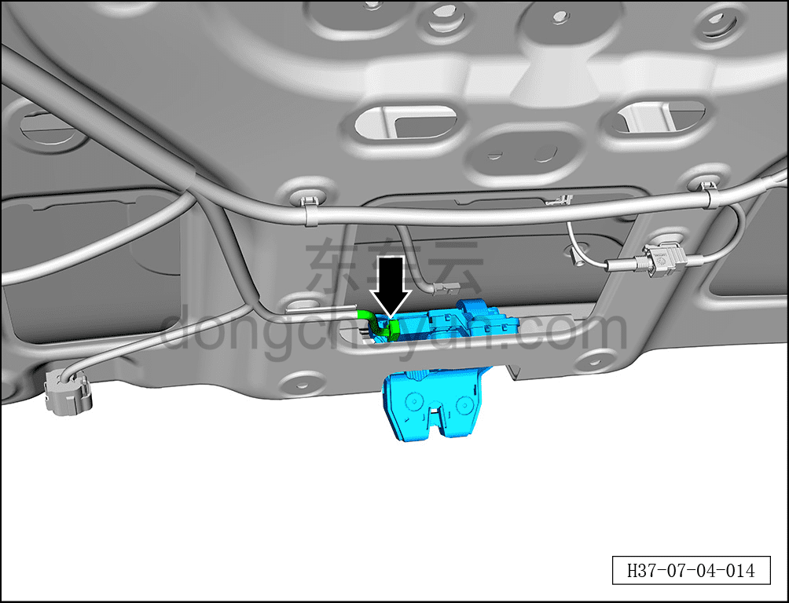
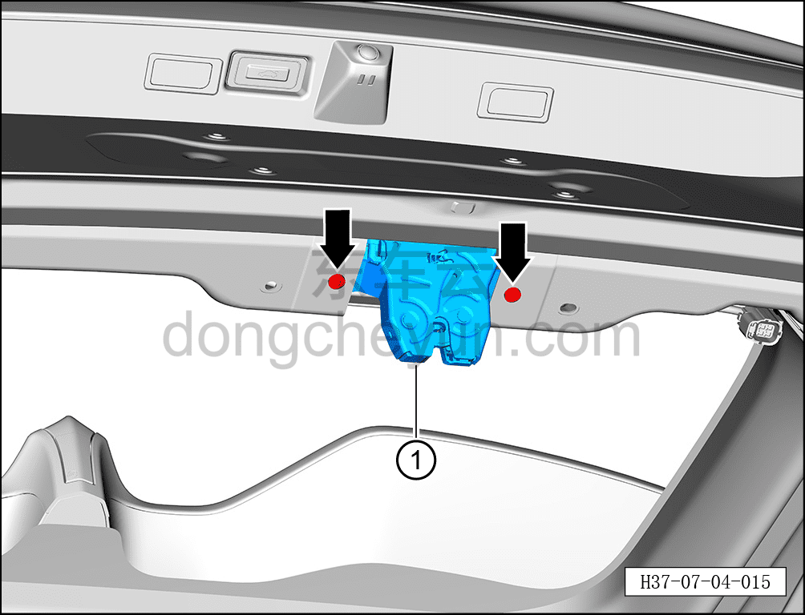

# Снятие и установка замка двери багажника в сборе

> Открывающиеся элементы кузова › Дверь багажника › Навесные элементы двери багажника  
> Оригинал: `拆卸与安装背门锁总成` · [dongcheyun 56746](https://dongcheyun.com/p/56746), страница `d44e35411bbe4ba594c529072deccbb1` · [оглавление](../README.md)

**Порядок снятия**

1. Выключите все электроприборы, отключите питание.

2. Выполните операцию обесточивания автомобиля для ремонта. См. [3.1.4.1 Обесточивание автомобиля](../03-техническое-обслуживание/005-обесточивание-автомобиля.md)

3. Снимите нижнюю декоративную накладку двери багажника. См. [8.4.4.2 Снятие и установка нижней декоративной накладки двери багажника](../08-внутренняя-и-внешняя-отделка/122-снятие-и-установка-нижней-накладки-двери-багажника.md)

4. Снимите замок двери багажника в сборе.

a. Удерживая фиксатор разъёма, отсоедините разъём замка двери багажника в сборе.

b. С помощью бита T30 выверните 2 крепёжных винта замка двери багажника в сборе.

Момент затяжки винта: 8±1 Н·м

c. Извлеките замок двери багажника в сборе ①.

**Порядок установки**

Установка выполняется в обратном порядке.

**Внимание:**

**- После установки замка двери багажника в сборе необходимо проверить нормальность открытия и закрытия двери багажника.**
