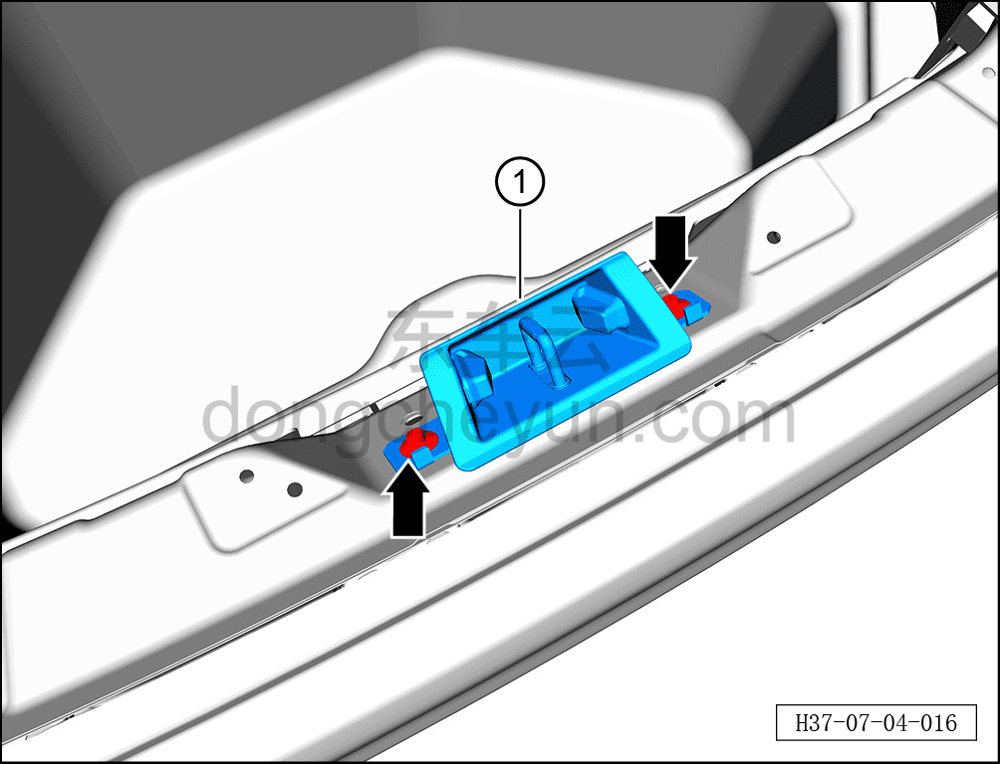

# Снятие и установка ответной части замка двери багажника в сборе

> Открывающиеся элементы кузова › Дверь багажника › Навесные элементы двери багажника  
> Оригинал: `拆卸与安装背门锁扣总成` · [dongcheyun 56746](https://dongcheyun.com/p/56746), страница `4cdf1a7e9e7544fca1fcdf8472be05d4` · [оглавление](../README.md)

**Порядок снятия**

1. Выключите все электроприборы, отключите питание.

2. Снимите порожную накладку двери багажника. См. [8.5.7.3 Снятие и установка порожной накладки двери багажника](../08-внутренняя-и-внешняя-отделка/145-снятие-и-установка-накладки-порога-двери-багажника.md)

3. Снимите ответную часть замка двери багажника в сборе.

a. С помощью торцевой головки 10 мм выверните 2 крепёжных болта ответной части замка двери багажника в сборе.

Момент затяжки болтов: 20±3 Н·м

**Внимание:**

**- Крепёжные болты ответной части замка двери багажника в сборе являются одноразовыми деталями, после снятия необходимо заменить на новые болты и нанести на них фиксирующий состав, предотвращающий самоотвинчивание.**

b. Извлеките ответную часть замка двери багажника в сборе ①.

**Порядок установки**

Установка выполняется в обратном порядке.
