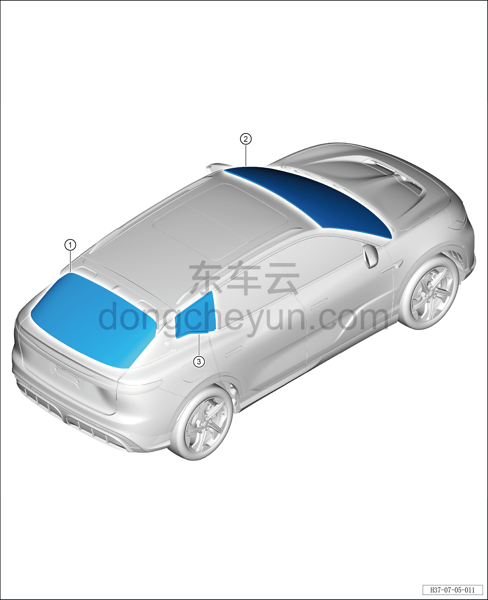

# Расположение компонентов

> Открывающиеся элементы кузова › Стёкла › Расположение компонентов  
> Оригинал: `零部件位置图` · [dongcheyun 56746](https://dongcheyun.com/p/56746), страница `612de88694fc4a699c7ba13e946302c6` · [оглавление](../README.md)

| № | Наименование детали | Кол-во на автомобиль | Примечание |
|---|---|---|---|
| 1 | Заднее стекло | 1 | - |
| 2 | Лобовое стекло | 1 | - |
| 3 | Стекло заднего форточного окна | 2 | - |
