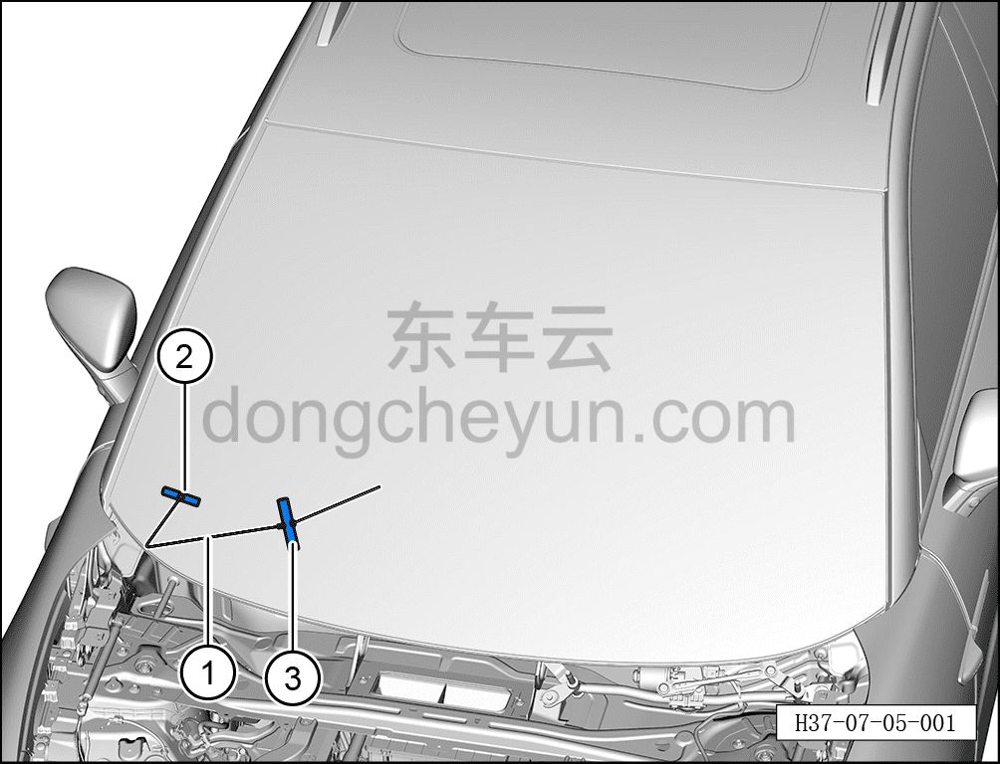
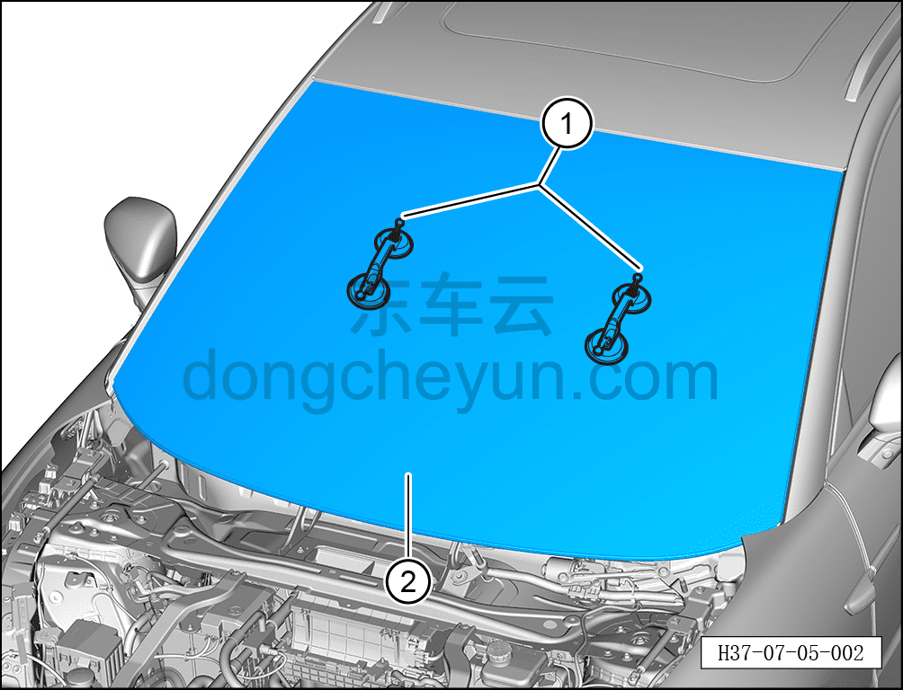

# Снятие и установка лобового стекла

> Открывающиеся элементы кузова › Стёкла › Лобовое стекло  
> Оригинал: `拆卸与安装前风窗玻璃` · [dongcheyun 56746](https://dongcheyun.com/p/56746), страница `0102d113da004ab391e539a9a337e61a` · [оглавление](../README.md)

**Порядок снятия**

**Примечание:**

**- При снятии лобового стекла необходимо избегать порезов кузова и салона.**

1. Выключите все электроприборы, отключите питание.

2. Выполните операцию обесточивания автомобиля для ремонта. См. [3.1.4.1 Обесточивание автомобиля](../03-техническое-обслуживание/005-обесточивание-автомобиля.md)

3. Снимите капот. См. [7.1.3.1 Снятие и установка капота](003-снятие-и-установка-капота.md)

4. Снимите левую нижнюю декоративную накладку лобового стекла. См. [8.6.7.7 Снятие и установка левой нижней декоративной накладки лобового стекла](../08-внутренняя-и-внешняя-отделка/244-снятие-и-установка-крышки-стеклоочистителя-в-сборе.md)

5. Снимите верхние защитные накладки левой и правой стоек A. См. [8.5.5.1 Снятие и установка верхней защитной накладки левой стойки A](../08-внутренняя-и-внешняя-отделка/131-снятие-и-установка-левой-верхней-накладки-стойки-a.md)

6. Снимите датчик дождя и освещённости. См. [9.5.6.1 Снятие и установка датчика дождя и освещённости](../09-электрическая-и-электронная-система/048-снятие-и-установка-датчика-дождя-и-освещённости.md)

7. Снимите бинокулярную переднюю камеру. См. [9.10.4.3 Снятие и установка бинокулярной передней камеры](../09-электрическая-и-электронная-система/105-снятие-и-установка-передней-бинокулярной.md)

8. Снимите внутреннее зеркало заднего вида. См. [8.6.8.9 Снятие и установка внутреннего зеркала заднего вида](../08-внутренняя-и-внешняя-отделка/262-снятие-и-установка-внутреннего-зеркала-заднего-вида.md)

9. Снимите лобовое стекло.

a. С помощью шила проколите клеевой герметизирующий материал лобового стекла.

b. Пропустите режущую струну через клеевой герметизирующий материал, вытяните её внутрь автомобиля.

c. Зафиксируйте режущую струну ①, вытянутую внутрь автомобиля, ручками ② и ③, чтобы предотвратить её выпадение.

d. С помощью второго специалиста вырежьте приклеенное стекло.

**Внимание:**

**- При снятии разбитого лобового стекла необходимо использовать средства защиты.**

**- Разбитое лобовое стекло может повредить кузов и внутреннюю обивку кузова.**

**- Перед резкой герметизирующего материала закройте панель приборов, чтобы не повредить приборы и обивку.**

**- При выполнении последующих операций снятия необходимо действовать с помощью второго специалиста.**

e. Установите присоску для стекла ① на лобовое стекло ②.

f. Аккуратно снимите лобовое стекло ②.

**Внимание:**

**- При снятии повреждённого лобового стекла необходимо надевать средства защиты и защитные очки.**

**- После завершения снятия необходимо своевременно и полностью, без остатков, убрать осколки разбитого стекла.**

**Порядок установки**

Установка выполняется в обратном порядке.

**Внимание:**

**- При установке лобового стекла необходимо очистить лобовое стекло и посадочную поверхность кузова с помощью очистителя для стекла.**

**- Если установку необходимо выполнить немедленно после очистки, посадочное место лобового стекла необходимо активировать с помощью активатора.**

**- Активатор нельзя допускать в контакт с грунтовкой (базовым покрытием), иначе это повредит лакокрасочное покрытие.**

**- Активатор токсичен, при выполнении работ необходимо надевать средства защиты от отравления, чтобы избежать случайного контакта с телом.**

**- Активатор, грунтовка и герметик для стекла должны быть одного бренда.**

**- Керамическое покрытие на лобовом стекле не является грунтовкой, при нанесении герметика необходимо обязательно нанести грунтовку.**

**- При приклеивании стекла устанавливайте и прижимайте его осторожно, избегая возникновения монтажных напряжений.**

**- При выступании клея вытрите остатки клея чистящей тканью.**

**- Через 3-4 часа (при температуре около 20°C) после установки лобового стекла проведите испытание дождеванием.**

**- При выполнении проверки дождеванием давление воды должно поддерживаться в подходящем диапазоне.**

**- В период высыхания нельзя подавать сжатый воздух на место нанесения герметика.**

**- При обнаружении мест утечки заделайте их герметиком.**
