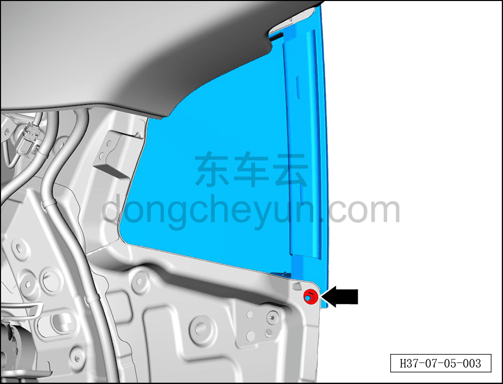
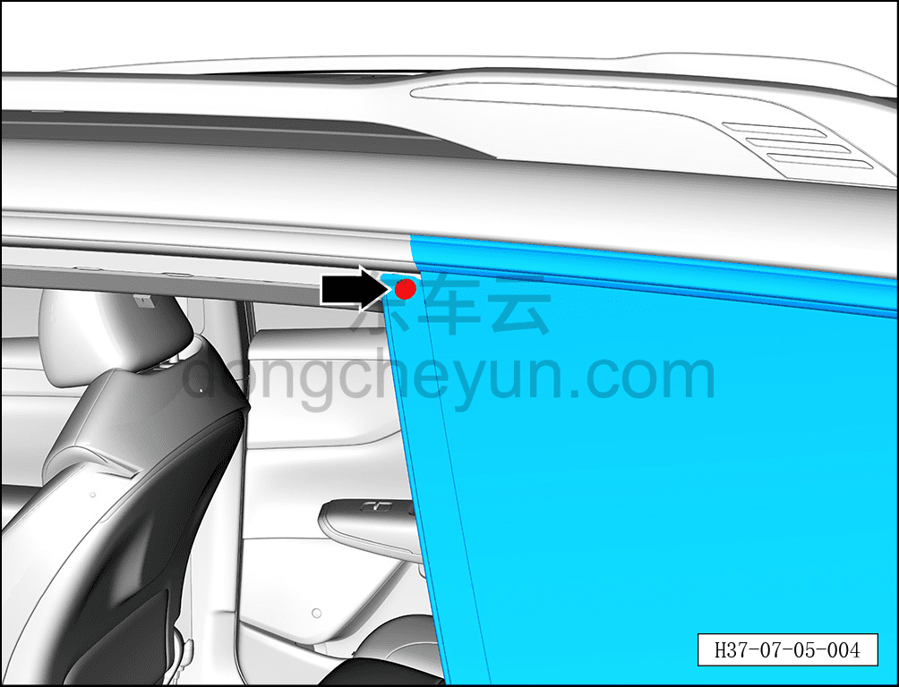
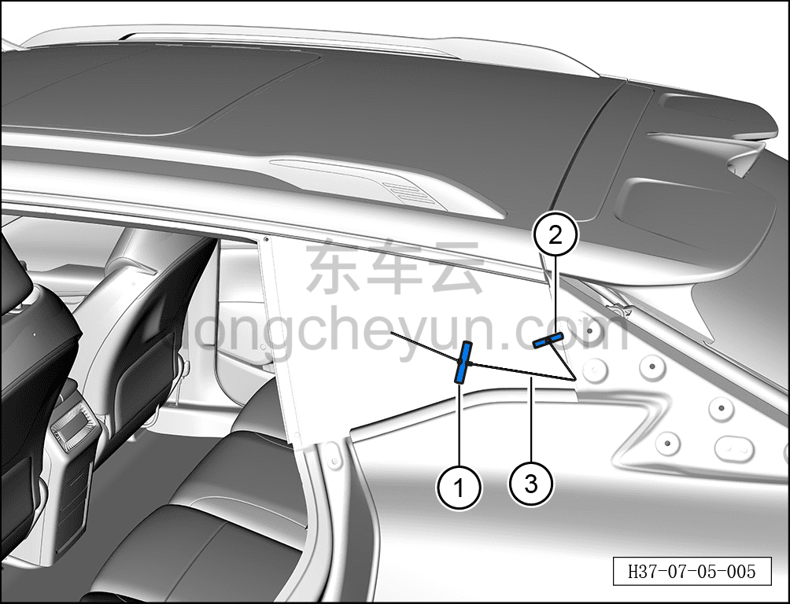
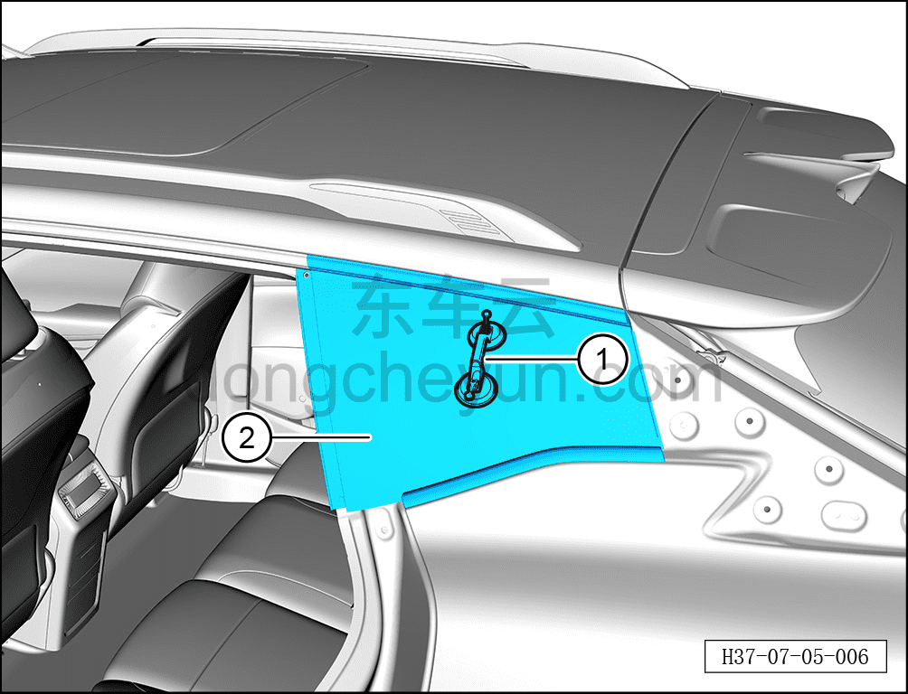

# Снятие и установка стекла левого заднего форточного окна

> Открывающиеся элементы кузова › Стёкла › Форточное окно  
> Оригинал: `拆卸与安装左后角窗玻璃` · [dongcheyun 56746](https://dongcheyun.com/p/56746), страница `46b13db3048646ef9ef17479439815b3` · [оглавление](../README.md)

**Порядок снятия**

**Примечание:**

**- Далее описано стекло левого заднего форточного окна, правая сторона выполняется по аналогии с левой.**

**- При снятии стекла левого заднего форточного окна необходимо избегать порезов кузова и салона.**

1. Выключите все электроприборы, отключите питание.

2. Снимите внутреннюю обивку левого заднего форточного окна. См. [8.5.5.11 Снятие и установка внутренней обивки левого заднего форточного окна](../08-внутренняя-и-внешняя-отделка/141-снятие-и-установка-обивки-левого-заднего-углового.md)

3. Снимите наружную декоративную накладку левой стойки B заднего борта. См. [8.6.2.2 Снятие и установка наружной декоративной накладки стойки B бокового ограждения слева](../08-внутренняя-и-внешняя-отделка/159-снятие-и-установка-наружной-накладки-стойки-b-левой.md)

4. Снимите стекло левого заднего форточного окна.

a. С помощью торцевой головки 10 мм выверните крепёжную гайку стекла левого заднего форточного окна.

Момент затяжки гайки: 8±1 Н·м

b. С помощью инструмента для снятия заклёпок снимите крепёжную заклёпку стекла левого заднего форточного окна.

c. С помощью шила проколите клеевой герметизирующий материал стекла левого заднего форточного окна.

d. Пропустите режущую струну через клеевой герметизирующий материал, вытяните её внутрь автомобиля.

e. Зафиксируйте режущую струну ③, вытянутую внутрь автомобиля, ручками ① и ②, чтобы предотвратить её выпадение.

f. С помощью второго специалиста вырежьте приклеенное стекло.

**Внимание:**

**- При снятии разбитого стекла левого заднего форточного окна необходимо использовать средства защиты.**

**- Разбитое стекло левого заднего форточного окна может повредить кузов и внутреннюю обивку кузова.**

**- Перед резкой герметизирующего материала закройте обивку, чтобы не повредить обивку.**

**- После завершения снятия с помощью пылесоса своевременно и полностью, без остатков, убрать осколки разбитого стекла.**

**- При выполнении последующих операций снятия необходимо действовать с помощью второго специалиста.**

g. Установите присоску для стекла ① на стекло левого заднего форточного окна ②.

h. Аккуратно снимите стекло левого заднего форточного окна ②.

**Порядок установки**

Установка выполняется в обратном порядке.

**Внимание:**

**- При установке стекла необходимо очистить стекло заднего форточного окна и посадочную поверхность кузова с помощью очистителя для стекла.**

**- После очистки клеевая посадочная поверхность заднего бокового стекла должна оставаться чистой, без масляных загрязнений.**

**- Если установку необходимо выполнить немедленно после очистки, посадочное место стекла левого заднего форточного окна необходимо активировать с помощью активатора.**

**- Активатор нельзя допускать в контакт с грунтовкой (базовым покрытием), иначе это повредит лакокрасочное покрытие.**

**- Активатор нельзя наносить на прозрачную область стекла.**

**- Активатор токсичен, при выполнении работ необходимо надевать средства защиты от отравления, чтобы избежать случайного контакта с телом.**

**- Через 3-4 часа (при температуре около 20°C) после установки заднего форточного стекла проведите испытание дождеванием.**

**- При выполнении проверки дождеванием давление воды должно поддерживаться в подходящем диапазоне.**

**- В период высыхания нельзя подавать сжатый воздух на место нанесения герметика.**

**- При обнаружении мест утечки заделайте их герметиком.**
