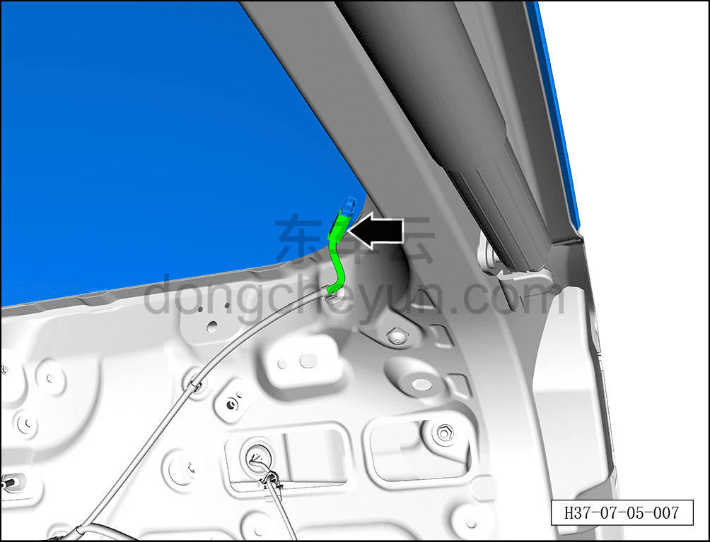
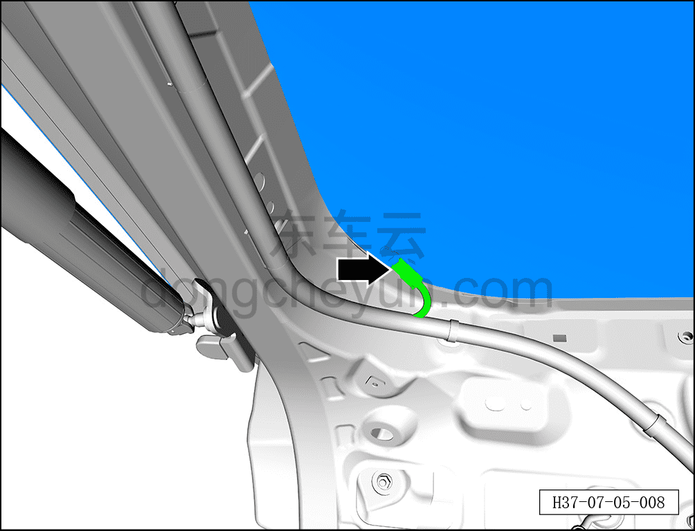
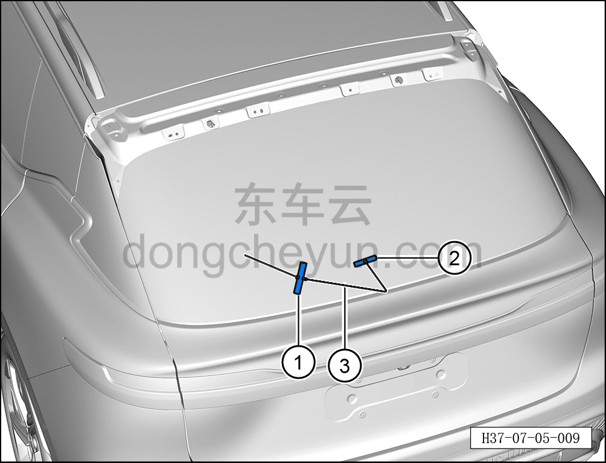
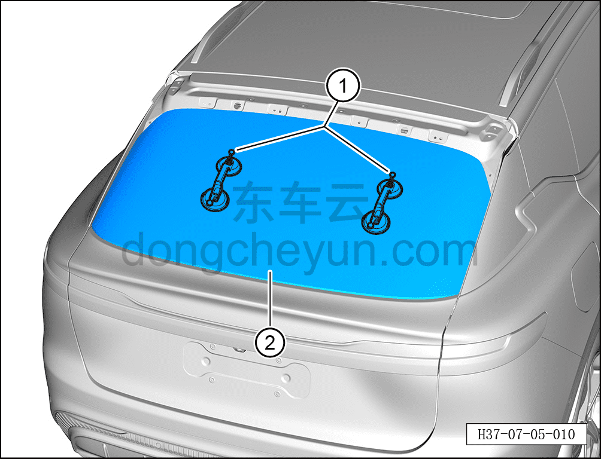

# Снятие и установка заднего стекла

> Открывающиеся элементы кузова › Стёкла › Заднее стекло  
> Оригинал: `拆卸与安装后风窗玻璃` · [dongcheyun 56746](https://dongcheyun.com/p/56746), страница `9220a5fa2de145ddb7be5aa62c861444` · [оглавление](../README.md)

**Порядок снятия**

**Примечание:**

**- При снятии заднего стекла необходимо избегать порезов кузова.**

1. Выключите все электроприборы, отключите питание.

2. Выполните операцию обесточивания автомобиля для ремонта. См. [3.1.4.1 Обесточивание автомобиля](../03-техническое-обслуживание/005-обесточивание-автомобиля.md)

3. Снимите спойлер. См. [8.6.6.8 Снятие и установка спойлера](../08-внутренняя-и-внешняя-отделка/221-снятие-и-установка-спойлера.md)

4. Снимите левую и правую декоративные накладки двери багажника. См. [8.4.4.3 Снятие и установка левой декоративной накладки двери багажника](../08-внутренняя-и-внешняя-отделка/123-снятие-и-установка-левой-накладки-двери-багажника.md)

5. Снимите заднее стекло.

a. Удерживая фиксатор разъёма, отсоедините разъём заднего стекла и жгута двери багажника в сборе.

b. Удерживая фиксатор разъёма, отсоедините разъём заднего стекла и жгута двери багажника в сборе.

c. С помощью шила проколите клеевой герметизирующий материал заднего стекла.

d. Пропустите режущую струну через клеевой герметизирующий материал, вытяните её внутрь автомобиля.

e. Зафиксируйте режущую струну ③ внутри автомобиля ручками ① и ②, чтобы предотвратить её выпадение.

f. С помощью второго специалиста вырежьте приклеенное стекло.

**Внимание:**

**- При снятии разбитого заднего стекла необходимо использовать средства защиты.**

**- Разбитое заднее стекло может повредить кузов и внутреннюю обивку кузова.**

**- Перед резкой герметизирующего материала закройте обивку, чтобы не повредить обивку.**

**- При выполнении последующих операций снятия необходимо действовать с помощью второго специалиста.**

**- При снятии повреждённого стекла двери багажника необходимо надевать средства защиты и защитные очки.**

**- После завершения снятия с помощью пылесоса своевременно и полностью, без остатков, убрать осколки разбитого стекла.**

g. Установите присоску для стекла ① на заднее стекло ②.

h. Аккуратно снимите заднее стекло ②.

**Порядок установки**

Установка выполняется в обратном порядке.

**Внимание:**

**- При установке стекла необходимо очистить заднее стекло и посадочную поверхность кузова с помощью очистителя для стекла.**

**- После очистки клеевая посадочная поверхность стекла двери багажника должна оставаться чистой, без масляных загрязнений.**

**- Если установку необходимо выполнить немедленно после очистки, посадочное место заднего стекла необходимо активировать с помощью активатора.**

**- Активатор нельзя допускать в контакт с грунтовкой (базовым покрытием), иначе это повредит лакокрасочное покрытие.**

**- Активатор нельзя наносить на прозрачную область стекла.**

**- Активатор токсичен, при выполнении работ необходимо надевать средства защиты от отравления, чтобы избежать случайного контакта с телом.**

**- Керамическое покрытие на стекле двери багажника не является грунтовкой, при нанесении герметика необходимо обязательно нанести грунтовку.**

**- При приклеивании стекла устанавливайте и прижимайте его осторожно, избегая возникновения монтажных напряжений.**

**- При выступании клея вытрите остатки клея чистящей тканью.**

**- Через 3-4 часа (при температуре около 20°C) после установки заднего стекла проведите испытание дождеванием.**

**- При выполнении проверки дождеванием давление воды должно поддерживаться в подходящем диапазоне.**

**- В период высыхания нельзя подавать сжатый воздух на место нанесения герметика.**

**- При обнаружении мест утечки заделайте их герметиком.**
