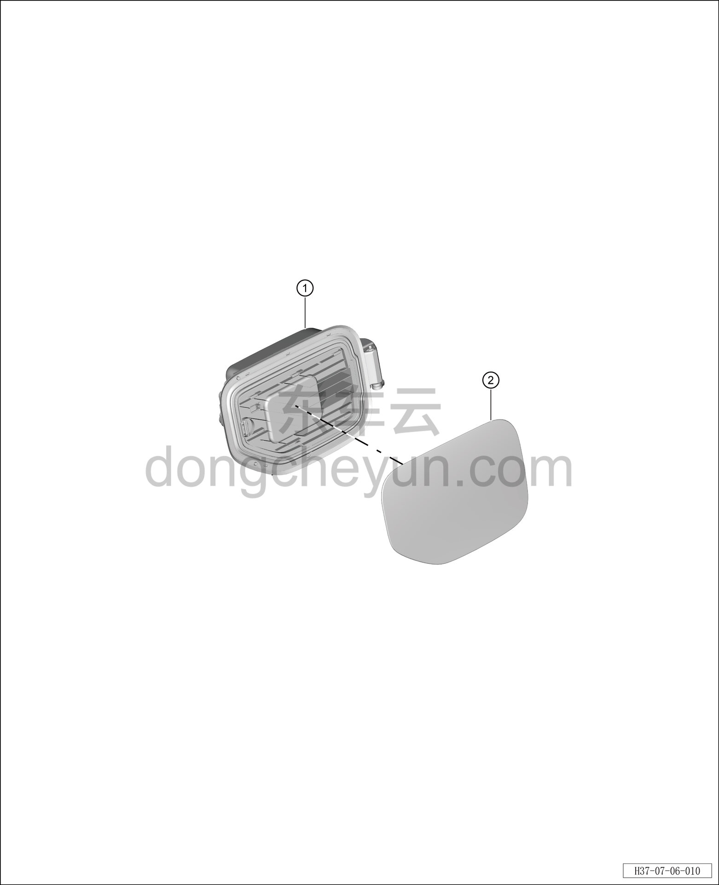

# Покомпонентный вид (деталировка)

> Открывающиеся элементы кузова › Зарядный порт › Покомпонентный вид (деталировка)  
> Оригинал: `结构分解图` · [dongcheyun 56746](https://dongcheyun.com/p/56746), страница `b109ef231ca04e43bb9dbc8a28aa35f6` · [оглавление](../README.md)

| № | Наименование детали | Кол-во на автомобиль | Примечание |
|---|---|---|---|
| 1 | Корпус лючка зарядного порта | 1 | - |
| 2 | Крышка лючка зарядного порта | 1 | - |
