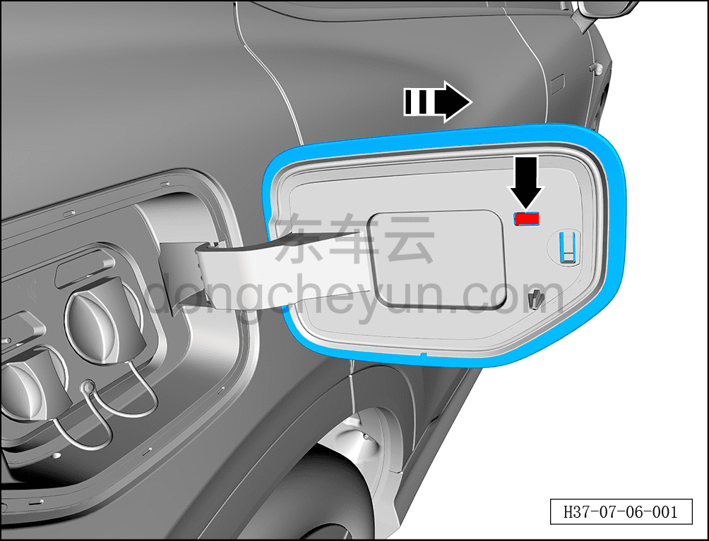
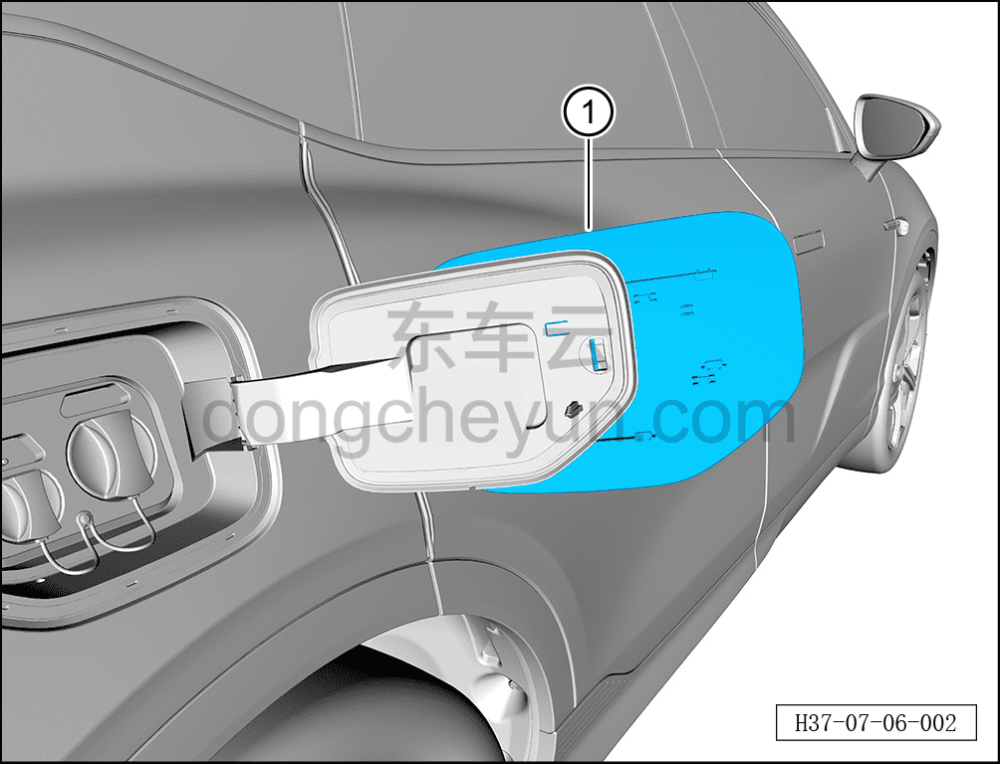

# Снятие и установка крышки лючка зарядного порта

> Открывающиеся элементы кузова › Зарядный порт › Лючок зарядного порта  
> Оригинал: `拆卸与安装充电口盖盖板` · [dongcheyun 56746](https://dongcheyun.com/p/56746), страница `05251da191a24eb2ad92b5438692a70f` · [оглавление](../README.md)

**Порядок снятия**

1. Выключите все электроприборы, отключите питание.

2. Откройте лючок зарядного порта.

3. Снимите крышку лючка зарядного порта.

a. С помощью плоской отвёртки отогните наружу крепёжную клипсу, соединяющую корпус лючка зарядного порта с крышкой лючка зарядного порта.

b. Сдвиньте крышку лючка зарядного порта в направлении стрелки.

**Внимание:**

**- При снятии не повредите паз крышки лючка зарядного порта.**

c. Извлеките крышку лючка зарядного порта ①.

**Порядок установки**

Установка выполняется в обратном порядке.

**Внимание:**

**- Если паз крышки лючка зарядного порта сломан, необходимо заменить деталь на новую.**
