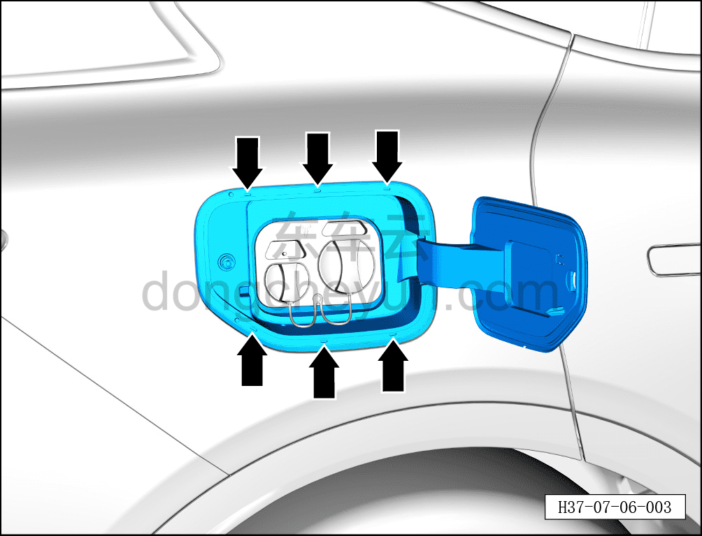
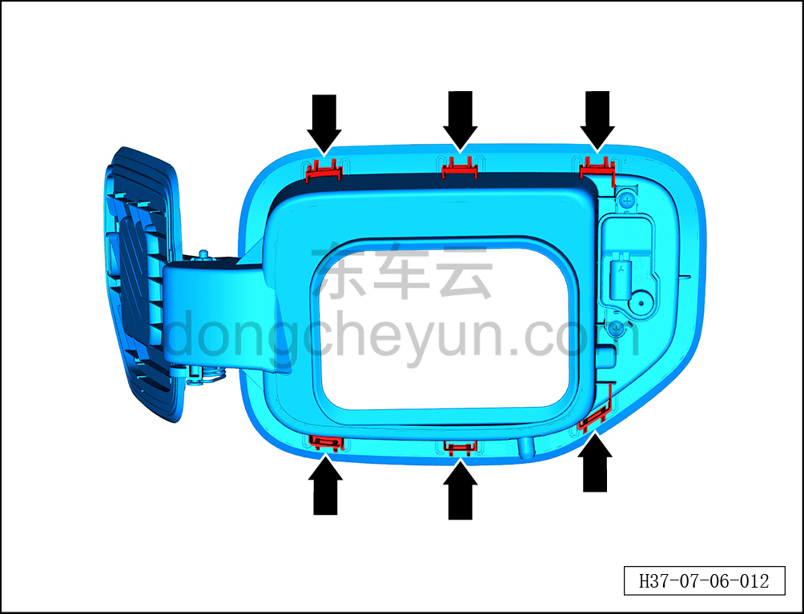
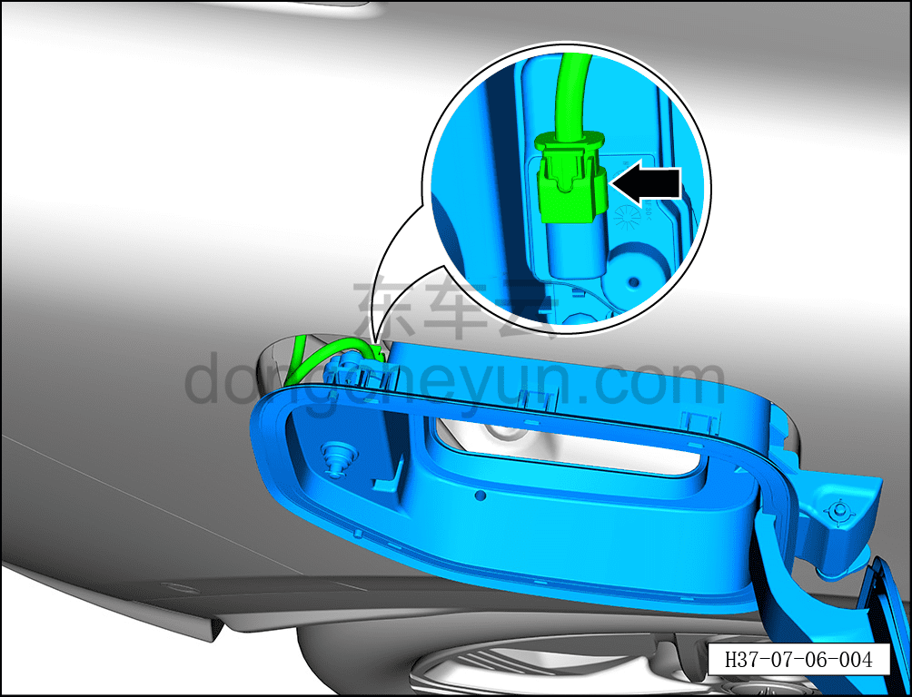

# Снятие и установка корпуса лючка зарядного порта

> Открывающиеся элементы кузова › Зарядный порт › Лючок зарядного порта  
> Оригинал: `拆卸与安装充电口盖本体` · [dongcheyun 56746](https://dongcheyun.com/p/56746), страница `956393c5633a40e9b260d899d4b8fe6c` · [оглавление](../README.md)

**Порядок снятия**

1. Выключите все электроприборы, отключите питание.

2. Выполните операцию обесточивания автомобиля для ремонта. См. [3.1.4.1 Обесточивание автомобиля](../03-техническое-обслуживание/005-обесточивание-автомобиля.md)

3. Снимите крышку лючка зарядного порта. См. [7.6.3.1 Снятие и установка крышки лючка зарядного порта](070-снятие-и-установка-крышки-лючка-зарядного-порта.md)

4. Снимите корпус лючка зарядного порта.

a. С помощью инструмента для снятия внутренней облицовки отогните наружу край корпуса лючка зарядного порта, отсоедините 6 крепёжных клипс в местах, указанных стрелками, извлеките корпус лючка зарядного порта наружу.

**Внимание:**

**- На задней стороне корпуса лючка зарядного порта имеется соединение жгута проводов, при извлечении избегайте его повреждения.**

b. Клипсы на задней стороне корпуса лючка зарядного порта показаны на левом рисунке.

c. Отведите назад фиксатор разъёма, удерживая фиксатор разъёма, отсоедините разъём корпуса лючка зарядного порта.

**Порядок установки**

Установка выполняется в обратном порядке.

**Внимание:**

**- Перед установкой проверьте клипсы на задней стороне корпуса лючка зарядного порта на отсутствие поломок, при их наличии необходимо заменить деталь на новую.**
