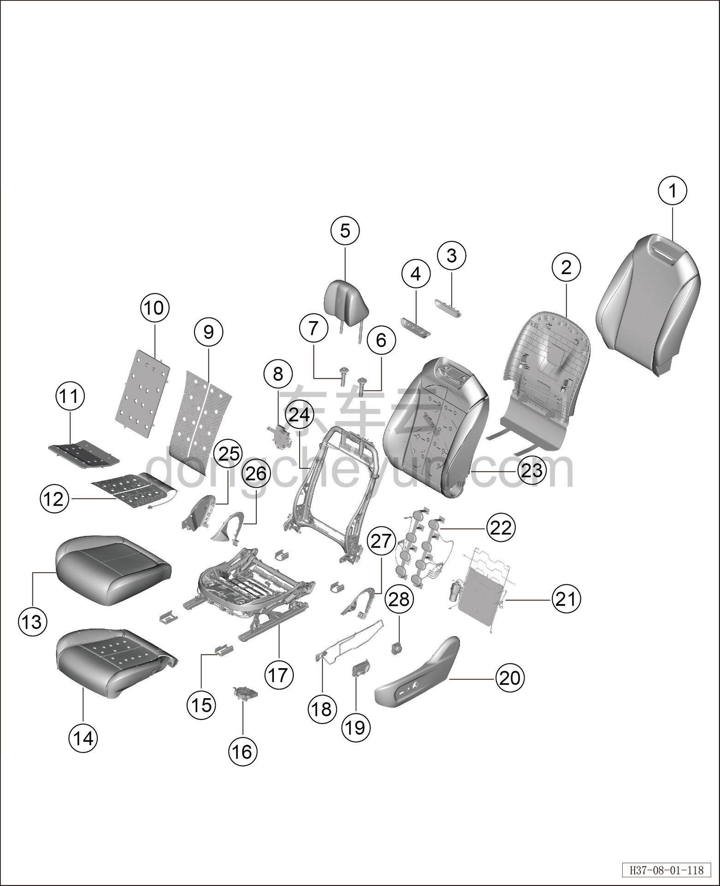

# Покомпонентный вид (деталировка) передних сидений

> Внутренняя и внешняя отделка › Сиденья  
> Оригинал: `前排座椅分解图` · [dongcheyun 56746](https://dongcheyun.com/p/56746), страница `fc1598c0514249a8b840b478ecabe3ae` · [оглавление](../README.md)

| № | Наименование детали | Кол-во на автомобиль | Примечание |
|---|---|---|---|
| 1 | Обивка спинки сиденья водителя | 1 | - |
| 2 | Задняя панель сиденья | 1 | - |
| 3 | Верхняя крышка спинки переднего сиденья в сборе | 1 | - |
| 4 | Основание верхней крышки спинки переднего сиденья | 1 | - |
| 5 | Подголовник передний | 1 | - |
| 6 | Запираемая направляющая втулка подголовника | 1 | - |
| 7 | Гладкая направляющая втулка подголовника | 1 | - |
| 8 | Узел вентилятора спинки переднего сиденья | 1 | - |
| 9 | Нагревательный коврик спинки | 1 | - |
| 10 | Вентиляционный мешок спинки переднего сиденья | 1 | - |
| 11 | Вентиляционный мешок подушки переднего сиденья | 1 | - |
| 12 | Нагревательный коврик подушки сиденья | 1 | - |
| 13 | Обивка подушки сиденья водителя | 1 | - |
| 14 | Пенонаполнитель подушки сиденья водителя | 4 | - |
| 15 | Крышка направляющих рельсов сиденья водителя | 1 | - |
| 16 | Узел вентилятора подушки переднего сиденья | 1 | - |
| 17 | Каркас подушки левого переднего сиденья в сборе | 1 | - |
| 18 | Монтажная проволока наружной накладки левого сиденья | 1 | - |
| 19 | Переключатель регулировки сиденья водителя | 1 | - |
| 20 | Наружная накладка сиденья водителя | 1 | - |
| 21 | Четырёхпозиционная поясничная поддержка | 1 | - |
| 22 | Массажный пневмомешок | 1 | - |
| 23 | Пенонаполнитель спинки сиденья водителя | 1 | - |
| 24 | Каркас спинки левого переднего сиденья в сборе | 1 | - |
| 25 | Внутренняя накладка сиденья водителя | 1 | - |
| 26 | Внутренний кожух внутренней стороны сиденья водителя | 1 | - |
| 27 | Внутренний кожух наружной стороны сиденья водителя | 1 | - |
| 28 | Переключатель поясничной поддержки слева | 1 | - |
