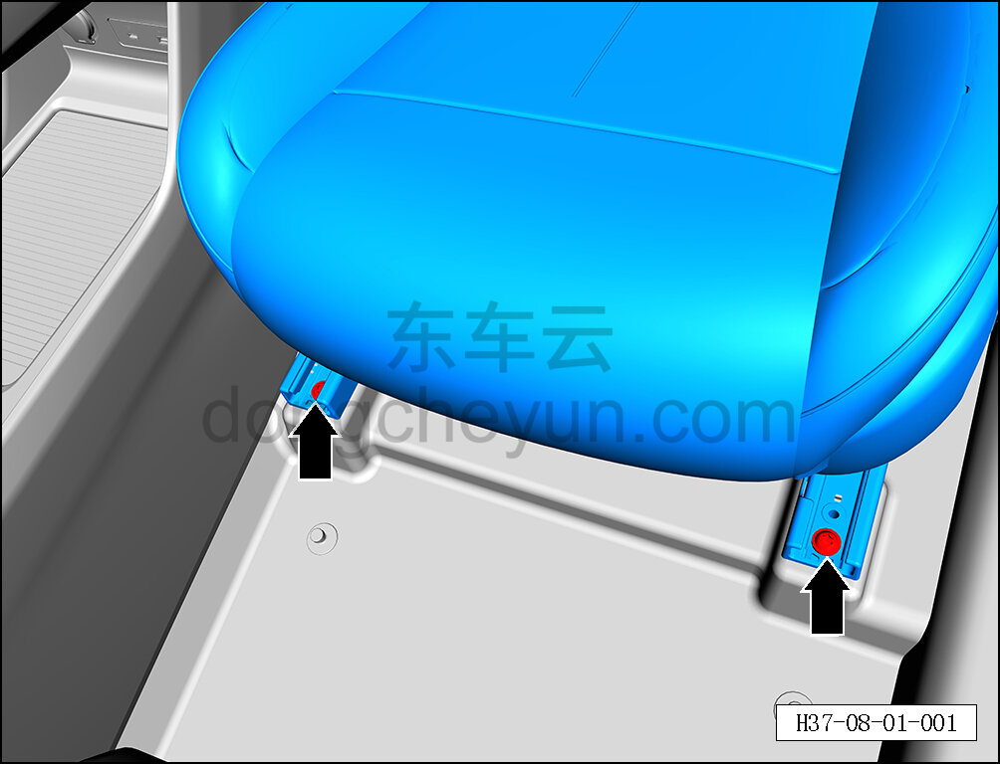
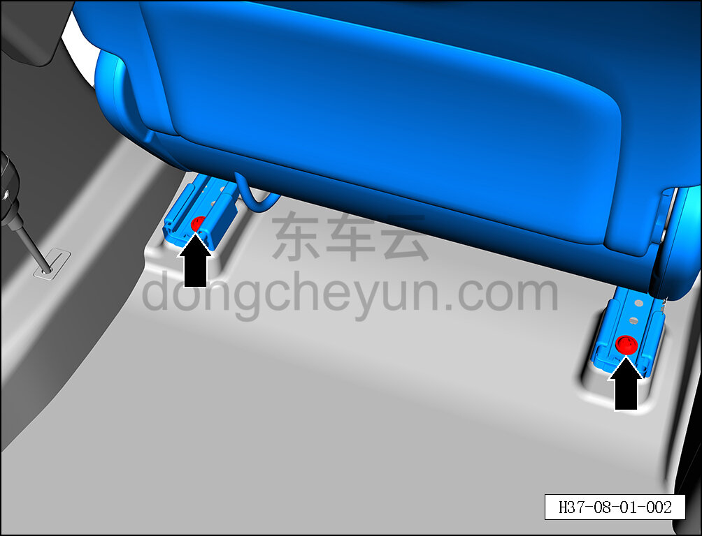
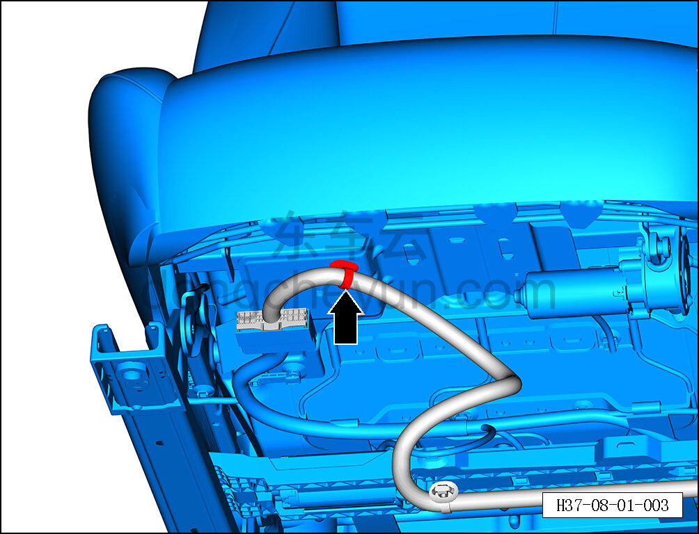
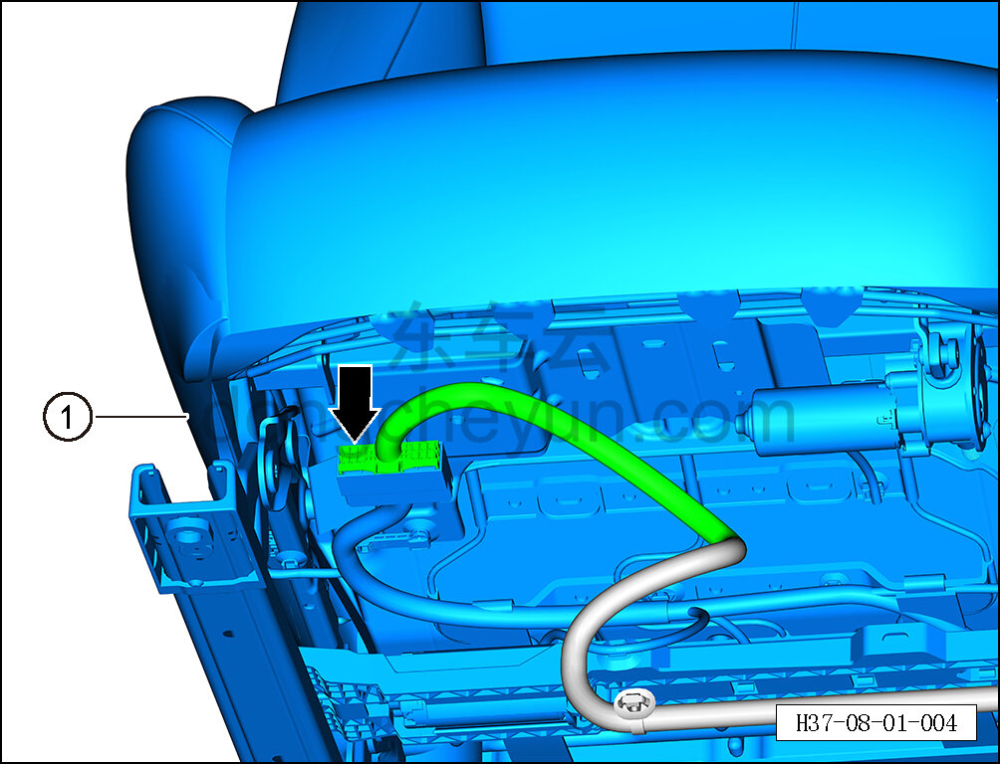

# Снятие и установка сиденья водителя в сборе

> Внутренняя и внешняя отделка › Сиденья › Снятие и установка передних сидений  
> Оригинал: `拆卸与安装驾驶员座椅总成` · [dongcheyun 56746](https://dongcheyun.com/p/56746), страница `bab83ac06bce4ebd9f097f73d82b99f9` · [оглавление](../README.md)

**Порядок снятия**

**Примечание:**

**- Далее описано снятие и установка сиденья водителя, пассажирское сиденье выполняется по аналогии с сиденьем водителя.**

1. Снимите сиденье водителя в сборе.

a. С помощью биты T50 выверните 2 передних крепёжных болта сиденья водителя в сборе.

Момент затяжки болта: 55±8 Н·м

b. Переместите сиденье в крайнее переднее положение, с помощью биты T50 выверните 2 задних крепёжных болта сиденья водителя в сборе.

Момент затяжки болта: 55±8 Н·м

c. Выключите все электрические потребители, отключите питание.

d. Выполните операцию обесточивания автомобиля перед ремонтом. См. [3.1.4.1 Обесточивание автомобиля](../03-техническое-обслуживание/005-обесточивание-автомобиля.md)

e. С помощью инструмента для снятия внутренней облицовки отсоедините крепёжную клипсу жгута сиденья водителя в сборе.

f. Удерживая фиксатор разъёма, отсоедините разъём сиденья водителя в сборе.

g. Совместно с ещё одним специалистом снимите сиденье водителя в сборе ①.

**Внимание:**

**- При извлечении сиденья водителя необходимо принять меры защиты, чтобы не поцарапать внутреннюю обивку или лакокрасочное покрытие.**

**Порядок установки **

Установка выполняется в обратном порядке.

**Внимание:**

**- Затяните крепёжные болты сиденья водителя в сборе с указанным моментом. **

**- После завершения установки проверьте нормальность работы всех функций сиденья водителя. **
