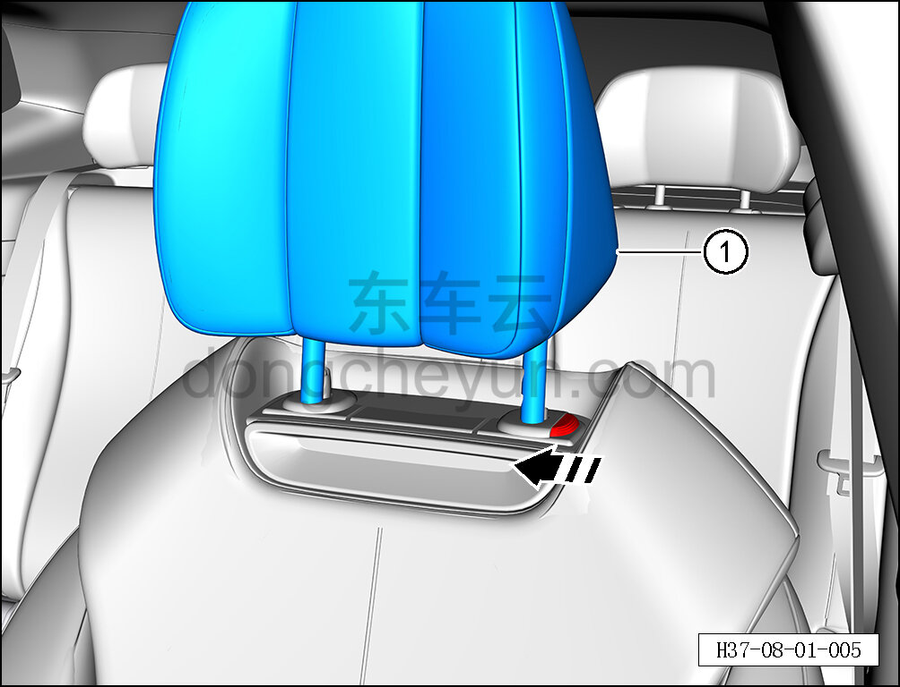

# Снятие и установка переднего подголовника

> Внутренняя и внешняя отделка › Сиденья › Снятие и установка передних сидений  
> Оригинал: `拆卸与安装前头枕` · [dongcheyun 56746](https://dongcheyun.com/p/56746), страница `b1a3450186364670837737608d7586bd` · [оглавление](../README.md)

**Порядок снятия**

**Примечание:**

**- Далее описано снятие и установка переднего подголовника сиденья водителя, передний подголовник пассажирского сиденья выполняется по аналогии с подголовником сиденья водителя.**

1. Снимите передний подголовник сиденья водителя.

a. Нажмите кнопку регулировки высоты подголовника в направлении стрелки.

b. Поднимите вверх и снимите передний подголовник ①.

**Порядок установки**

Установка выполняется в обратном порядке.
