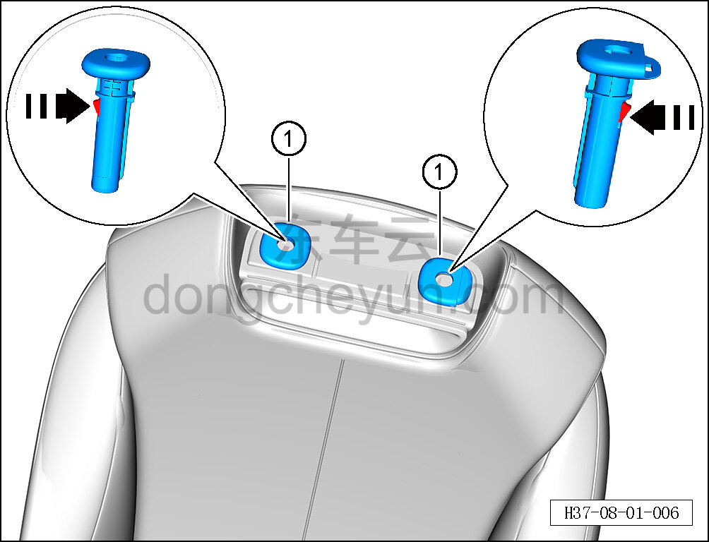

# Снятие и установка направляющей втулки подголовника

> Внутренняя и внешняя отделка › Сиденья › Снятие и установка передних сидений  
> Оригинал: `拆卸与安装头枕导向套` · [dongcheyun 56746](https://dongcheyun.com/p/56746), страница `08f34fde34c64d1fa8668c5320c146ba` · [оглавление](../README.md)

**Порядок снятия**

**Примечание:**

**- Далее описано снятие и установка направляющей втулки подголовника сиденья водителя, направляющая втулка подголовника пассажирского сиденья выполняется по аналогии с направляющей втулкой подголовника сиденья водителя.**

1. Снимите передний подголовник сиденья водителя. См. [8.1.3.2 Снятие и установка переднего подголовника](004-снятие-и-установка-переднего-подголовника.md)

2. Снимите направляющую втулку подголовника сиденья водителя.

a. С помощью плоской отвёртки отсоедините крепёжную клипсу внутри направляющей втулки.

b. Снимите направляющую втулку подголовника ①.

**Порядок установки**

Установка выполняется в обратном порядке.

**Внимание:**

**- После завершения установки проверьте нормальность функции регулировки подголовника. **
