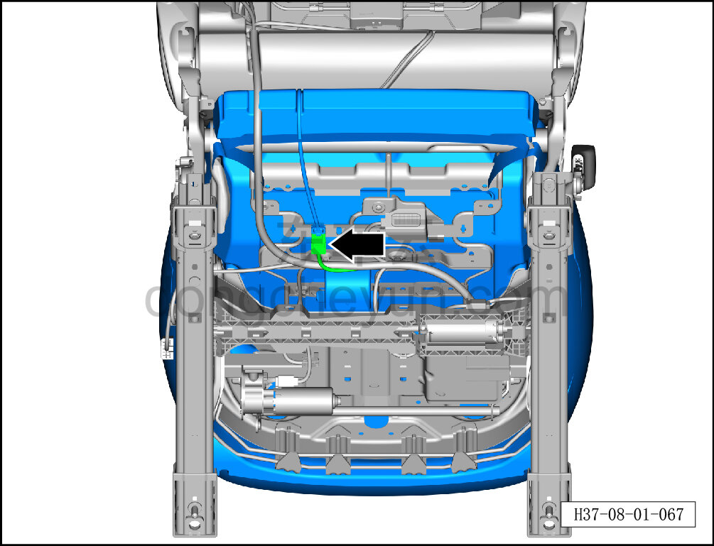
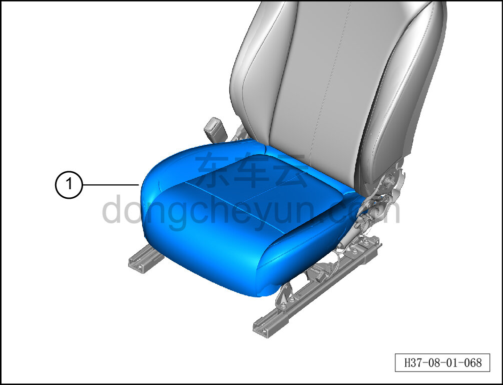

# Снятие и установка обивки подушки сиденья водителя

> Внутренняя и внешняя отделка › Сиденья › Снятие и установка передних сидений  
> Оригинал: `拆卸与安装主驾座垫面套` · [dongcheyun 56746](https://dongcheyun.com/p/56746), страница `e133c118c4024620bf7d396e129aaf26` · [оглавление](../README.md)

**Порядок снятия**

**Примечание:**

**- Далее описано снятие и установка обивки подушки сиденья водителя, обивка подушки пассажирского сиденья выполняется по аналогии с обивкой подушки сиденья водителя.**

1. Снимите сиденье водителя в сборе. См. [8.1.3.1 Снятие и установка сиденья водителя в сборе](003-снятие-и-установка-сиденья-водителя-в-сборе.md)

2. Снимите внутренний кожух наружной стороны сиденья водителя. См. [8.1.3.7 Снятие и установка внутреннего кожуха наружной стороны сиденья водителя](009-снятие-и-установка-внутреннего-кожуха-наружной-стороны.md)

4. Снимите монтажную проволоку наружной накладки левого сиденья. См. [8.1.3.15 Снятие и установка монтажной проволоки наружной накладки левого сиденья](017-снятие-и-установка-монтажной-проволоки-наружной.md)

5. Снимите узел вентилятора подушки переднего сиденья. См. [8.1.3.14 Снятие и установка узла вентилятора подушки сиденья](016-снятие-и-установка-узла-вентилятора-подушки-сиденья.md)

6. Снимите обивку подушки сиденья водителя.

a. Удерживая фиксатор разъёма, отсоедините разъём жгута нагревательного коврика подушки сиденья.

b. Отсоедините крепёжные клипсы по периметру обивки подушки сиденья водителя, извлеките обивку подушки сиденья водителя ①.

**Порядок установки**

Установка выполняется в обратном порядке.
