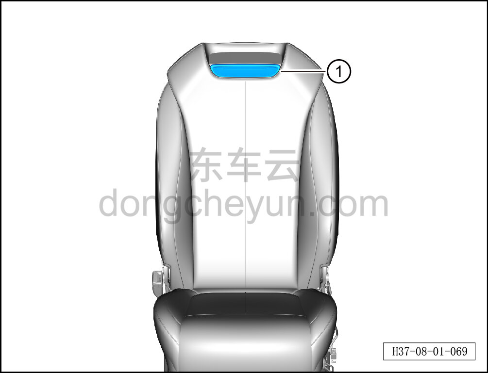
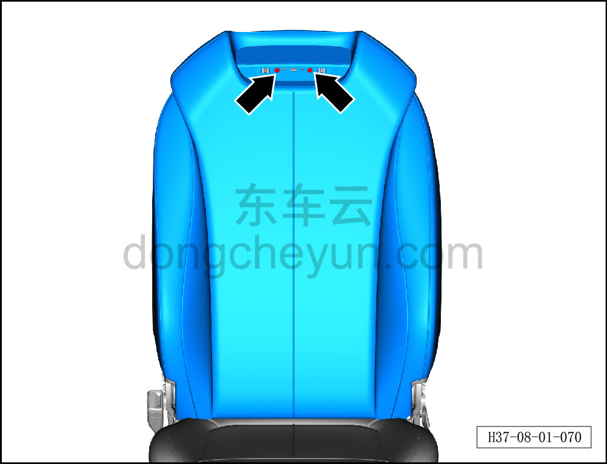
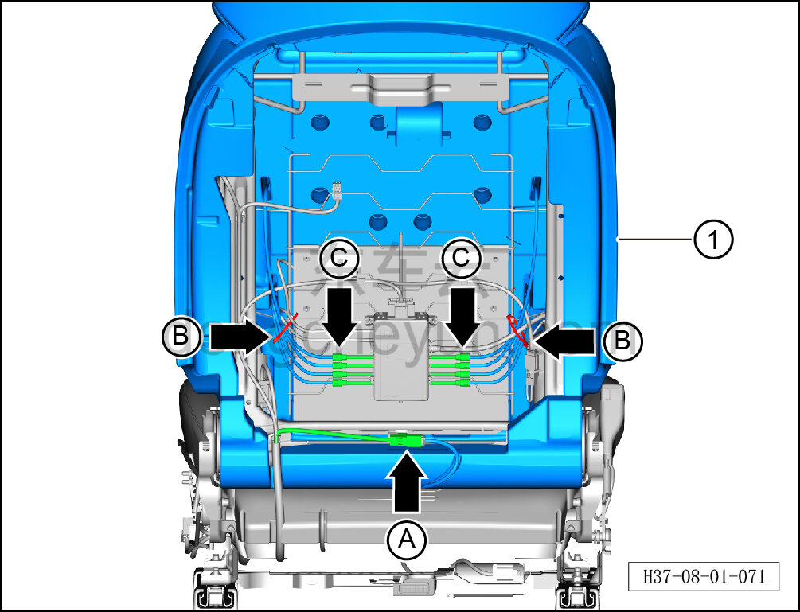

# Снятие и установка обивки спинки сиденья водителя

> Внутренняя и внешняя отделка › Сиденья › Снятие и установка передних сидений  
> Оригинал: `拆卸与安装主驾靠背面套` · [dongcheyun 56746](https://dongcheyun.com/p/56746), страница `33cba00e82d1444494aa99f132f0d4bf` · [оглавление](../README.md)

**Порядок снятия**

**Примечание:**

**- Далее описано снятие и установка обивки спинки сиденья водителя в сборе, обивка спинки пассажирского сиденья в сборе выполняется по аналогии с обивкой спинки сиденья водителя.**

1. Снимите сиденье водителя в сборе. См. [8.1.3.1 Снятие и установка сиденья водителя в сборе](003-снятие-и-установка-сиденья-водителя-в-сборе.md)

2. Снимите направляющую втулку подголовника. См. [8.1.3.3 Снятие и установка направляющей втулки подголовника](005-снятие-и-установка-направляющей-втулки-подголовника.md)

3. Снимите заднюю панель сиденья водителя. См. [8.1.3.12 Снятие и установка задней панели сиденья](014-снятие-и-установка-задней-панели-сиденья.md)

4. Снимите внутренний кожух наружной стороны сиденья водителя. См. [8.1.3.7 Снятие и установка внутреннего кожуха наружной стороны сиденья водителя](009-снятие-и-установка-внутреннего-кожуха-наружной-стороны.md)

5. Снимите внутренний кожух внутренней стороны сиденья водителя. См. [8.1.3.9 Снятие и установка внутреннего кожуха внутренней стороны сиденья водителя](011-снятие-и-установка-внутреннего-кожуха-внутренней.md)

6. Снимите узел вентилятора спинки переднего сиденья. См. [8.1.3.13 Снятие и установка узла вентилятора спинки переднего сиденья](015-снятие-и-установка-узла-вентилятора-спинки.md)

7. Снимите обивку спинки сиденья водителя.

a. С помощью инструмента для снятия внутренней облицовки отсоедините клипсу ① обивки спинки сиденья водителя.

b. С помощью крестовой отвёртки выверните 2 крепёжных винта обивки спинки сиденья водителя.

c. Извлеките обивку спинки сиденья водителя в сборе ①.

d. Удерживая фиксатор разъёма, отсоедините разъём A жгута нагревательного коврика спинки.

e. С помощью ножниц перережьте 2 стяжки B, фиксирующие четырёхпозиционную поясничную поддержку.

f. Отсоедините разъём C, соединяющий левый и правый массажные пневмомешки с четырёхпозиционной поясничной поддержкой.

g. Отсоедините крепёжные клипсы, соединяющие обивку спинки сиденья водителя в сборе с каркасом спинки сиденья водителя, извлеките обивку спинки сиденья водителя ①.

**Порядок установки**

Установка выполняется в обратном порядке.
