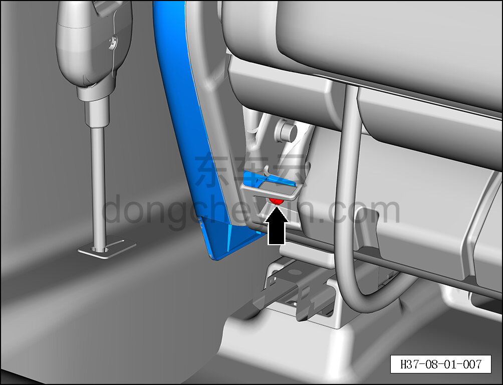
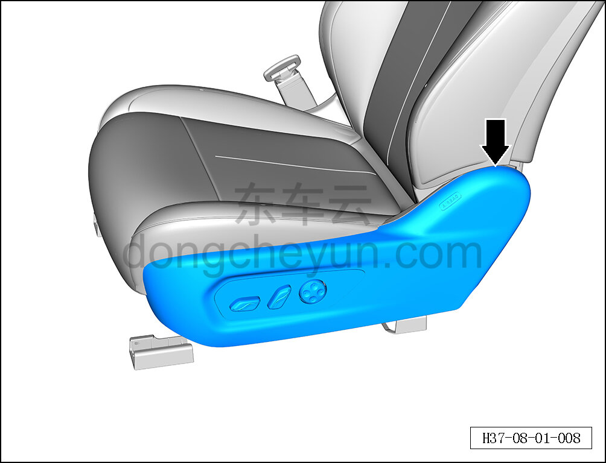
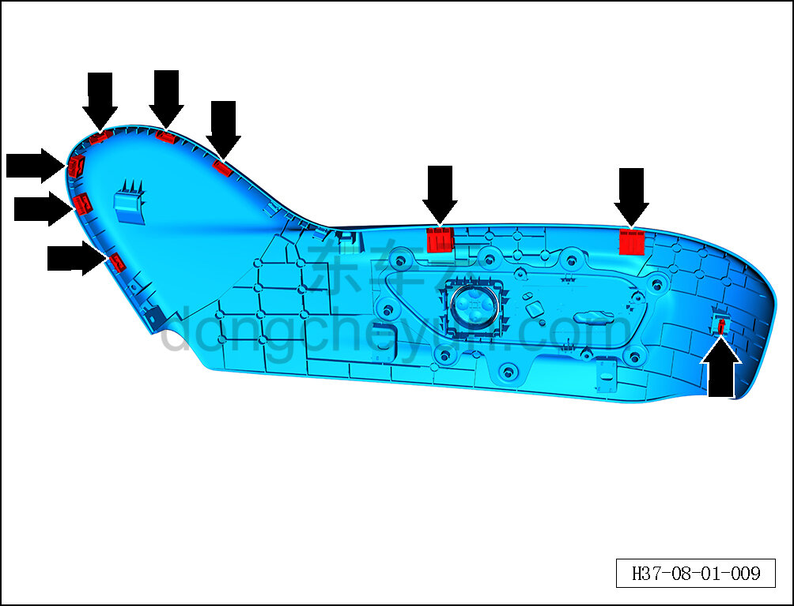
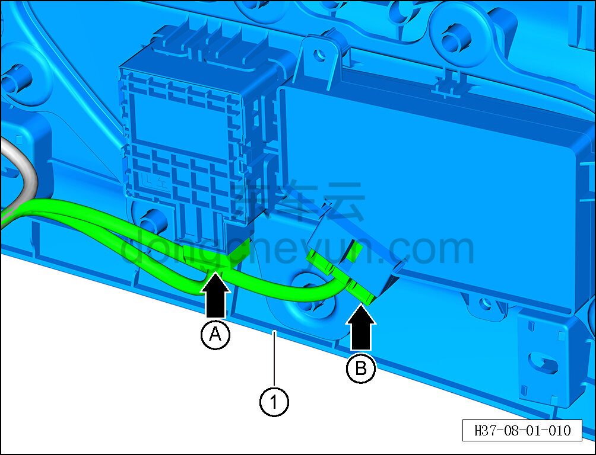

# Снятие и установка наружной накладки сиденья водителя

> Внутренняя и внешняя отделка › Сиденья › Снятие и установка передних сидений  
> Оригинал: `拆卸与安装主驾外侧护板` · [dongcheyun 56746](https://dongcheyun.com/p/56746), страница `15cebbfd1099406a95bdc5f02c05d4e1` · [оглавление](../README.md)

**Порядок снятия**

**Примечание:**

**- Далее описано снятие и установка наружной накладки сиденья водителя, наружная накладка пассажирского сиденья выполняется по аналогии с наружной накладкой сиденья водителя.**

1. Снимите наружную накладку сиденья водителя.

a. С помощью крестовой отвёртки выверните крепёжный винт наружной накладки сиденья водителя.

b. С помощью инструмента для снятия внутренней облицовки отсоедините 9 крепёжных клипс наружной накладки сиденья водителя.

c. Расположение клипс показано на рисунке слева.

d. Удерживая фиксатор разъёма, отсоедините разъём A переключателя поясничной поддержки сиденья водителя, отсоедините разъём B переключателя регулировки сиденья водителя.

e. Извлеките наружную накладку сиденья водителя ①.

**Порядок установки **

Установка выполняется в обратном порядке.

**Внимание:**

**- После завершения установки проверьте нормальность работы функций сиденья. **
