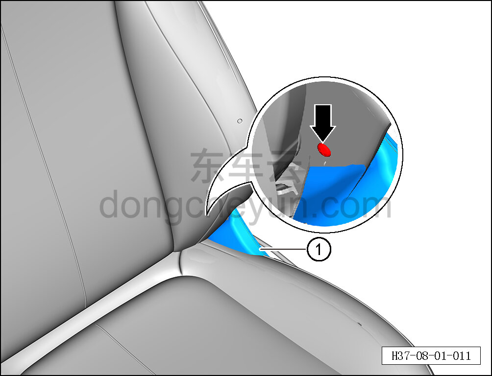

# Снятие и установка внутреннего кожуха наружной стороны сиденья водителя

> Внутренняя и внешняя отделка › Сиденья › Снятие и установка передних сидений  
> Оригинал: `拆卸与安装主驾外侧内罩盖` · [dongcheyun 56746](https://dongcheyun.com/p/56746), страница `09fe919e772249e7a4228fb130d48440` · [оглавление](../README.md)

**Порядок снятия**

**Примечание:**

**- Далее описано снятие и установка внутреннего кожуха наружной стороны сиденья водителя, внутренний кожух наружной стороны пассажирского сиденья выполняется по аналогии с внутренним кожухом наружной стороны сиденья водителя.**

1. Снимите наружную накладку сиденья водителя. См. [8.1.3.6 Снятие и установка наружной накладки сиденья водителя](008-снятие-и-установка-наружной-накладки-сиденья-водителя.md)

2. Снимите внутренний кожух наружной стороны сиденья водителя.

a. Приподнимите часть спинки сиденья, с помощью крестовой отвёртки выверните крепёжный винт внутреннего кожуха наружной стороны.

b. Извлеките внутренний кожух наружной стороны сиденья водителя ①.

**Порядок установки**

Установка выполняется в обратном порядке.

**Внимание:**

**- После завершения установки проверьте нормальность работы функций сиденья. **
