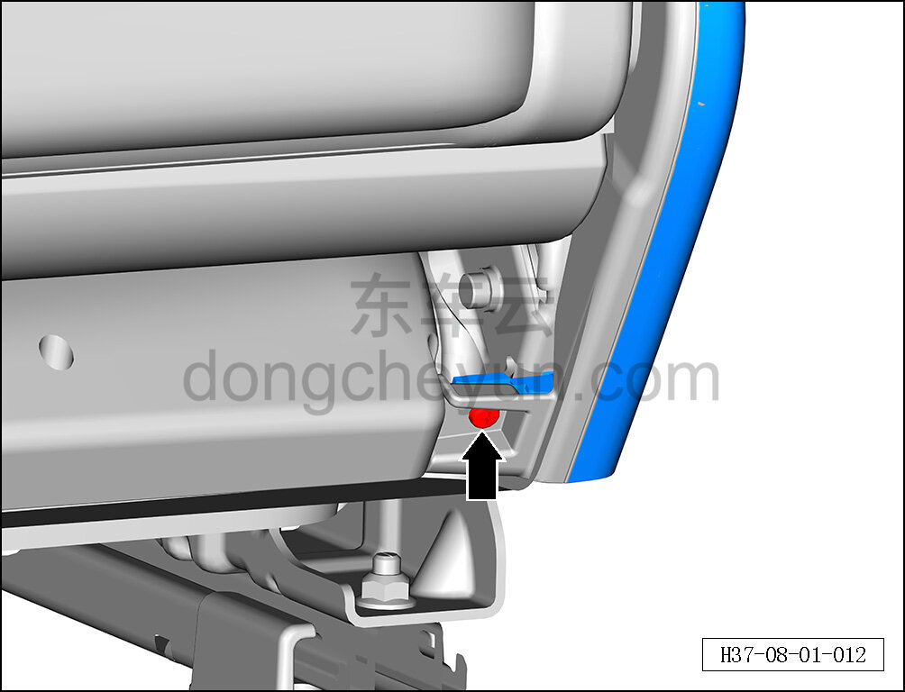
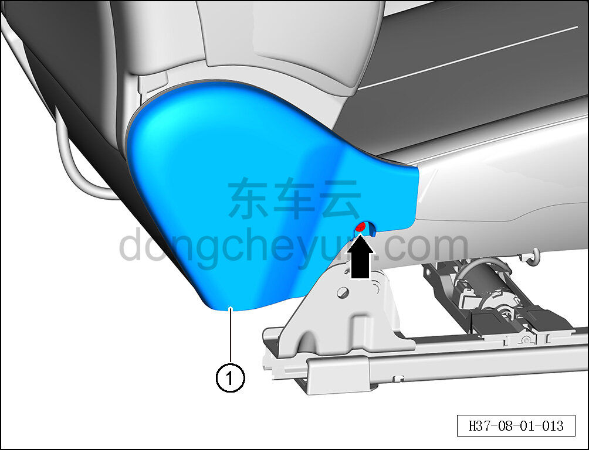
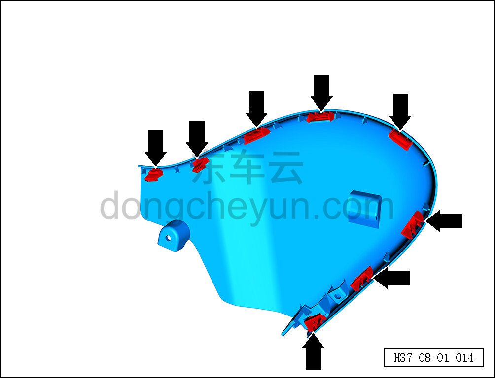

# Снятие и установка внутренней накладки сиденья водителя

> Внутренняя и внешняя отделка › Сиденья › Снятие и установка передних сидений  
> Оригинал: `拆卸与安装主驾内侧护板` · [dongcheyun 56746](https://dongcheyun.com/p/56746), страница `a693b50616e946af958f52fcaa94a46e` · [оглавление](../README.md)

**Порядок снятия**

**Примечание:**

**- Далее описано снятие и установка внутренней накладки сиденья водителя, внутренняя накладка пассажирского сиденья выполняется по аналогии с внутренней накладкой сиденья водителя.**

1. Снимите сиденье водителя в сборе. См. [8.1.3.1 Снятие и установка сиденья водителя в сборе](003-снятие-и-установка-сиденья-водителя-в-сборе.md)

2. Снимите замок переднего ремня безопасности. См. [11.1.6.4 Снятие и установка замка переднего ремня безопасности](../11-система-безопасности/014-снятие-и-установка-замка-переднего-ремня-безопасности.md)

3. Снимите внутреннюю накладку сиденья водителя.

a. С помощью крестовой отвёртки выверните крепёжный винт внутренней накладки сиденья водителя.

b. С помощью крестовой отвёртки выверните крепёжный винт внутренней накладки сиденья водителя.

c. С помощью инструмента для снятия внутренней облицовки отсоедините 8 крепёжных клипс внутренней накладки сиденья водителя.

d. Извлеките внутреннюю накладку сиденья водителя ①.

e. Расположение клипс показано на рисунке слева.

**Порядок установки **

Установка выполняется в обратном порядке.

**Внимание:**

** - После завершения установки проверьте нормальность работы функций сиденья. **
