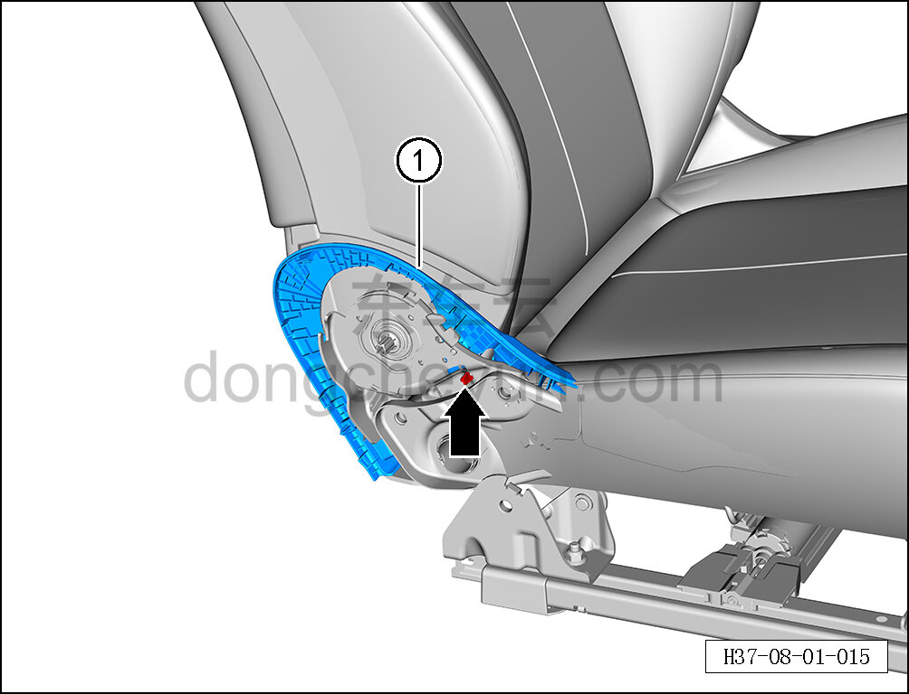

# Снятие и установка внутреннего кожуха внутренней стороны сиденья водителя

> Внутренняя и внешняя отделка › Сиденья › Снятие и установка передних сидений  
> Оригинал: `拆卸与安装主驾内侧内罩盖` · [dongcheyun 56746](https://dongcheyun.com/p/56746), страница `62ac1ef8b48e4bef87e3a88b8a710305` · [оглавление](../README.md)

**Порядок снятия**

**Примечание:**

**- Далее описано снятие и установка внутреннего кожуха внутренней стороны сиденья водителя, внутренний кожух внутренней стороны пассажирского сиденья выполняется по аналогии с внутренним кожухом внутренней стороны сиденья водителя. **

1. Снимите сиденье водителя в сборе, см. [8.1.3.1 Снятие и установка сиденья водителя в сборе](003-снятие-и-установка-сиденья-водителя-в-сборе.md)

2. Снимите внутреннюю накладку сиденья водителя. См. [8.1.3.8 Снятие и установка внутренней накладки сиденья водителя](010-снятие-и-установка-внутренней-накладки-сиденья-водителя.md)

3. Снимите внутренний кожух внутренней стороны сиденья водителя.

a. Отодвиньте часть подушки сиденья, отсоедините крепёжный зажим внутреннего кожуха внутренней стороны сиденья водителя.

b. Извлеките внутренний кожух внутренней стороны сиденья водителя ①.

**Порядок установки**

Установка выполняется в обратном порядке.

**Внимание:**

**-После завершения установки проверьте надёжность крепления.**
