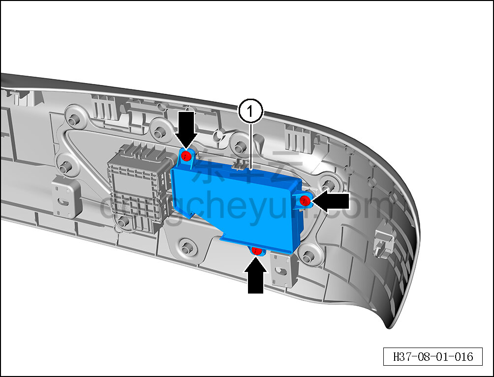

# Снятие и установка переключателя регулировки сиденья водителя

> Внутренняя и внешняя отделка › Сиденья › Снятие и установка передних сидений  
> Оригинал: `拆卸与安装主驾座椅调节开关` · [dongcheyun 56746](https://dongcheyun.com/p/56746), страница `68c3c91e1ad841d7a43b6b1ead3d6c2e` · [оглавление](../README.md)

**Порядок снятия**

**Примечание:**

**- Далее описано снятие и установка переключателя регулировки сиденья водителя, переключатель регулировки пассажирского сиденья выполняется по аналогии с переключателем регулировки сиденья водителя. **

1. Снимите наружную накладку сиденья водителя. См. [8.1.3.6 Снятие и установка наружной накладки сиденья водителя](008-снятие-и-установка-наружной-накладки-сиденья-водителя.md)

2. Снимите переключатель регулировки сиденья водителя.

a. С помощью крестовой отвёртки выверните 3 крепёжных винта переключателя регулировки сиденья водителя.

b. Извлеките переключатель регулировки сиденья водителя ①.

**Порядок установки**

Установка выполняется в обратном порядке.

**Внимание:**

**– После завершения установки проверьте нормальность работы функций сиденья. **
