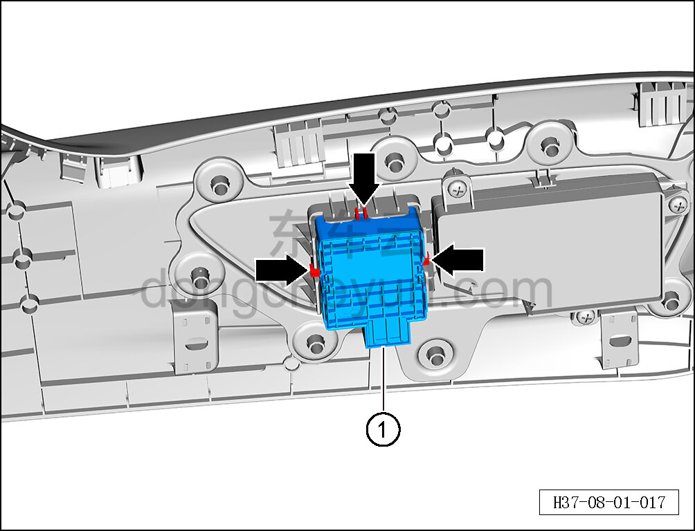

# Снятие и установка переключателя поясничной поддержки слева

> Внутренняя и внешняя отделка › Сиденья › Снятие и установка передних сидений  
> Оригинал: `拆卸与安装左侧腰托开关` · [dongcheyun 56746](https://dongcheyun.com/p/56746), страница `f64db6cc603948e68e35fff0251d4fb4` · [оглавление](../README.md)

**Порядок снятия**

1. Снимите наружную накладку сиденья водителя. См. [8.1.3.6 Снятие и установка наружной накладки сиденья водителя](008-снятие-и-установка-наружной-накладки-сиденья-водителя.md)

2. Снимите переключатель поясничной поддержки слева.

a. С помощью инструмента для снятия внутренней облицовки отсоедините 3 крепёжных зажима переключателя поясничной поддержки слева.

b. Извлеките переключатель поясничной поддержки слева ①.

**Порядок установки**

Установка выполняется в обратном порядке.

**Внимание:**

**- После завершения установки проверьте нормальность работы функций сиденья.**
