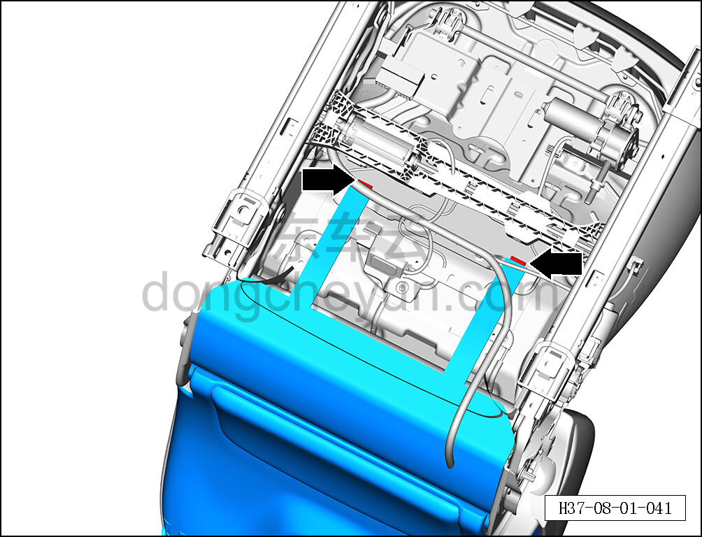
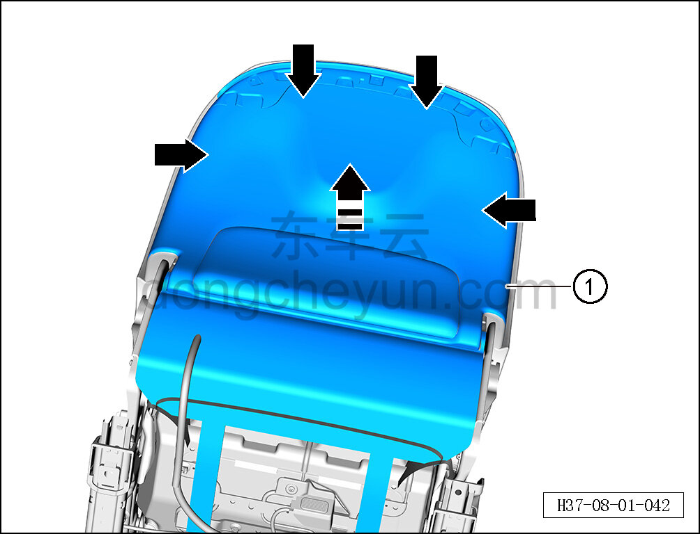

# Снятие и установка задней панели сиденья

> Внутренняя и внешняя отделка › Сиденья › Снятие и установка передних сидений  
> Оригинал: `拆卸与安装座椅背板` · [dongcheyun 56746](https://dongcheyun.com/p/56746), страница `c69b536717c841fca3f9c75e6ca884d7` · [оглавление](../README.md)

**Порядок снятия**

**Примечание:**

**- Далее описано снятие и установка задней панели сиденья водителя, задняя панель пассажирского сиденья выполняется по аналогии с задней панелью сиденья водителя. **

1. Снимите сиденье водителя в сборе. См. [8.1.3.1 Снятие и установка сиденья водителя в сборе](003-снятие-и-установка-сиденья-водителя-в-сборе.md)

2. Снимите заднюю панель сиденья.

a. С помощью инструмента для снятия внутренней облицовки отсоедините 2 крепёжные клипсы задней панели сиденья.

b. С помощью инструмента для снятия внутренней облицовки отсоедините 4 крепёжные клипсы задней панели сиденья.

c. Снимите заднюю панель сиденья ① в направлении стрелки.

**Порядок установки **

Установка выполняется в обратном порядке.

** Внимание: **

**- После завершения установки проверьте нормальность работы функций сиденья. **
