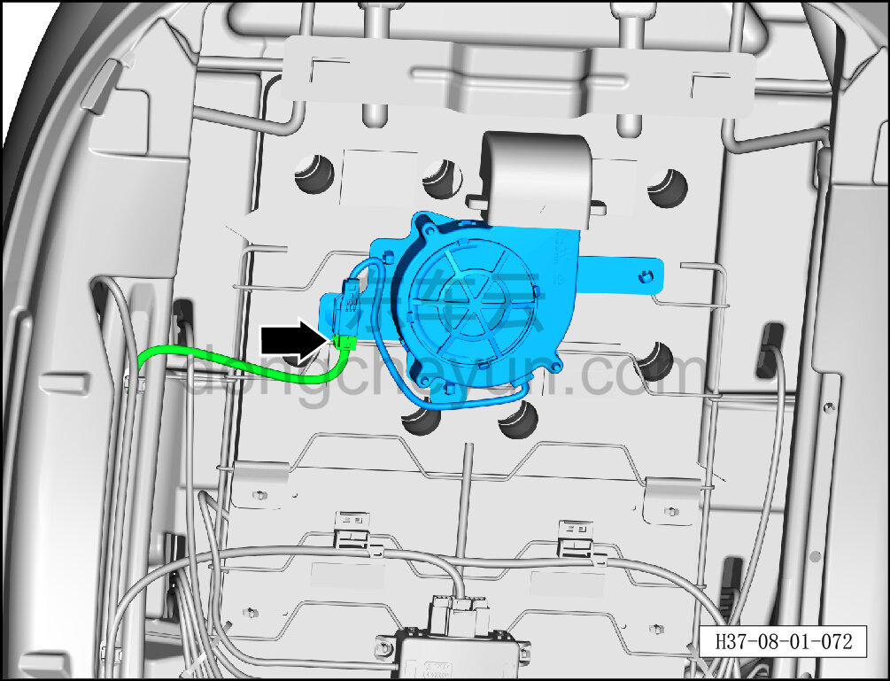
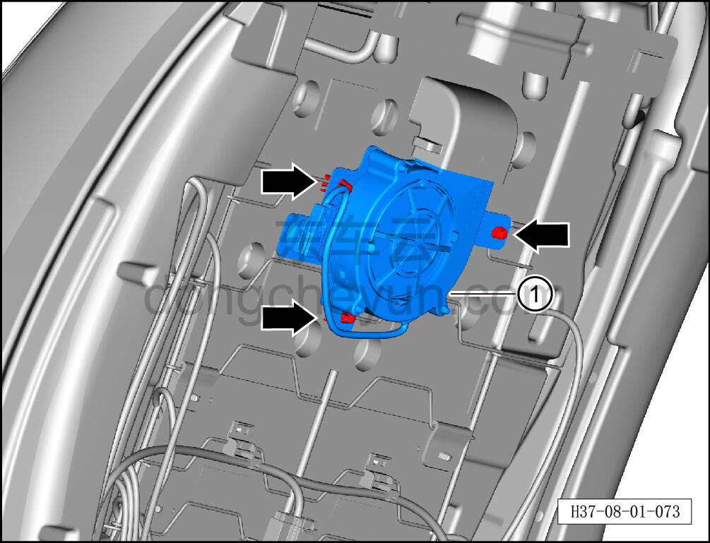

# Снятие и установка узла вентилятора спинки

> Внутренняя и внешняя отделка › Сиденья › Снятие и установка передних сидений  
> Оригинал: `拆卸与安装靠背风扇组件` · [dongcheyun 56746](https://dongcheyun.com/p/56746), страница `02a3da045e5b48f1983ebe59b9df7244` · [оглавление](../README.md)

**Порядок снятия**

**Примечание:**

**-Далее описано снятие и установка узла вентилятора спинки сиденья водителя, узел вентилятора спинки пассажирского сиденья выполняется по аналогии с узлом вентилятора спинки сиденья водителя.**

1. Снимите сиденье водителя в сборе. См. [8.1.3.1 Снятие и установка сиденья водителя в сборе](003-снятие-и-установка-сиденья-водителя-в-сборе.md)

2. Снимите заднюю панель сиденья водителя. См. [8.1.3.12 Снятие и установка задней панели сиденья](014-снятие-и-установка-задней-панели-сиденья.md)

3. Снимите узел вентилятора спинки переднего сиденья.

a. Удерживая фиксатор разъёма, отсоедините разъём жгута узла вентилятора спинки переднего сиденья.

b. С помощью инструмента для снятия внутренней облицовки отсоедините 3 крепёжные клипсы узла вентилятора спинки переднего сиденья.

c. Снимите узел вентилятора спинки переднего сиденья ①.

**Порядок установки**

Установка выполняется в обратном порядке.

**Внимание:**

**-После завершения установки проверьте нормальность работы функций сиденья.**
