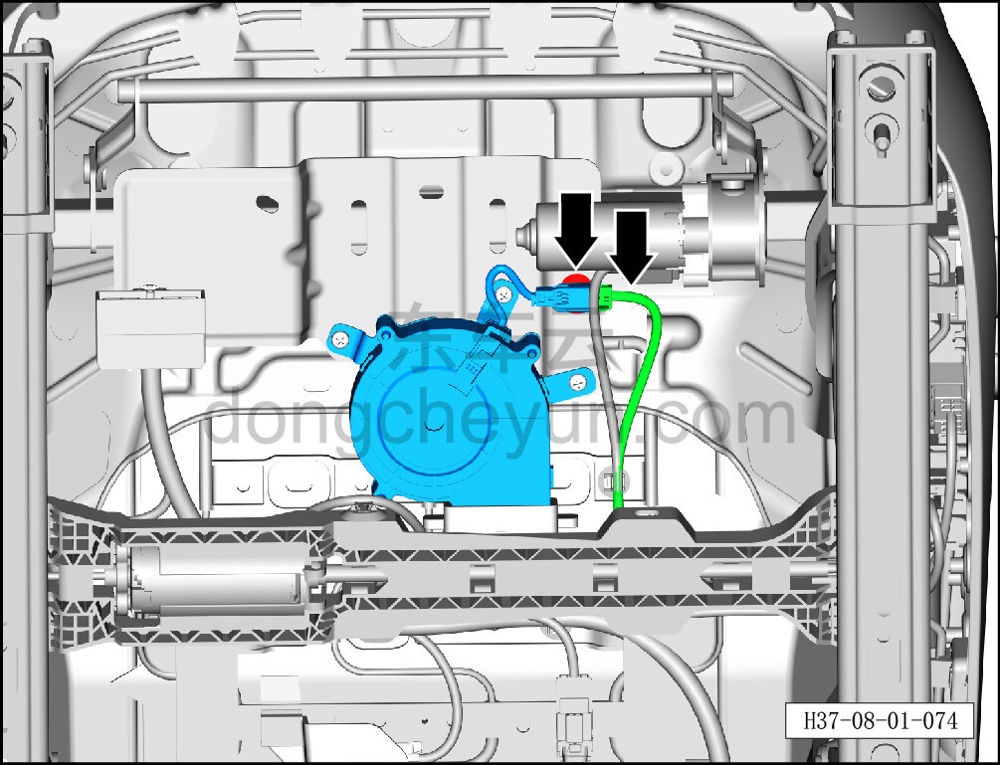
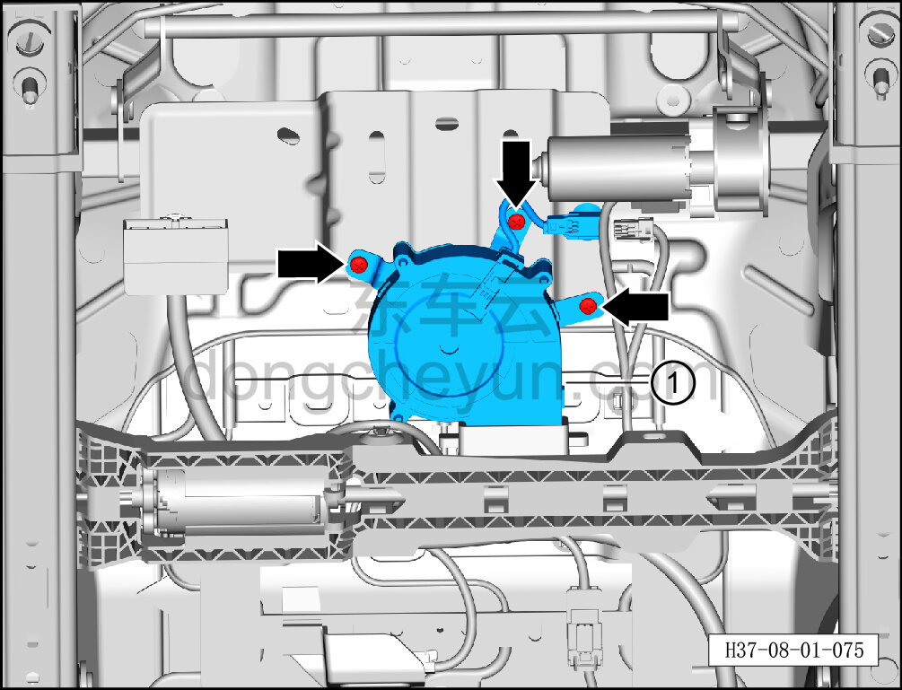

# Снятие и установка узла вентилятора подушки сиденья

> Внутренняя и внешняя отделка › Сиденья › Снятие и установка передних сидений  
> Оригинал: `拆卸与安装座垫风扇组件` · [dongcheyun 56746](https://dongcheyun.com/p/56746), страница `d4fe18cbd3a64fa7bcee7a0d098ab8b4` · [оглавление](../README.md)

**Порядок снятия**

**Примечание:**

**-Далее описано снятие и установка узла вентилятора подушки сиденья водителя, узел вентилятора подушки пассажирского сиденья выполняется по аналогии с узлом вентилятора подушки сиденья водителя.**

1. Снимите сиденье водителя в сборе. См. [8.1.3.1 Снятие и установка сиденья водителя в сборе](003-снятие-и-установка-сиденья-водителя-в-сборе.md)

2. Снимите узел вентилятора подушки переднего сиденья.

a. Удерживая фиксатор разъёма, отсоедините разъём жгута узла вентилятора подушки переднего сиденья.

b. С помощью инструмента для снятия внутренней облицовки отсоедините крепёжную клипсу жгута узла вентилятора подушки переднего сиденья.

c. С помощью крестовой отвёртки выверните 3 крепёжных винта узла вентилятора подушки переднего сиденья.

d. Снимите узел вентилятора подушки переднего сиденья ①.

**Порядок установки**

Установка выполняется в обратном порядке.

**Внимание:**

**-После завершения установки проверьте нормальность работы функций сиденья.**
