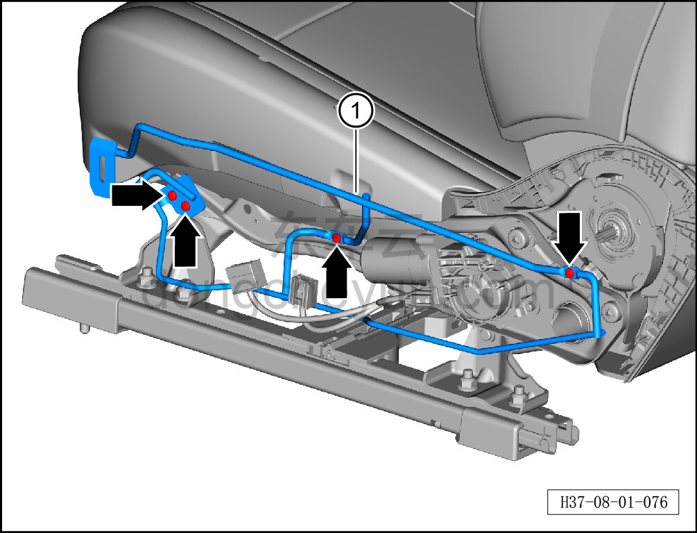

# Снятие и установка монтажной проволоки наружной накладки левого сиденья

> Внутренняя и внешняя отделка › Сиденья › Снятие и установка передних сидений  
> Оригинал: `拆卸与安装左座椅外侧护板安装钢丝` · [dongcheyun 56746](https://dongcheyun.com/p/56746), страница `3f7f4e439e1741588bb5b22ff102f62e` · [оглавление](../README.md)

**Порядок снятия**

**Примечание:**

**-Далее описано снятие и установка монтажной проволоки наружной накладки левого сиденья, монтажная проволока наружной накладки правого сиденья выполняется по аналогии с монтажной проволокой наружной накладки левого сиденья.**

1. Снимите сиденье водителя в сборе. См. [8.1.3.1 Снятие и установка сиденья водителя в сборе](003-снятие-и-установка-сиденья-водителя-в-сборе.md)

2. Снимите наружную накладку сиденья водителя. См. [8.1.3.6 Снятие и установка наружной накладки сиденья водителя](008-снятие-и-установка-наружной-накладки-сиденья-водителя.md)

3. Снимите монтажную проволоку наружной накладки левого сиденья.

a. С помощью крестовой отвёртки выверните 4 крепёжных винта монтажной проволоки наружной накладки левого сиденья.

b. Снимите монтажную проволоку наружной накладки левого сиденья ①.

**Порядок установки**

Установка выполняется в обратном порядке.

**Внимание:**

**-После завершения установки проверьте нормальность работы функций сиденья.**
