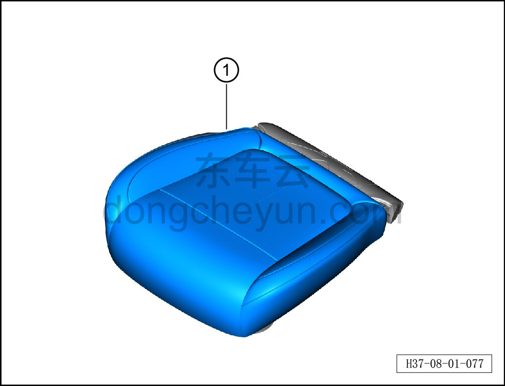
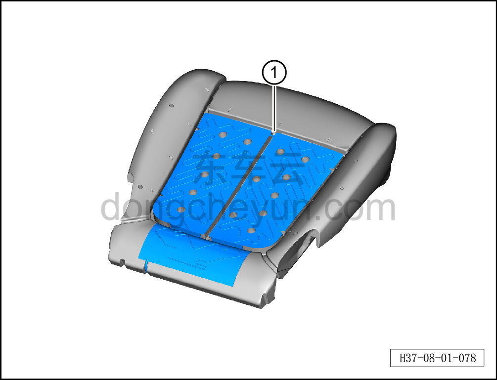

# Снятие и установка нагревательного коврика подушки сиденья

> Внутренняя и внешняя отделка › Сиденья › Снятие и установка передних сидений  
> Оригинал: `拆卸与安装座垫加热垫` · [dongcheyun 56746](https://dongcheyun.com/p/56746), страница `f75fcd22b226438a8208188e2f3ef237` · [оглавление](../README.md)

**Порядок снятия**

**Примечание:**

**-Далее описано снятие и установка нагревательного коврика подушки сиденья водителя, нагревательный коврик подушки пассажирского сиденья выполняется по аналогии с нагревательным ковриком подушки сиденья водителя.**

1. Снимите сиденье водителя в сборе. См. [8.1.3.1 Снятие и установка сиденья водителя в сборе](003-снятие-и-установка-сиденья-водителя-в-сборе.md)

2. Снимите обивку подушки сиденья водителя. См. [8.1.3.4 Снятие и установка обивки подушки сиденья водителя](006-снятие-и-установка-обивки-подушки-сиденья-водителя.md)

3. Снимите нагревательный коврик подушки сиденья.

a. С помощью клещей для стопорных колец отсоедините стопорное кольцо обивки подушки сиденья, извлеките обивку подушки сиденья ①.

b. Извлеките нагревательный коврик подушки сиденья ①.

**Внимание:**

**-Поверхность соединения нагревательного коврика подушки сиденья с пенонаполнителем подушки заполнена клеем, при слишком плотном соединении можно разъединить с помощью канцелярского ножа, избегая повреждения пенонаполнителя подушки.**

**Порядок установки**

Установка выполняется в обратном порядке.

**Внимание:**

**-Перед установкой необходимо повторно нанести клей на нагревательный коврик подушки сиденья, чтобы обеспечить его плотное прилегание к пенонаполнителю подушки.**
