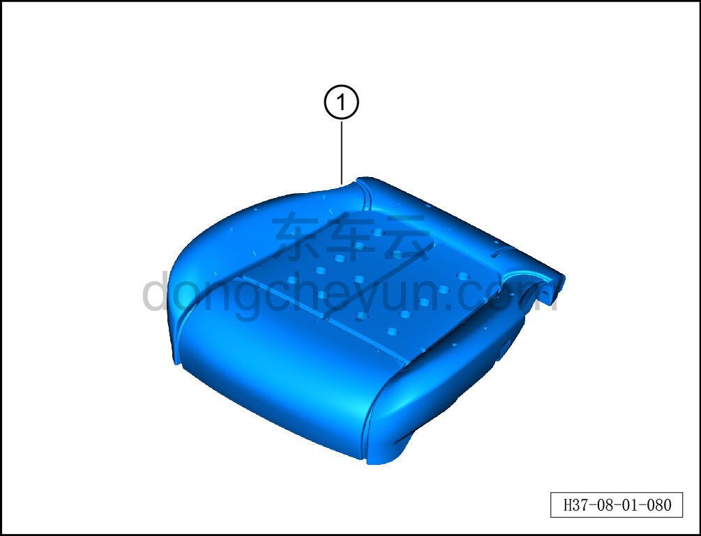

# Снятие и установка пенонаполнителя подушки сиденья водителя

> Внутренняя и внешняя отделка › Сиденья › Снятие и установка передних сидений  
> Оригинал: `拆卸与安装主驾坐垫发泡` · [dongcheyun 56746](https://dongcheyun.com/p/56746), страница `7b0baea539f74ee4b3c756e5746b74c7` · [оглавление](../README.md)

**Порядок снятия**

**Примечание:**

**-Далее описано снятие и установка пенонаполнителя подушки сиденья водителя, пенонаполнитель подушки пассажирского сиденья выполняется по аналогии с пенонаполнителем подушки сиденья водителя.**

1. Снимите сиденье водителя в сборе. См. [8.1.3.1 Снятие и установка сиденья водителя в сборе](003-снятие-и-установка-сиденья-водителя-в-сборе.md)

2. Снимите обивку подушки сиденья водителя. См. [8.1.3.4 Снятие и установка обивки подушки сиденья водителя](006-снятие-и-установка-обивки-подушки-сиденья-водителя.md)

3. Снимите нагревательный коврик подушки сиденья водителя. См. [8.1.3.16 Снятие и установка нагревательного коврика подушки сиденья](018-снятие-и-установка-нагревательного-коврика-подушки.md)

4. Снимите вентиляционный мешок подушки переднего сиденья. См. [8.1.3.17 Снятие и установка вентиляционного мешка подушки переднего сиденья](019-снятие-и-установка-вентиляционного-мешка-подушки.md)

5. Снимите пенонаполнитель подушки сиденья водителя.

a. Извлеките пенонаполнитель подушки сиденья водителя ①.

**Порядок установки**

Установка выполняется в обратном порядке.

**Внимание:**

**-Перед установкой необходимо повторно нанести клей на нагревательный коврик подушки и вентиляционный мешок подушки, чтобы обеспечить их плотное прилегание к пенонаполнителю подушки.**
