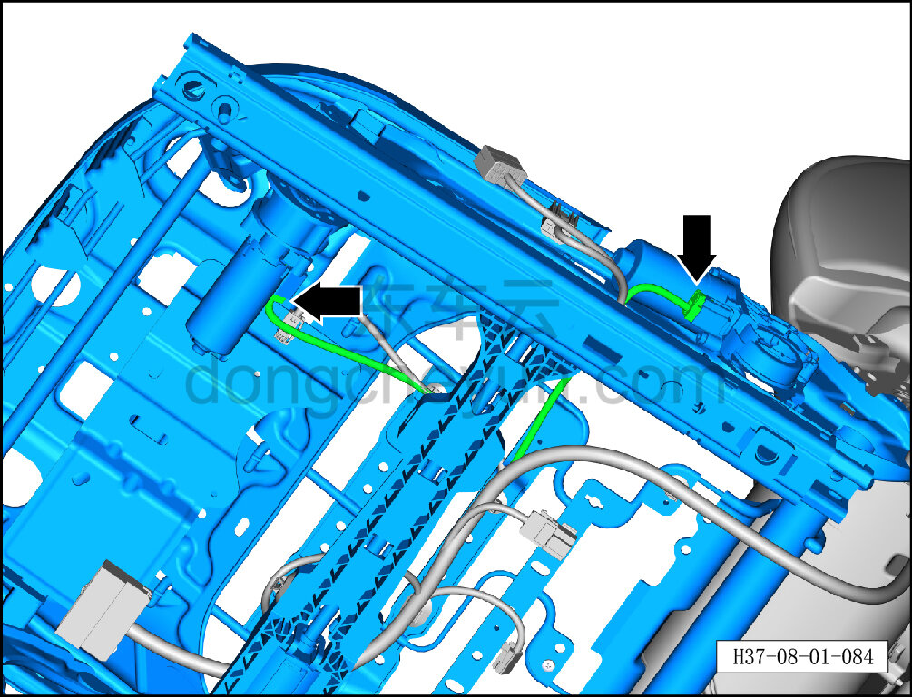
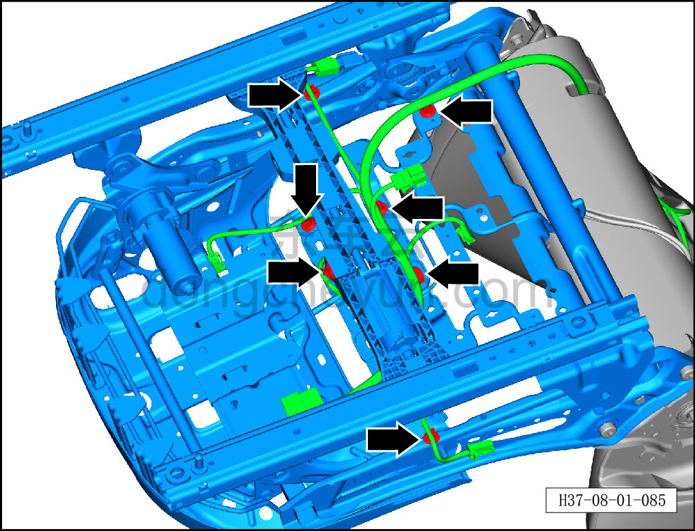
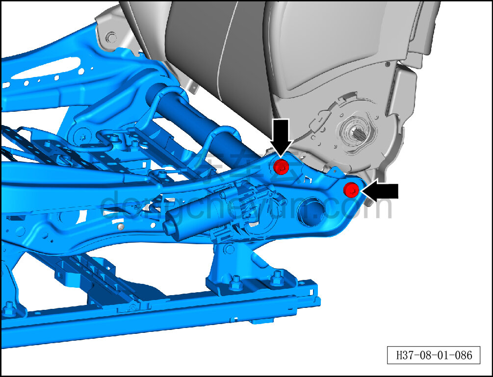
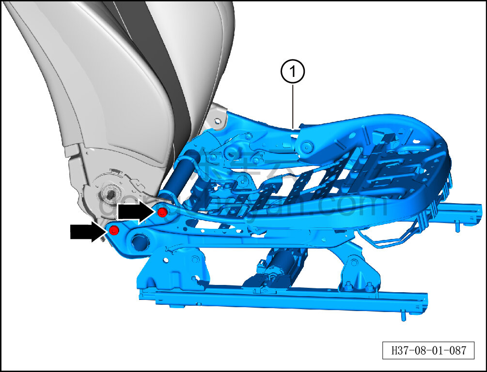

# Снятие и установка каркаса подушки левого переднего сиденья в сборе

> Внутренняя и внешняя отделка › Сиденья › Снятие и установка передних сидений  
> Оригинал: `拆卸与安装左前座垫骨架总成` · [dongcheyun 56746](https://dongcheyun.com/p/56746), страница `c329ac8458d64faf89a732ec75fb8755` · [оглавление](../README.md)

**Порядок снятия**

**Примечание:**

**-Далее описано снятие и установка каркаса подушки левого переднего сиденья в сборе, каркас подушки правого переднего сиденья в сборе выполняется по аналогии с каркасом подушки левого переднего сиденья в сборе.**

1. Снимите сиденье водителя в сборе. См. [8.1.3.1 Снятие и установка сиденья водителя в сборе](003-снятие-и-установка-сиденья-водителя-в-сборе.md)

2. Снимите обивку подушки сиденья водителя. См. [8.1.3.4 Снятие и установка обивки подушки сиденья водителя](006-снятие-и-установка-обивки-подушки-сиденья-водителя.md)

3. Снимите замок переднего ремня безопасности слева. См. [11.1.6.4 Снятие и установка замка переднего ремня безопасности](../11-система-безопасности/014-снятие-и-установка-замка-переднего-ремня-безопасности.md)

4. Снимите каркас подушки левого переднего сиденья в сборе.

a. Удерживая фиксатор разъёма, отсоедините разъём жгута сиденья.

b. С помощью инструмента для снятия внутренней облицовки отсоедините 7 крепёжных клипс жгута сиденья.

c. С помощью биты T45 выверните 2 крепёжных болта с левой стороны каркаса подушки левого переднего сиденья в сборе.

**Внимание:**

**-На болты нанесён фиксирующий состав для резьбы, при затруднении снятия можно прогреть болты фена и затем снять.**

d. С помощью биты T45 выверните 2 крепёжных болта с правой стороны каркаса подушки левого переднего сиденья в сборе.

e. Уложите жгут сиденья, отделите его от каркаса подушки левого переднего сиденья в сборе, снимите каркас подушки левого переднего сиденья в сборе ①.

**Внимание:**

**-На болты нанесён фиксирующий состав для резьбы, при затруднении снятия можно прогреть болты фена и затем снять.**

**Порядок установки**

Установка выполняется в обратном порядке.

**Внимание:**

**-Перед установкой крепёжных болтов каркаса подушки в сборе нанесите необходимое количество фиксирующего состава для резьбы.**
