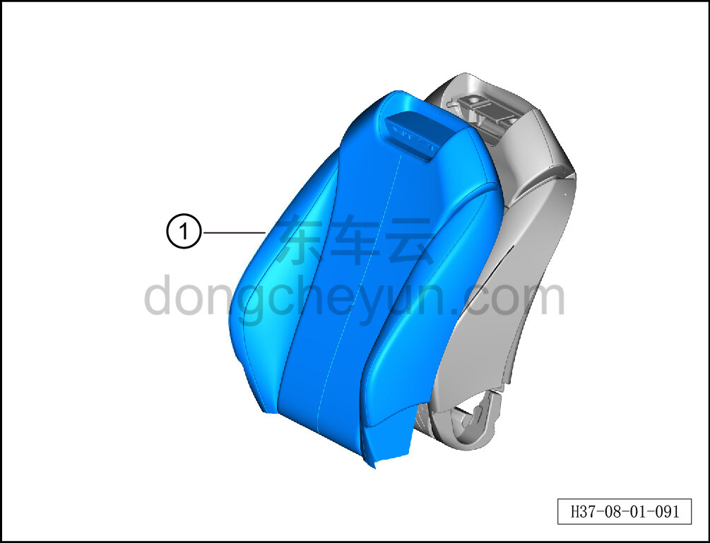
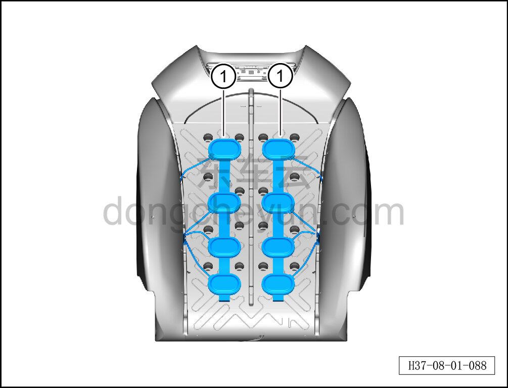

# Снятие и установка массажного пневмомешка

> Внутренняя и внешняя отделка › Сиденья › Снятие и установка передних сидений  
> Оригинал: `拆卸与安装按摩气袋` · [dongcheyun 56746](https://dongcheyun.com/p/56746), страница `f022ff5d5c2143b5b8ccbdfa4c0b4f9c` · [оглавление](../README.md)

**Порядок снятия**

**Примечание:**

**-Далее описано снятие и установка массажного пневмомешка сиденья водителя, массажный пневмомешок пассажирского сиденья выполняется по аналогии с массажным пневмомешком сиденья водителя.**

1. Снимите сиденье водителя в сборе. См. [8.1.3.1 Снятие и установка сиденья водителя в сборе](003-снятие-и-установка-сиденья-водителя-в-сборе.md)

2. Снимите обивку спинки сиденья водителя. См. [8.1.3.5 Снятие и установка обивки спинки сиденья водителя](007-снятие-и-установка-обивки-спинки-сиденья-водителя.md)

3. Снимите массажный пневмомешок сиденья водителя.

a. С помощью клещей для стопорных колец отсоедините стопорное кольцо обивки спинки, извлеките обивку спинки ①.

b. Извлеките массажный пневмомешок сиденья водителя ①.

**Внимание:**

**-Поверхность соединения массажного пневмомешка с пенонаполнителем спинки заполнена клеем, при слишком плотном соединении можно разъединить с помощью канцелярского ножа, избегая повреждения пенонаполнителя спинки.**

**Порядок установки**

Установка выполняется в обратном порядке.

**Внимание:**

**-Поверхность соединения массажного пневмомешка с пенонаполнителем спинки заполнена клеем, при слишком плотном соединении можно разъединить с помощью канцелярского ножа, избегая повреждения пенонаполнителя спинки.**
