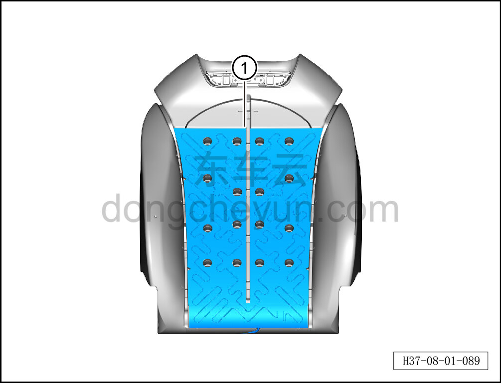

# Снятие и установка нагревательного коврика спинки

> Внутренняя и внешняя отделка › Сиденья › Снятие и установка передних сидений  
> Оригинал: `拆卸与安装靠背加热垫` · [dongcheyun 56746](https://dongcheyun.com/p/56746), страница `5ef15ee3158649679584da2081fbe7d7` · [оглавление](../README.md)

**Порядок снятия**

**Примечание:**

**-Далее описано снятие и установка нагревательного коврика спинки сиденья водителя, нагревательный коврик спинки пассажирского сиденья выполняется по аналогии с нагревательным ковриком спинки сиденья водителя.**

1. Снимите сиденье водителя в сборе. См. [8.1.3.1 Снятие и установка сиденья водителя в сборе](003-снятие-и-установка-сиденья-водителя-в-сборе.md)

2. Снимите обивку спинки сиденья водителя. См. [8.1.3.5 Снятие и установка обивки спинки сиденья водителя](007-снятие-и-установка-обивки-спинки-сиденья-водителя.md)

3. Снимите массажный пневмомешок сиденья водителя. См. [8.1.3.20 Снятие и установка массажного пневмомешка](022-снятие-и-установка-массажного-пневмомешка.md)

4. Снимите нагревательный коврик спинки сиденья водителя.

a. Извлеките нагревательный коврик спинки сиденья водителя ①.

**Внимание:**

**-Поверхность соединения нагревательного коврика спинки с пенонаполнителем спинки заполнена клеем, при слишком плотном соединении можно разъединить с помощью канцелярского ножа, избегая повреждения пенонаполнителя спинки.**

**Порядок установки**

Установка выполняется в обратном порядке.

**Внимание:**

**-Перед установкой необходимо повторно нанести клей на нагревательный коврик спинки, чтобы обеспечить его плотное прилегание к пенонаполнителю спинки.**
