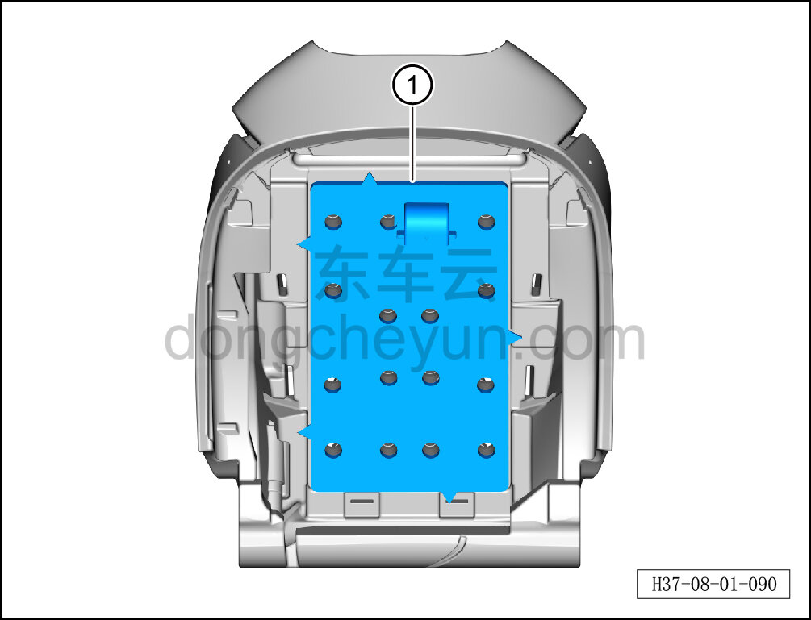

# Снятие и установка вентиляционного мешка спинки переднего сиденья

> Внутренняя и внешняя отделка › Сиденья › Снятие и установка передних сидений  
> Оригинал: `拆卸与安装前排靠背通风袋` · [dongcheyun 56746](https://dongcheyun.com/p/56746), страница `8afcffa5ddec4acba24f135a6a897e02` · [оглавление](../README.md)

**Порядок снятия**

**Примечание:**

**-Далее описано снятие и установка вентиляционного мешка спинки сиденья водителя, вентиляционный мешок спинки пассажирского сиденья выполняется по аналогии с вентиляционным мешком спинки сиденья водителя.**

1. Снимите сиденье водителя в сборе. См. [8.1.3.1 Снятие и установка сиденья водителя в сборе](003-снятие-и-установка-сиденья-водителя-в-сборе.md)

2. Снимите обивку спинки сиденья водителя. См. [8.1.3.5 Снятие и установка обивки спинки сиденья водителя](007-снятие-и-установка-обивки-спинки-сиденья-водителя.md)

3. Снимите вентиляционный мешок спинки переднего сиденья.

a. Извлеките вентиляционный мешок спинки переднего сиденья ①.

**Порядок установки**

Установка выполняется в обратном порядке.

**Внимание:**

**-Перед установкой необходимо повторно нанести клей на вентиляционный мешок спинки, чтобы обеспечить его плотное прилегание к пенонаполнителю спинки.**
