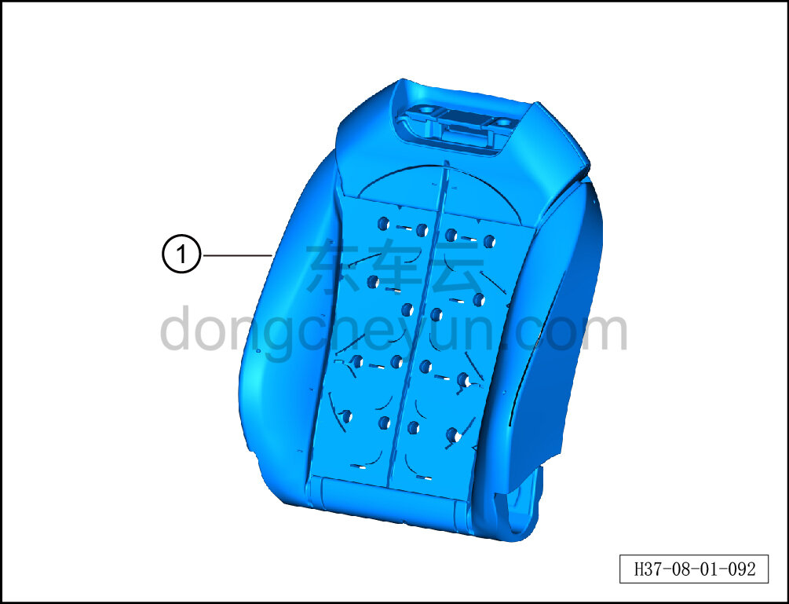

# Снятие и установка пенонаполнителя спинки сиденья водителя

> Внутренняя и внешняя отделка › Сиденья › Снятие и установка передних сидений  
> Оригинал: `拆卸与安装主驾靠背发泡` · [dongcheyun 56746](https://dongcheyun.com/p/56746), страница `df8460e58e114da3b726479509185aa2` · [оглавление](../README.md)

**Порядок снятия**

**Примечание:**

**-Далее описано снятие и установка пенонаполнителя спинки сиденья водителя, пенонаполнитель спинки пассажирского сиденья выполняется по аналогии с пенонаполнителем спинки сиденья водителя.**

1. Снимите сиденье водителя в сборе. См. [8.1.3.1 Снятие и установка сиденья водителя в сборе](003-снятие-и-установка-сиденья-водителя-в-сборе.md)

2. Снимите обивку подушки сиденья водителя. См. [8.1.3.4 Снятие и установка обивки подушки сиденья водителя](006-снятие-и-установка-обивки-подушки-сиденья-водителя.md)

3. Снимите массажный пневмомешок сиденья водителя. См. [8.1.3.20 Снятие и установка массажного пневмомешка](022-снятие-и-установка-массажного-пневмомешка.md)

4. Снимите нагревательный коврик спинки сиденья водителя. См. [8.1.3.21 Снятие и установка нагревательного коврика спинки](023-снятие-и-установка-нагревательного-коврика-спинки.md)

5. Снимите вентиляционный мешок спинки переднего сиденья. См. [8.1.3.22 Снятие и установка вентиляционного мешка спинки переднего сиденья](024-снятие-и-установка-вентиляционного-мешка-спинки.md)

6. Снимите пенонаполнитель спинки сиденья водителя.

a. Извлеките пенонаполнитель спинки сиденья водителя ①.

**Порядок установки**

Установка выполняется в обратном порядке.

**Внимание:**

**-Перед установкой необходимо повторно нанести клей на массажный пневмомешок, нагревательный коврик спинки и вентиляционный мешок спинки, чтобы обеспечить их плотное прилегание к пенонаполнителю спинки.**
