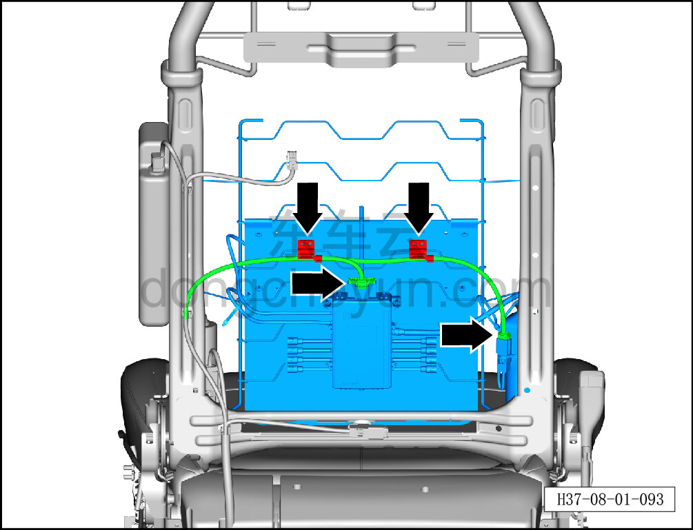
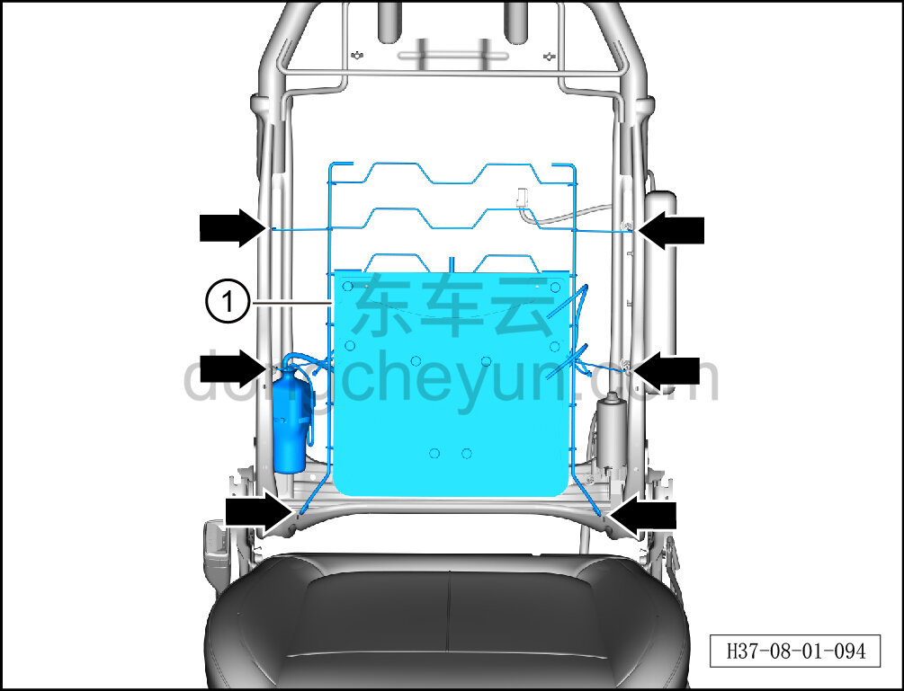

# Снятие и установка четырёхпозиционной поясничной поддержки

> Внутренняя и внешняя отделка › Сиденья › Снятие и установка передних сидений  
> Оригинал: `拆卸与安装四向腰托` · [dongcheyun 56746](https://dongcheyun.com/p/56746), страница `d86ee7923b4b41679cf2d885740a9e58` · [оглавление](../README.md)

**Порядок снятия**

**Примечание:**

**-Далее описано снятие и установка четырёхпозиционной поясничной поддержки сиденья водителя, четырёхпозиционная поясничная поддержка пассажирского сиденья выполняется по аналогии с четырёхпозиционной поясничной поддержкой сиденья водителя.**

1. Снимите сиденье водителя в сборе. См. [8.1.3.1 Снятие и установка сиденья водителя в сборе](003-снятие-и-установка-сиденья-водителя-в-сборе.md)

2. Снимите обивку спинки сиденья водителя. См. [8.1.3.5 Снятие и установка обивки спинки сиденья водителя](007-снятие-и-установка-обивки-спинки-сиденья-водителя.md)

3. Снимите четырёхпозиционную поясничную поддержку.

a. Удерживая фиксатор разъёма, отсоедините 2 разъёма четырёхпозиционной поясничной поддержки.

b. Отсоедините 2 крепёжные клипсы жгута сиденья водителя.

c. Отсоедините 6 крепёжных крюков четырёхпозиционной поясничной поддержки.

d. Извлеките четырёхпозиционную поясничную поддержку ①.

**Порядок установки**

Установка выполняется в обратном порядке.

**Внимание:**

**-После завершения установки проверьте нормальность работы функций сиденья.**
