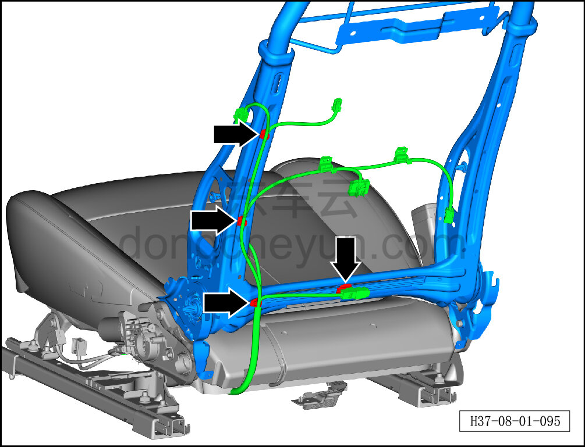
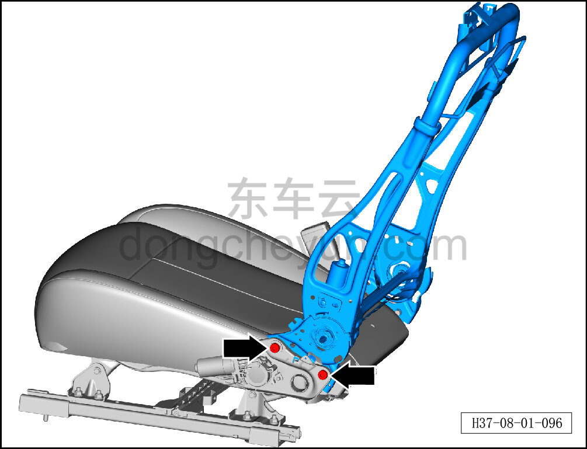
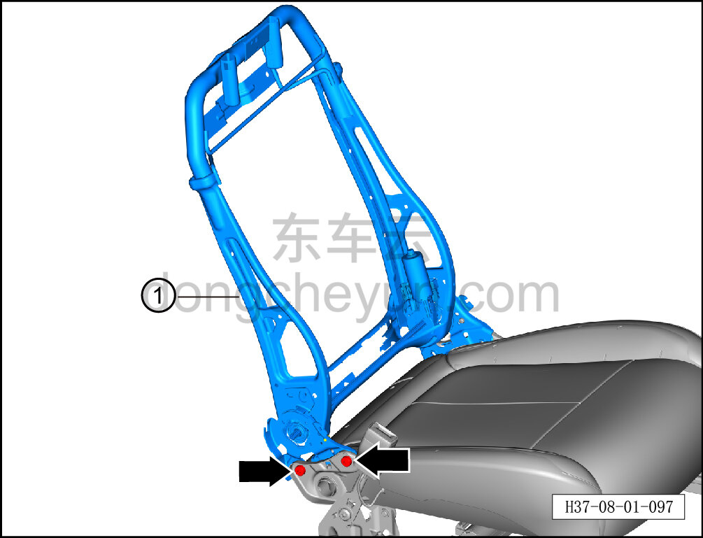

# Снятие и установка каркаса спинки левого переднего сиденья в сборе

> Внутренняя и внешняя отделка › Сиденья › Снятие и установка передних сидений  
> Оригинал: `拆卸与安装左前靠背骨架总成` · [dongcheyun 56746](https://dongcheyun.com/p/56746), страница `3a9de781155f4bfc865d419a96fec37b` · [оглавление](../README.md)

**Порядок снятия**

**Примечание:**

**-Далее описано снятие и установка каркаса спинки левого переднего сиденья в сборе, каркас спинки правого переднего сиденья в сборе выполняется по аналогии с каркасом спинки левого переднего сиденья в сборе.**

1. Снимите сиденье водителя в сборе. См. [8.1.3.1 Снятие и установка сиденья водителя в сборе](003-снятие-и-установка-сиденья-водителя-в-сборе.md)

2. Снимите обивку спинки сиденья водителя в сборе. См. [8.1.3.5 Снятие и установка обивки спинки сиденья водителя](007-снятие-и-установка-обивки-спинки-сиденья-водителя.md)

3. Снимите четырёхпозиционную поясничную поддержку сиденья водителя. См. [8.1.3.24 Снятие и установка четырёхпозиционной поясничной поддержки](026-снятие-и-установка-четырёхпозиционной-поясничной.md)

4. Снимите каркас спинки левого переднего сиденья в сборе.

a. С помощью инструмента для снятия внутренней облицовки отсоедините 4 крепёжные клипсы жгута сиденья.

b. С помощью биты T45 выверните 2 крепёжных болта с левой стороны каркаса спинки левого переднего сиденья в сборе.

**Внимание:**

**-На болты нанесён фиксирующий состав для резьбы, при затруднении снятия можно прогреть болты фена и затем снять.**

c. С помощью биты T45 выверните 2 крепёжных болта с правой стороны каркаса спинки левого переднего сиденья в сборе.

d. Уложите жгут сиденья, отделите его от каркаса спинки левого переднего сиденья в сборе, снимите каркас спинки левого переднего сиденья в сборе ①.

**Внимание:**

**-На болты нанесён фиксирующий состав для резьбы, при затруднении снятия можно прогреть болты фена и затем снять.**

**Порядок установки**

Установка выполняется в обратном порядке.

**Внимание:**

**-Перед установкой крепёжных болтов каркаса спинки в сборе нанесите необходимое количество фиксирующего состава для резьбы.**
