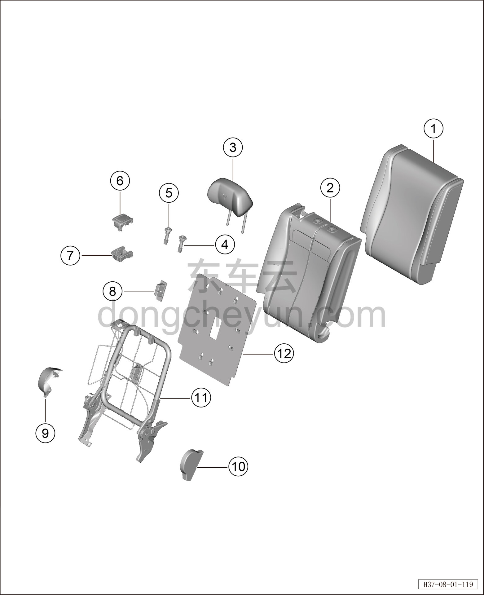
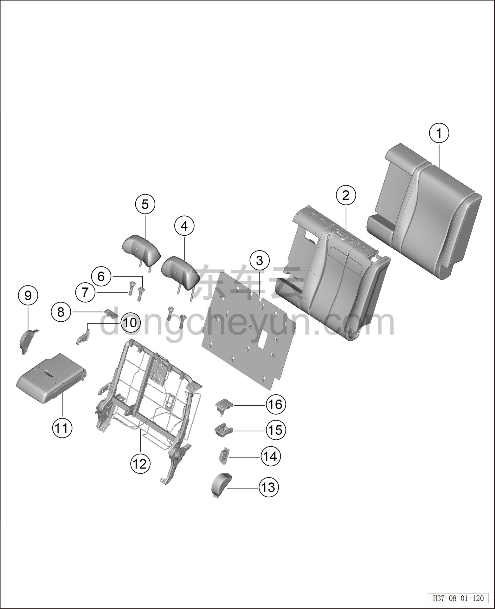
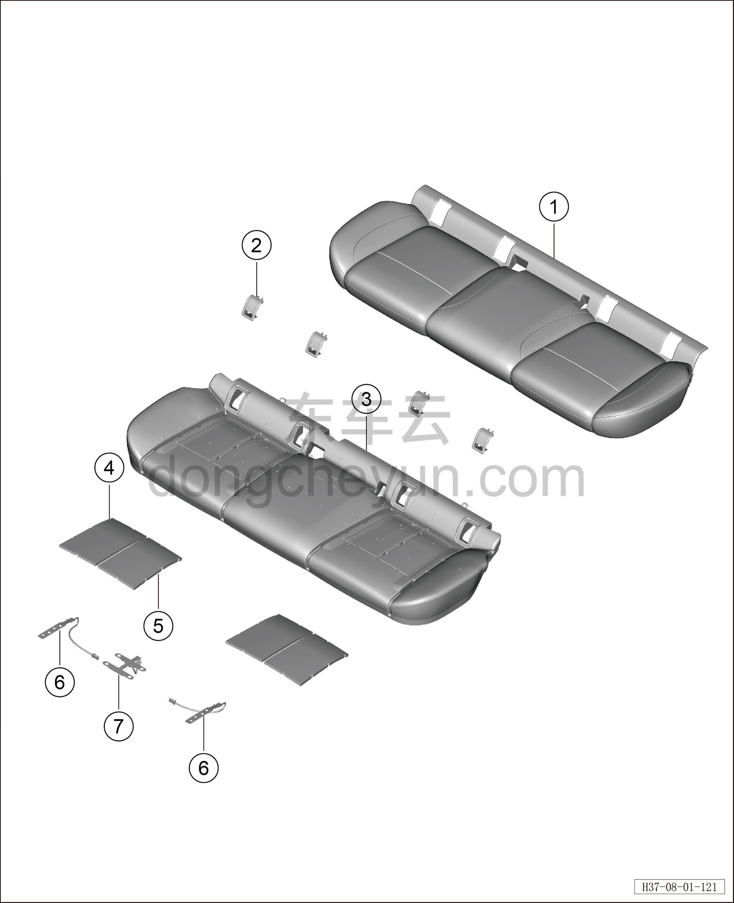

# Покомпонентный вид (деталировка) заднего сиденья

> Внутренняя и внешняя отделка › Сиденья  
> Оригинал: `后排座椅分解图` · [dongcheyun 56746](https://dongcheyun.com/p/56746), страница `fd03423c080741d0844e94664130b310` · [оглавление](../README.md)

| № | Наименование детали | Кол-во на автомобиль | Примечание |
|---|---|---|---|
| 1 | Обивка правой спинки заднего сиденья | 1 | - |
| 2 | Пенонаполнитель спинки секции 40% в сборе | 1 | - |
| 3 | Боковой подголовник заднего сиденья | 1 | - |
| 4 | Запираемая направляющая втулка подголовника | 1 | - |
| 5 | Гладкая направляющая втулка подголовника | 1 | - |
| 6 | Узел разблокировки спинки в сборе | 1 | - |
| 7 | Узел разблокировки спинки в сборе | 1 | - |
| 8 | Крышка отсека детского сиденья | 1 | - |
| 9 | Наружная накладка заднего сиденья в сборе | 1 | - |
| 10 | Внутренняя накладка заднего сиденья в сборе | 1 | - |
| 11 | Каркас спинки секции 40% заднего сиденья в сборе | 1 | - |
| 12 | Задняя накладка спинки правого сиденья | 1 | - |

| № | Наименование детали | Кол-во на автомобиль | Примечание |
|---|---|---|---|
| 1 | Обивка левой спинки заднего сиденья | 1 | - |
| 2 | Пенонаполнитель спинки секции 60% в сборе | 1 | - |
| 3 | Задняя накладка спинки левого сиденья | 1 | - |
| 4 | Боковой подголовник заднего сиденья | 1 | - |
| 5 | Средний подголовник заднего сиденья | 1 | - |
| 6 | Запираемая направляющая втулка подголовника | 2 | - |
| 7 | Гладкая направляющая втулка подголовника | 2 | - |
| 8 | Крышка ретрактора | 1 | - |
| 9 | Внутренняя накладка секции 60% заднего сиденья | 1 | - |
| 10 | Крышка среднего кронштейна | 1 | - |
| 11 | Подлокотник в сборе | 1 | - |
| 12 | Каркас спинки секции 60% заднего сиденья в сборе | 1 | - |
| 13 | Наружная накладка секции 60% заднего сиденья | 1 | - |
| 14 | Крышка отсека детского сиденья | 1 | - |
| 15 | Крышка узла разблокировки спинки | 1 | - |
| 16 | Узел разблокировки спинки в сборе | 1 | - |

| № | Наименование детали | Кол-во на автомобиль | Примечание |
|---|---|---|---|
| 1 | Обивка подушки заднего сиденья | 1 | - |
| 2 | Крышка ISOFIX | 4 | - |
| 3 | Пенонаполнитель подушки заднего сиденья в сборе | 1 | - |
| 4 | Пенонаполнитель подушки заднего сиденья в сборе (наружная сторона) | 2 | - |
| 5 | Пенонаполнитель подушки заднего сиденья в сборе (внутренняя сторона) | 2 | - |
| 6 | Датчик SBR заднего сиденья (обе стороны) | 2 | - |
| 7 | Датчик SBR заднего сиденья (центр) | 1 | - |
