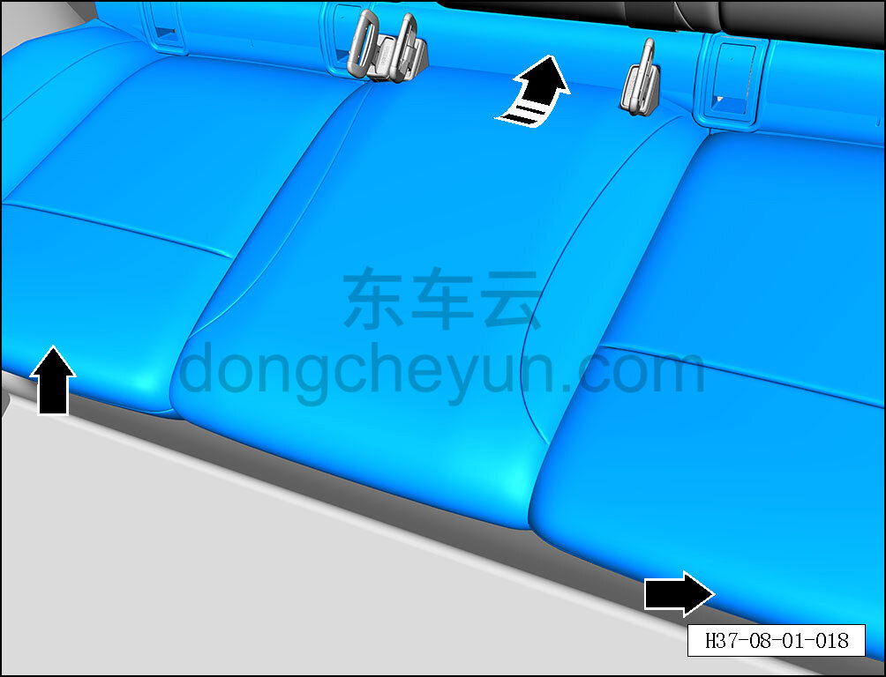
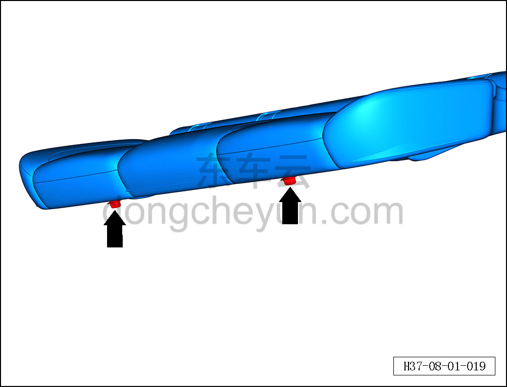
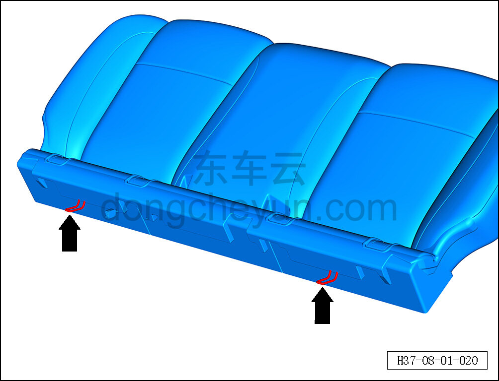
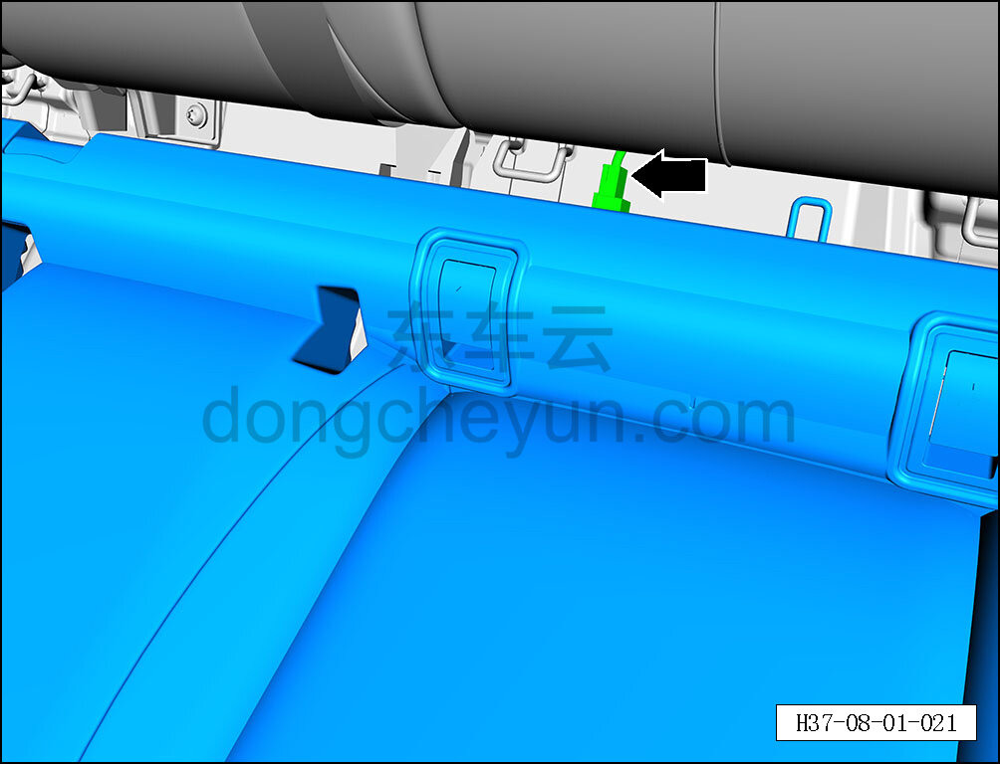

# Снятие и установка подушки заднего сиденья

> Внутренняя и внешняя отделка › Сиденья › Снятие и установка заднего сиденья  
> Оригинал: `拆卸与安装后排座椅坐垫` · [dongcheyun 56746](https://dongcheyun.com/p/56746), страница `599e992b5b1047a9b6cf2241f673fec5` · [оглавление](../README.md)

**Порядок снятия**

1. Выключите все электроприборы, отключите питание.

2. Выполните операцию обесточивания автомобиля для ремонта. См. [3.1.4.1 Обесточивание автомобиля](../03-техническое-обслуживание/005-обесточивание-автомобиля.md)

3. Снимите подушку заднего сиденья.

a. С помощью инструмента для снятия внутренней облицовки отсоедините 2 крепёжные клипсы подушки заднего сиденья.

b. Сдвиньте подушку заднего сиденья назад и приподнимите её вверх, отсоедините 2 крючка подушки заднего сиденья.

c. Расположение клипс показано на рисунке слева.

d. Расположение крючков показано на рисунке слева.

e. Удерживая фиксатор разъёма, отсоедините разъём подушки заднего сиденья в сборе.

f. Извлеките подушку заднего сиденья.

**Порядок установки **

Установка выполняется в обратном порядке.

**Внимание:**

**- После завершения установки проверьте правильность и надёжность установки подушки сиденья.**
