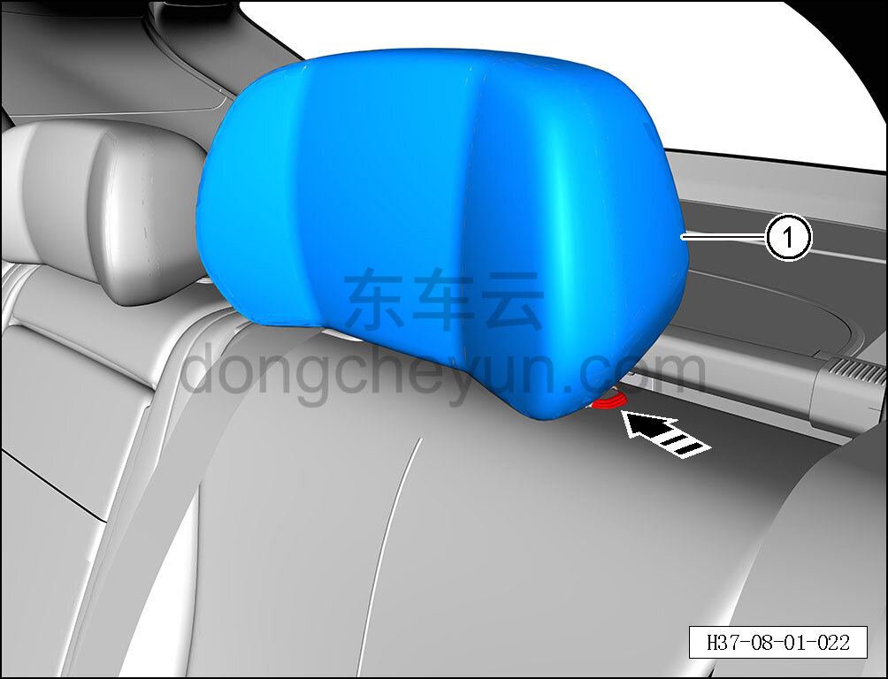

# Снятие и установка бокового подголовника заднего сиденья

> Внутренняя и внешняя отделка › Сиденья › Снятие и установка заднего сиденья  
> Оригинал: `拆卸与安装后排侧头枕` · [dongcheyun 56746](https://dongcheyun.com/p/56746), страница `014bc5c76381405da803b5b392338dc5` · [оглавление](../README.md)

**Порядок снятия**

**Примечание:**

**- Далее описано снятие и установка левого бокового подголовника заднего сиденья, правый и средний подголовники заднего сиденья выполняются по аналогии с левым боковым подголовником. **

1. Снимите левый боковой подголовник заднего сиденья.

a. Нажмите кнопку регулировки высоты подголовника в направлении стрелки.

b. Поднимите вверх и снимите левый боковой подголовник заднего сиденья ①.

**Порядок установки**

Установка выполняется в обратном порядке.

**Внимание:**

**- После завершения установки проверьте нормальность функции регулировки подголовника. **
