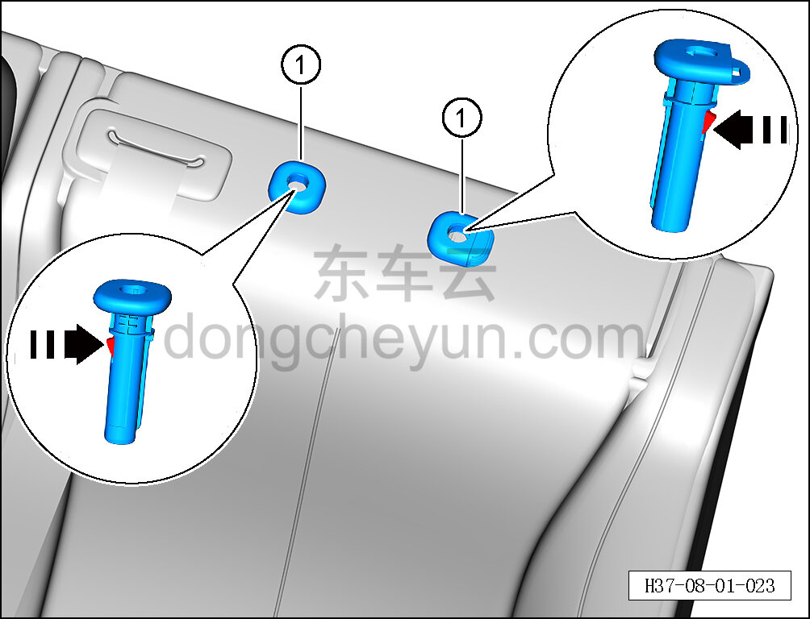

# Снятие и установка направляющей втулки подголовника заднего сиденья

> Внутренняя и внешняя отделка › Сиденья › Снятие и установка заднего сиденья  
> Оригинал: `拆卸与安装后排头枕导向套` · [dongcheyun 56746](https://dongcheyun.com/p/56746), страница `677fd3bfec244a1ea828a3d49936f7b6` · [оглавление](../README.md)

**Порядок снятия**

**Примечание:**

**-Далее описано снятие и установка направляющей втулки левого бокового подголовника заднего сиденья, направляющие втулки правого и среднего подголовников заднего сиденья выполняются по аналогии с направляющей втулкой левого бокового подголовника заднего сиденья.**

1.Снимите левый боковой подголовник заднего сиденья. См. [8.1.5.2 Снятие и установка подголовника заднего сиденья](030-снятие-и-установка-бокового-подголовника-заднего.md)

2.Снимите направляющую втулку левого бокового подголовника заднего сиденья.

a.С помощью плоской отвёртки прижмите крепёжную клипсу внутри направляющей втулки в направлении стрелки.

b. Снимите направляющую втулку левого бокового подголовника заднего сиденья ①.

**Порядок установки**

Установка выполняется в обратном порядке.

**Внимание:**

** - После завершения установки проверьте нормальность функции регулировки подголовника. **
