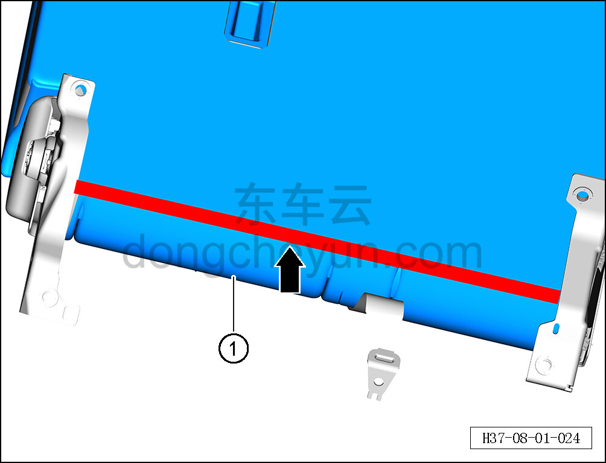

# Снятие и установка обивки левой спинки заднего сиденья

> Внутренняя и внешняя отделка › Сиденья › Снятие и установка заднего сиденья  
> Оригинал: `拆卸与安装后排左靠背面套` · [dongcheyun 56746](https://dongcheyun.com/p/56746), страница `fc6dd0bf0fe94a67b0a30d513c6d9458` · [оглавление](../README.md)

**Порядок снятия**

1. Выключите все электроприборы, отключите питание.

2. Выполните операцию обесточивания автомобиля для ремонта. См. [3.1.4.1 Обесточивание автомобиля](../03-техническое-обслуживание/005-обесточивание-автомобиля.md)

3. Снимите левую спинку заднего сиденья. См. [8.1.5.6 Снятие и установка левой спинки заднего сиденья](034-снятие-и-установка-левой-спинки-заднего-сиденья.md)

4. Снимите подлокотник в сборе. См. [8.1.5.8 Снятие и установка подлокотника в сборе](036-снятие-и-установка-подлокотника-в-сборе.md)

5. Снимите левый узел разблокировки спинки в сборе. См. [8.1.5.9 Снятие и установка узла разблокировки спинки в сборе](037-снятие-и-установка-узла-разблокировки-спинки-в-сборе.md)

6. Снимите крышку ретрактора. См. [8.1.5.10 Снятие и установка крышки ретрактора](038-снятие-и-установка-крышки-ретрактора.md)

7. Снимите крышку отсека детского сиденья левой спинки. См. [8.1.5.11 Снятие и установка крышки отсека детского сиденья левой спинки](039-снятие-и-установка-крышки-отсека-детского-сиденья.md)

8. Снимите направляющую втулку левого бокового подголовника заднего сиденья. См. [8.1.5.3 Снятие и установка направляющей втулки подголовника заднего сиденья](031-снятие-и-установка-направляющей-втулки-подголовника.md)

9. Снимите направляющую втулку среднего подголовника заднего сиденья. См. [8.1.5.3 Снятие и установка направляющей втулки подголовника заднего сиденья](031-снятие-и-установка-направляющей-втулки-подголовника.md)

10. Снимите обивку левой спинки заднего сиденья.

a. Отсоедините крепёжные клипсы обивки левой спинки заднего сиденья.

b. Снимите обивку левой спинки заднего сиденья ①.

**Порядок установки**

Установка выполняется в обратном порядке.

**Внимание:**

** - После завершения установки проверьте, чтобы обивка левой спинки заднего сиденья была ровной и надёжно закреплена. **
