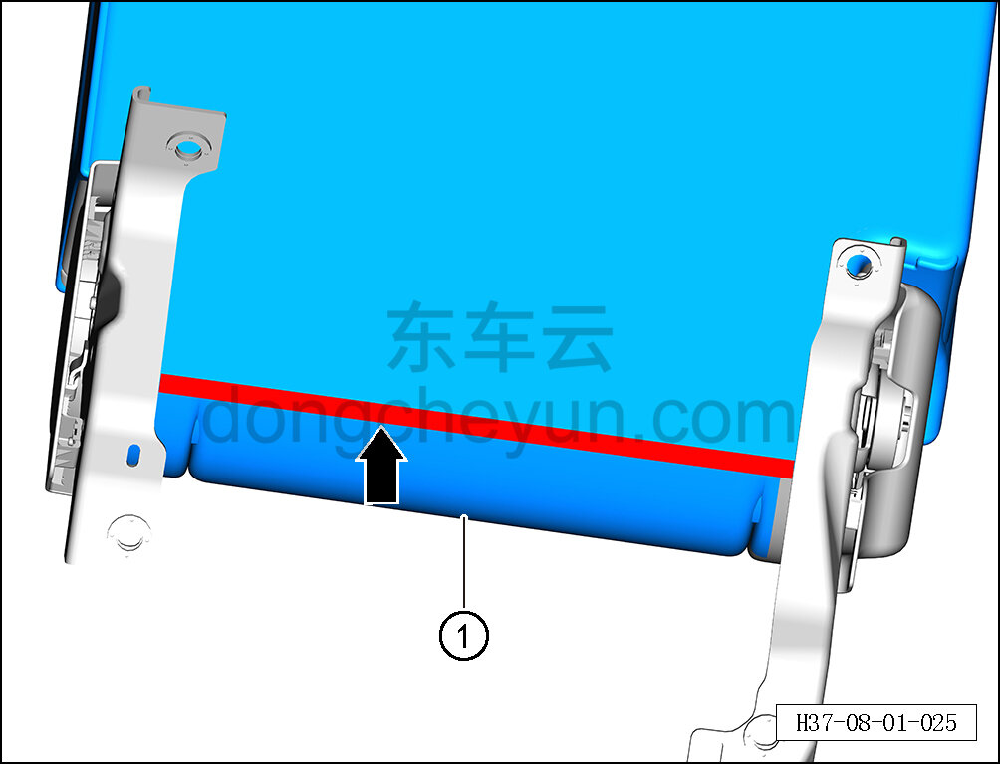

# Снятие и установка обивки правой спинки заднего сиденья

> Внутренняя и внешняя отделка › Сиденья › Снятие и установка заднего сиденья  
> Оригинал: `拆卸与安装后排右靠背面套` · [dongcheyun 56746](https://dongcheyun.com/p/56746), страница `1b124b5d125e4e1398407f6c82f1d66b` · [оглавление](../README.md)

**Порядок снятия**

1. Выключите все электроприборы, отключите питание.

2. Выполните операцию обесточивания автомобиля для ремонта. См. [3.1.4.1 Обесточивание автомобиля](../03-техническое-обслуживание/005-обесточивание-автомобиля.md)

3. Снимите правую спинку заднего сиденья. См. [8.1.5.7 Снятие и установка правой спинки заднего сиденья](035-снятие-и-установка-правой-спинки-заднего-сиденья.md)

4. Снимите правый узел разблокировки спинки в сборе. См. [8.1.5.9 Снятие и установка узла разблокировки спинки в сборе](037-снятие-и-установка-узла-разблокировки-спинки-в-сборе.md)

5. Снимите крышку отсека детского сиденья правой спинки. См. [8.1.5.11 Снятие и установка крышки отсека детского сиденья](039-снятие-и-установка-крышки-отсека-детского-сиденья.md)

6. Снимите направляющую втулку подголовника правой спинки заднего сиденья. См. [8.1.5.3 Снятие и установка направляющей втулки подголовника заднего сиденья](031-снятие-и-установка-направляющей-втулки-подголовника.md)

7. Снимите обивку правой спинки заднего сиденья.

a. Отсоедините крепёжные клипсы обивки правой спинки заднего сиденья.

b. Снимите обивку правой спинки заднего сиденья ①.

**Порядок установки**

Установка выполняется в обратном порядке.

**Внимание:**

** - После завершения установки проверьте, чтобы обивка правой спинки заднего сиденья была ровной и надёжно закреплена. **
