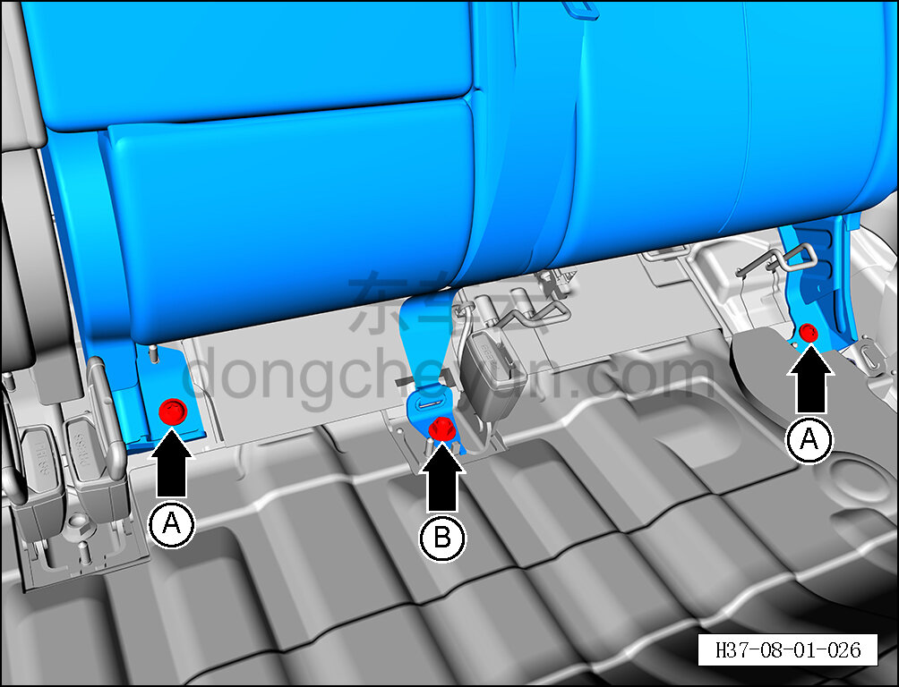
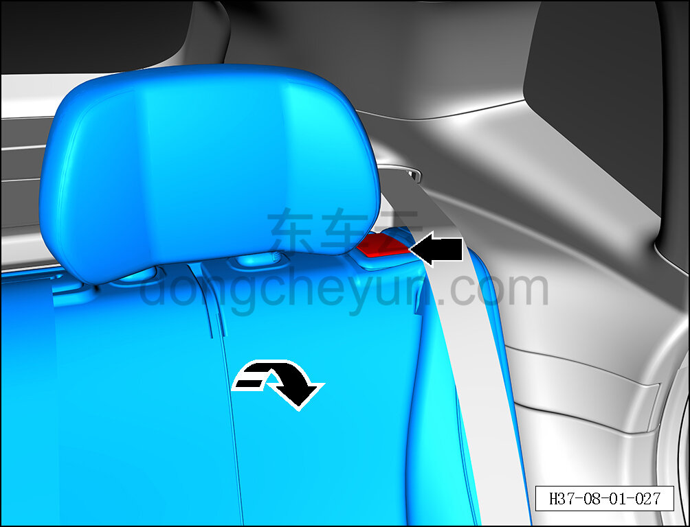
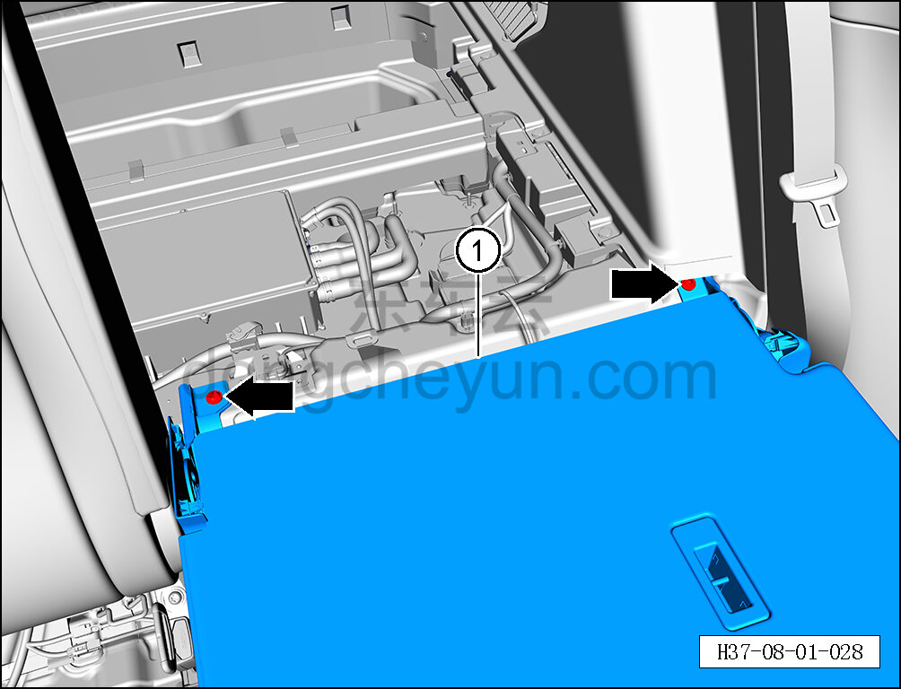

# Снятие и установка левой спинки заднего сиденья

> Внутренняя и внешняя отделка › Сиденья › Снятие и установка заднего сиденья  
> Оригинал: `拆卸与安装后排座椅左靠背` · [dongcheyun 56746](https://dongcheyun.com/p/56746), страница `ea451f40a0ef4011813eb43a1a6fbae9` · [оглавление](../README.md)

**Порядок снятия**

1. Выключите все электроприборы, отключите питание.

2. Выполните операцию обесточивания автомобиля для ремонта. См. [3.1.4.1 Обесточивание автомобиля](../03-техническое-обслуживание/005-обесточивание-автомобиля.md)

3. Снимите подушку заднего сиденья. См. [8.1.5.1 Снятие и установка подушки заднего сиденья](029-снятие-и-установка-подушки-заднего-сиденья.md)

4. Снимите левую спинку заднего сиденья.

a. С помощью биты T50 выверните 2 крепёжных болта A левой спинки заднего сиденья.

Момент затяжки болта A: 55±8 Н·м

b. С помощью торцевой головки 14 мм выверните крепёжный болт B замка ремня безопасности.

Момент затяжки болта B: 55±8 Н·м

c. Потяните переключатель замка левой спинки заднего сиденья, откиньте левую спинку заднего сиденья.

d. С помощью биты T50 выверните 2 крепёжных болта левой спинки заднего сиденья.

Момент затяжки болта: 55±8 Н·м

e. Снимите левую спинку заднего сиденья ①.

**Порядок установки**

Установка выполняется в обратном порядке.
