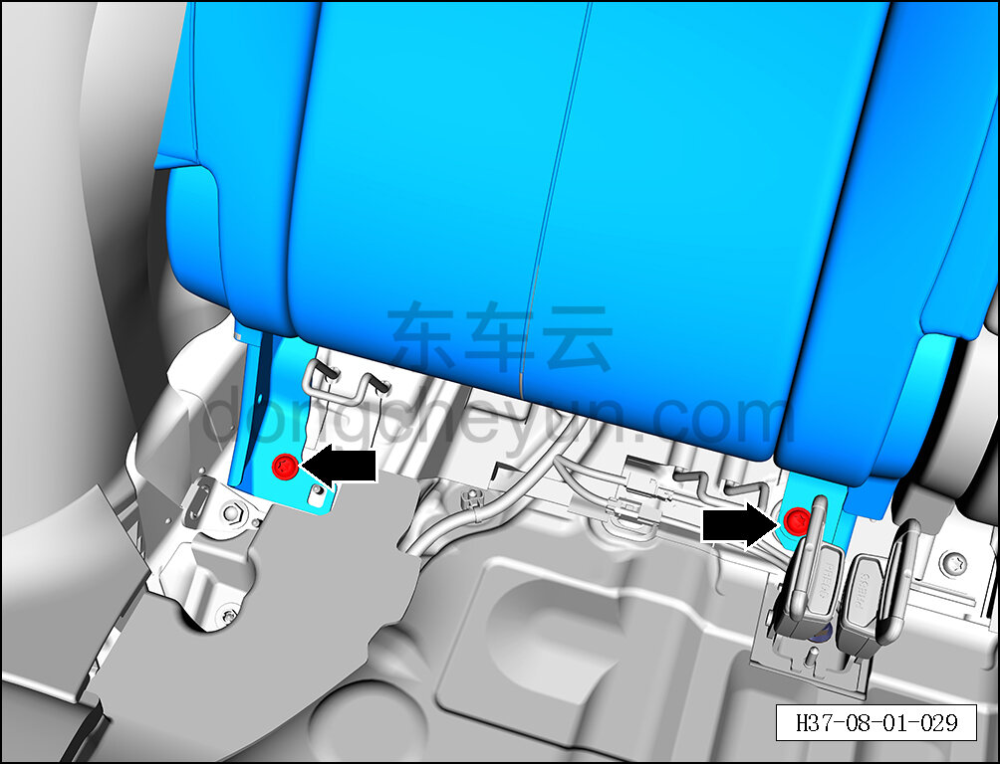
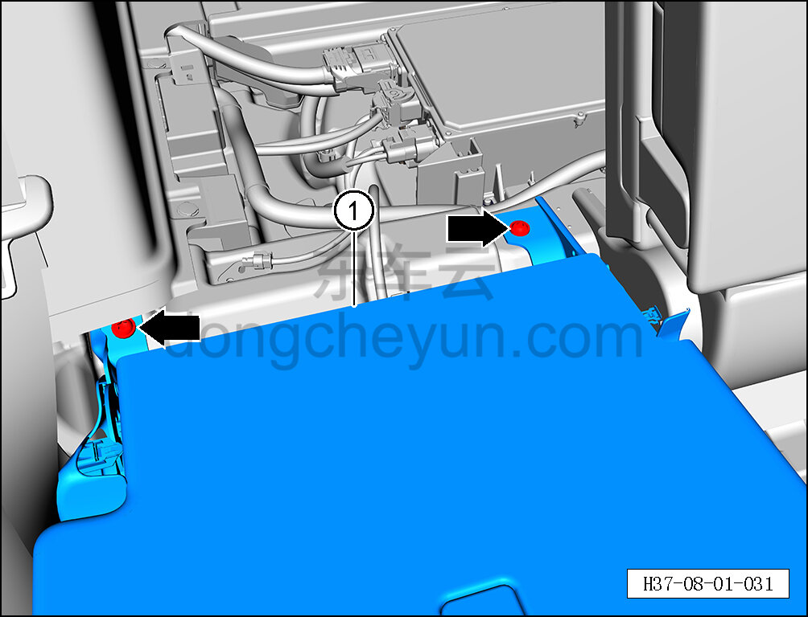

# Снятие и установка правой спинки заднего сиденья

> Внутренняя и внешняя отделка › Сиденья › Снятие и установка заднего сиденья  
> Оригинал: `拆卸与安装后排座椅右靠背` · [dongcheyun 56746](https://dongcheyun.com/p/56746), страница `13b4096049f64bbf8e7b6d0d38c03edc` · [оглавление](../README.md)

**Порядок снятия**

1. Выключите все электроприборы, отключите питание.

2. Выполните операцию обесточивания автомобиля для ремонта. См. [3.1.4.1 Обесточивание автомобиля](../03-техническое-обслуживание/005-обесточивание-автомобиля.md)

3. Снимите подушку заднего сиденья. См. [8.1.5.1 Снятие и установка подушки заднего сиденья](029-снятие-и-установка-подушки-заднего-сиденья.md)

4. Снимите правую спинку заднего сиденья.

a. С помощью биты T50 выверните 2 крепёжных болта правой спинки заднего сиденья.

Момент затяжки болта: 55±8 Н·м

b. Потяните переключатель замка правой спинки заднего сиденья, откиньте правую спинку заднего сиденья.

c. С помощью биты T50 выверните 2 крепёжных болта правой спинки заднего сиденья.

d. Снимите правую спинку заднего сиденья ①.

Момент затяжки болта: 55±8 Н·м

**Порядок установки**

Установка выполняется в обратном порядке.
