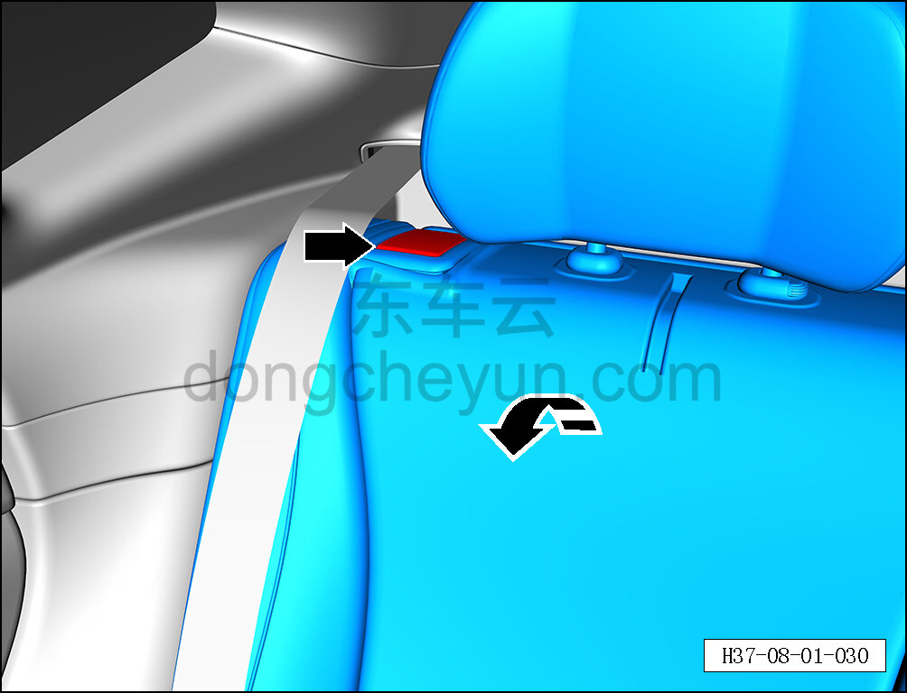
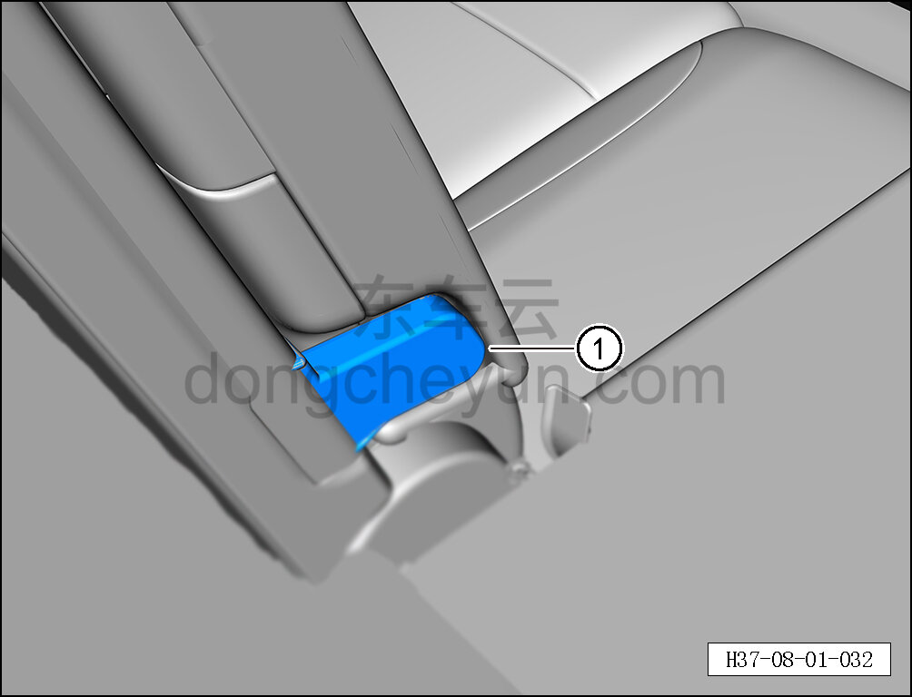
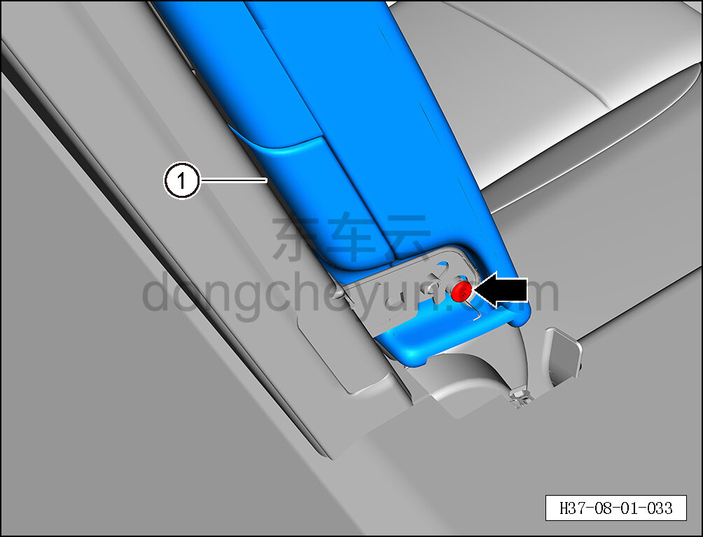

# Снятие и установка подлокотника в сборе

> Внутренняя и внешняя отделка › Сиденья › Снятие и установка заднего сиденья  
> Оригинал: `拆卸与安装扶手总成` · [dongcheyun 56746](https://dongcheyun.com/p/56746), страница `4d65253cab114cf0a77edd14f7b8ccfd` · [оглавление](../README.md)

**Порядок снятия**

1. Снимите подлокотник в сборе.

a. Потяните переключатель замка правой спинки заднего сиденья, откиньте правую спинку заднего сиденья в сборе.

b. Обеими руками разведите декоративную крышку подлокотника в сборе ① с обеих сторон наружу и снимите её движением вверх.

c. С помощью биты T25 выверните крепёжный болт подлокотника в сборе.

Момент затяжки болта: 9±1 Н·м

d. Снимите подлокотник в сборе ①.

**Порядок установки**

Установка выполняется в обратном порядке.

**Внимание:**

** - После завершения установки проверьте нормальность функций открытия и закрытия подлокотника. **
