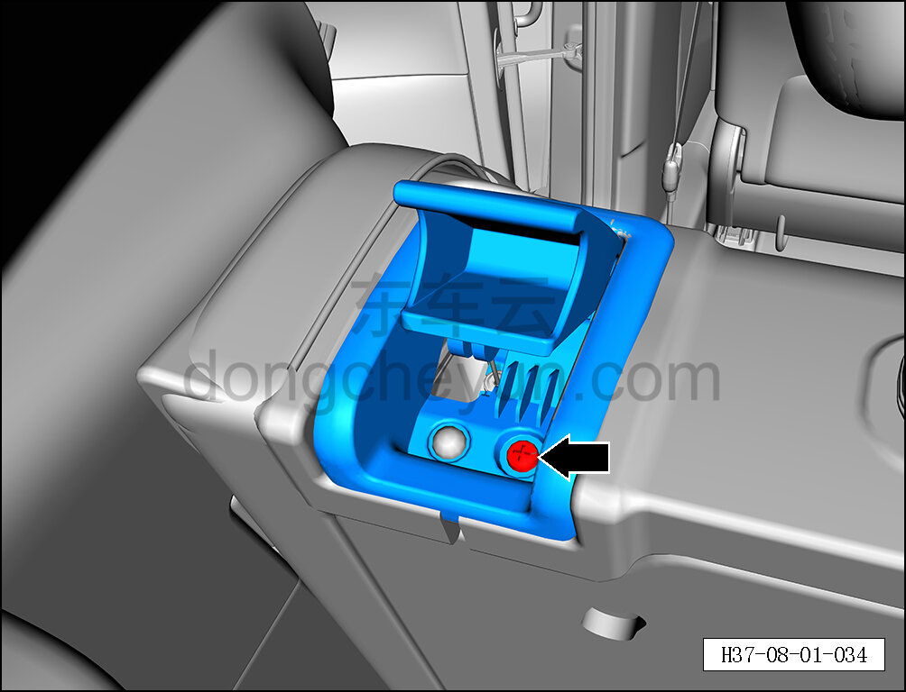
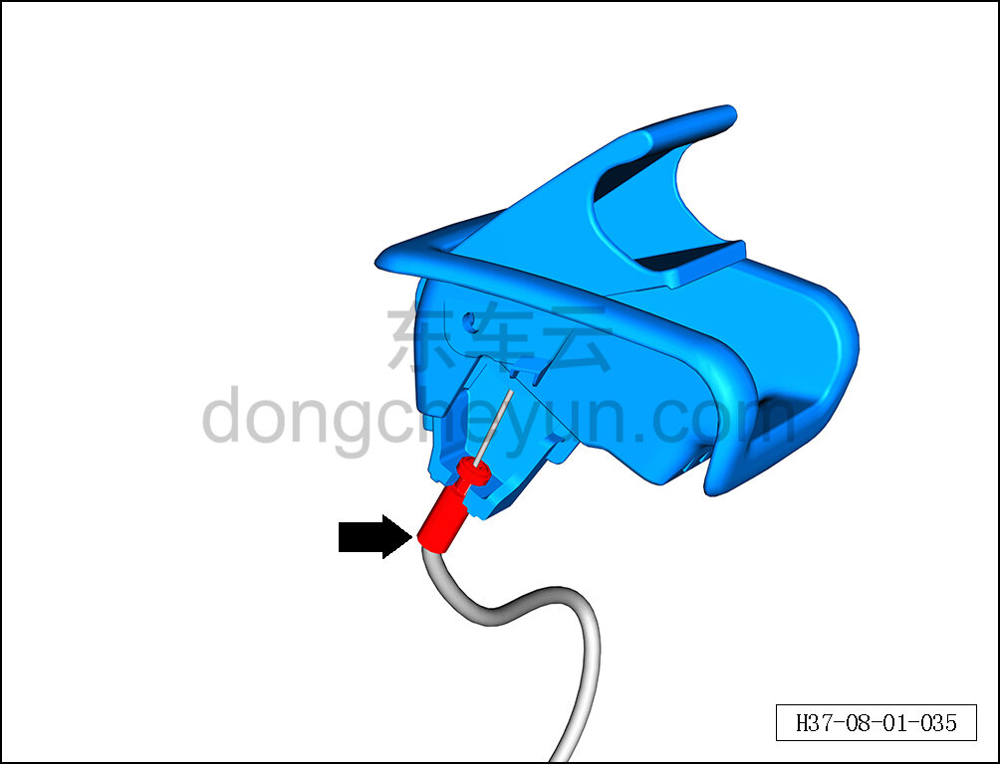
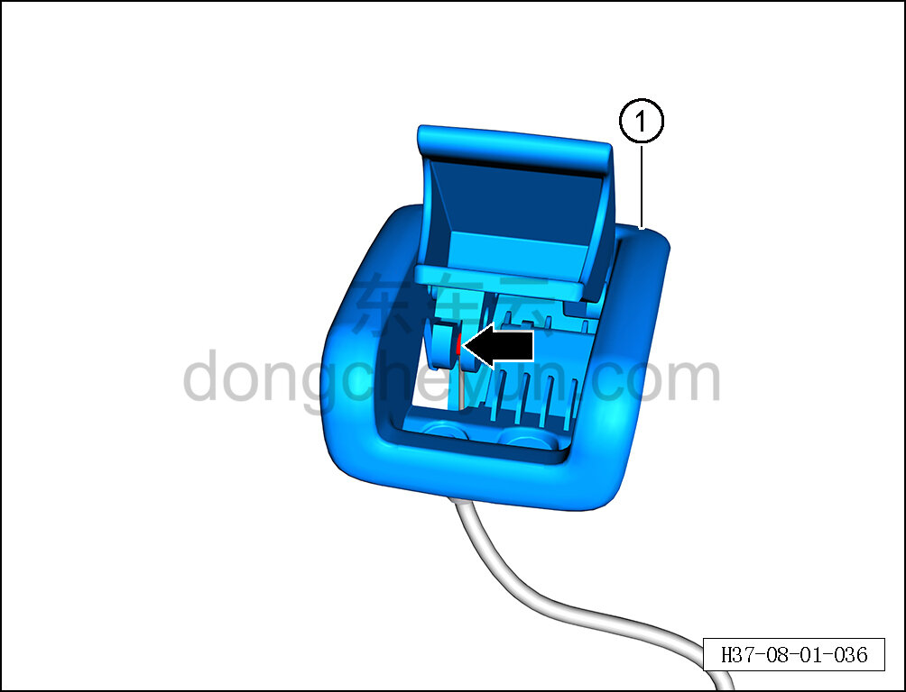

# Снятие и установка узла разблокировки спинки в сборе

> Внутренняя и внешняя отделка › Сиденья › Снятие и установка заднего сиденья  
> Оригинал: `拆卸与安装靠背解锁总成` · [dongcheyun 56746](https://dongcheyun.com/p/56746), страница `1b9f91c5eb9a4a729b7a6e51314f10d8` · [оглавление](../README.md)

**Порядок снятия**

**Примечание:**

**- Далее описано снятие и установка крышки узла разблокировки левой спинки, правая сторона выполняется по аналогии с левой. **

1. Снимите левый узел разблокировки спинки в сборе.

a. С помощью крестовой отвёртки выверните крепёжный винт левого узла разблокировки спинки в сборе.

b. С помощью инструмента для снятия внутренней облицовки отсоедините крепёжный зажим троса левого узла разблокировки спинки в сборе.

c. Отсоедините трос левого узла разблокировки спинки в сборе.

d. Извлеките левый узел разблокировки спинки в сборе ①.

**Порядок установки **

Установка выполняется в обратном порядке.

**Внимание:**

** - После завершения установки проверьте нормальность функции разблокировки спинки. **
