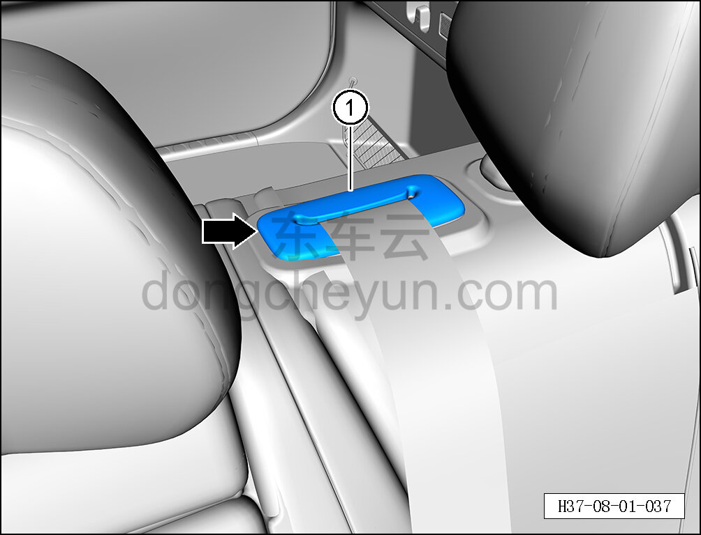
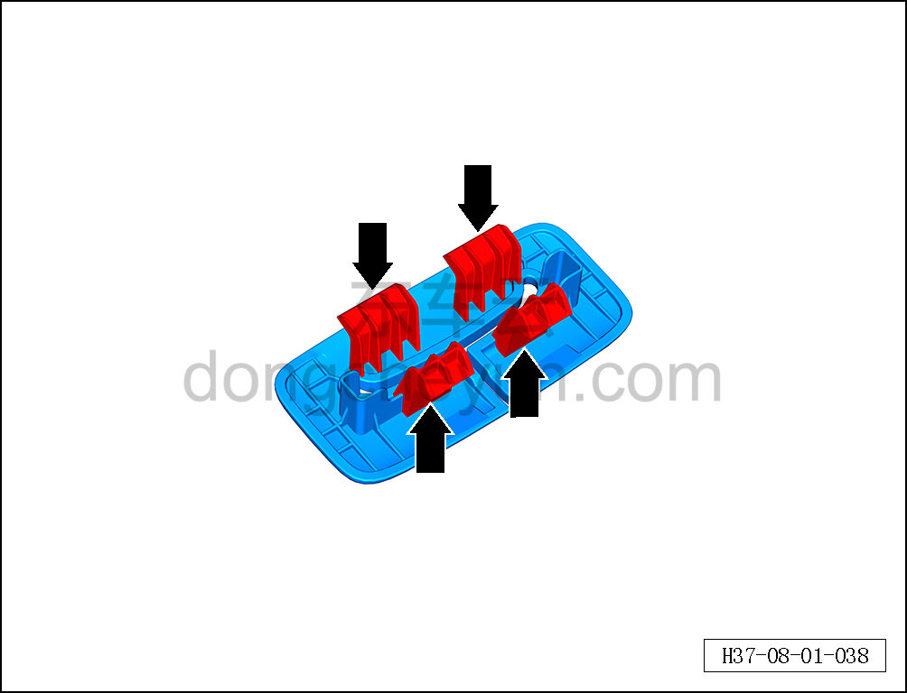

# Снятие и установка крышки ретрактора

> Внутренняя и внешняя отделка › Сиденья › Снятие и установка заднего сиденья  
> Оригинал: `拆卸与安装卷收器罩盖` · [dongcheyun 56746](https://dongcheyun.com/p/56746), страница `cfac8091e4224fbc907d4caab35598ca` · [оглавление](../README.md)

**Порядок снятия**

1. Снимите крышку ретрактора.

a. С помощью инструмента для снятия внутренней облицовки отсоедините 4 крепёжные клипсы крышки ретрактора.

b. Снимите крышку ретрактора ①.

c. Расположение клипс показано на рисунке слева.

**Порядок установки**

Установка выполняется в обратном порядке.
