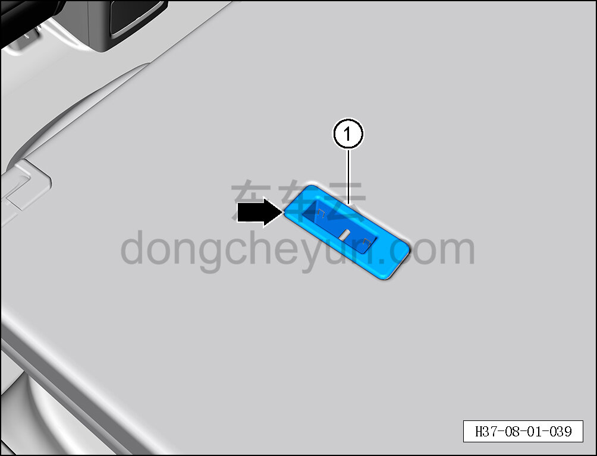
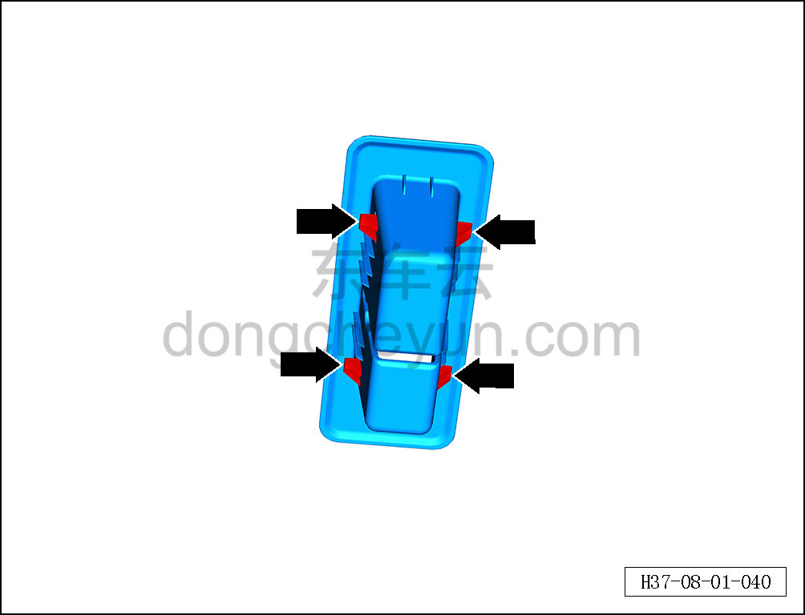

# Снятие и установка крышки отсека детского сиденья

> Внутренняя и внешняя отделка › Сиденья › Снятие и установка заднего сиденья  
> Оригинал: `拆卸与安装儿童座椅盖板` · [dongcheyun 56746](https://dongcheyun.com/p/56746), страница `e8f56ebfdaf544989518a27b44ea6d97` · [оглавление](../README.md)

**Порядок снятия**

**Примечание:**

**- Далее описано снятие и установка левой крышки отсека детского сиденья, правая сторона выполняется по аналогии с левой **

1. Снимите левую крышку отсека детского сиденья.

a. Потяните узел разблокировки боковой спинки, откиньте левую спинку заднего сиденья.

b. С помощью инструмента для снятия внутренней облицовки отсоедините 4 крепёжные клипсы левой крышки отсека детского сиденья.

c. Снимите левую крышку отсека детского сиденья ①.

d. Расположение клипс показано на рисунке слева.

**Порядок установки **

Установка выполняется в обратном порядке.
