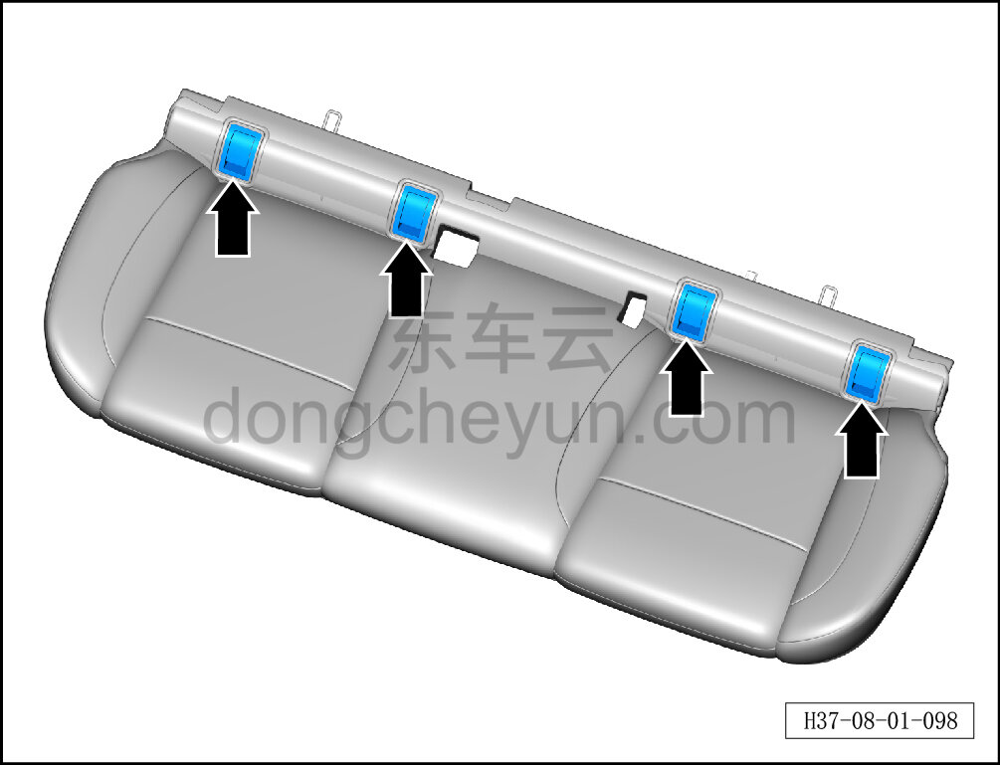
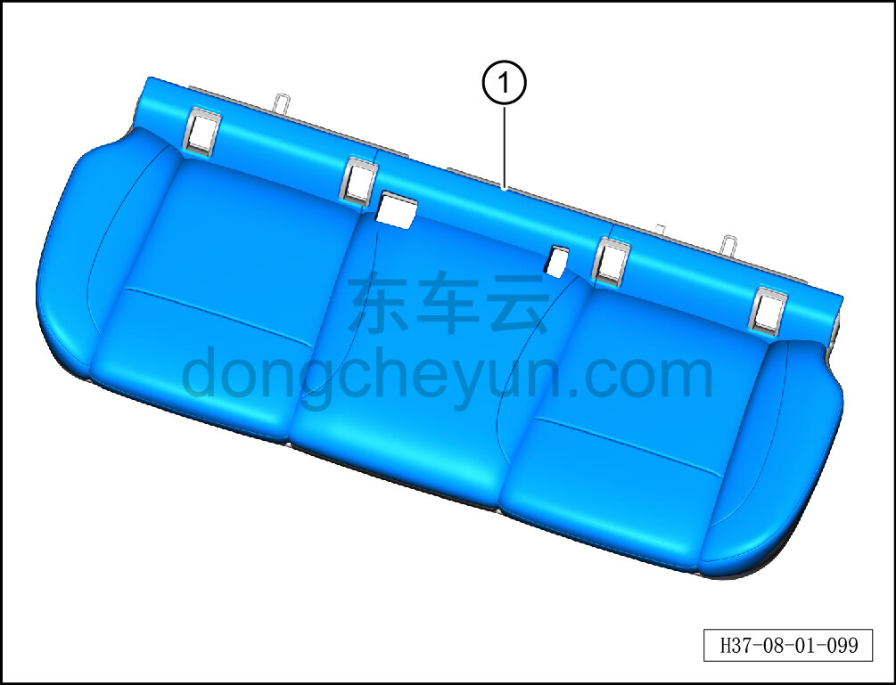

# Снятие и установка обивки подушки заднего сиденья

> Внутренняя и внешняя отделка › Сиденья › Снятие и установка заднего сиденья  
> Оригинал: `拆卸与安装后排座垫面套` · [dongcheyun 56746](https://dongcheyun.com/p/56746), страница `707908f8e1854c77a341aff7233f371e` · [оглавление](../README.md)

**Порядок снятия**

1. Выключите все электроприборы, отключите питание.

2. Выполните обесточивание автомобиля для ремонта. См. [3.1.4.1 Обесточивание автомобиля](../03-техническое-обслуживание/005-обесточивание-автомобиля.md)

3. Снимите подушку заднего сиденья. См. [8.1.5.1 Снятие и установка подушки заднего сиденья](029-снятие-и-установка-подушки-заднего-сиденья.md)

4. Снимите обивку подушки заднего сиденья.

a. С помощью инструмента для снятия внутренней облицовки отсоедините крышку ISOFIX.

b. С помощью клещей для стопорных колец отсоедините стопорное кольцо обивки подушки заднего сиденья, извлеките обивку подушки заднего сиденья ①.

**Порядок установки**

Установка выполняется в обратном порядке**.**
