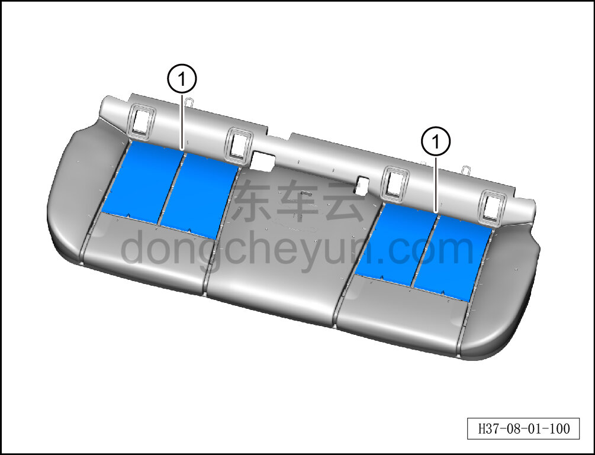

# Снятие и установка мягкого пенопласта подушки заднего сиденья

> Внутренняя и внешняя отделка › Сиденья › Снятие и установка заднего сиденья  
> Оригинал: `拆卸与安装后排座垫发泡海绵` · [dongcheyun 56746](https://dongcheyun.com/p/56746), страница `086ada8e98f34f858cd6a7155b952a97` · [оглавление](../README.md)

**Порядок снятия**

1. Выключите все электроприборы, отключите питание.

2. Выполните обесточивание автомобиля для ремонта. См. [3.1.4.1 Обесточивание автомобиля](../03-техническое-обслуживание/005-обесточивание-автомобиля.md)

3. Снимите подушку заднего сиденья. См. [8.1.5.1 Снятие и установка подушки заднего сиденья](029-снятие-и-установка-подушки-заднего-сиденья.md)

4. Снимите обивку подушки заднего сиденья. См. [8.1.5.12 Снятие и установка обивки подушки заднего сиденья](040-снятие-и-установка-обивки-подушки-заднего-сиденья.md)

5. Снимите мягкий пенопласт подушки заднего сиденья.

a. Извлеките мягкий пенопласт подушки заднего сиденья ①.

**Внимание:**

**-Поверхность соединения мягкого пенопласта подушки заднего сиденья с пенонаполнителем подушки заднего сиденья в сборе заполнена клеем, при слишком плотном соединении можно разъединить с помощью канцелярского ножа, избегая повреждения пенонаполнителя подушки заднего сиденья в сборе.**

**Порядок установки**

Установка выполняется в обратном порядке.

**Внимание:**

**-Перед установкой необходимо повторно нанести клей на мягкий пенопласт подушки заднего сиденья, чтобы обеспечить его плотное прилегание к пенонаполнителю подушки заднего сиденья в сборе.**
