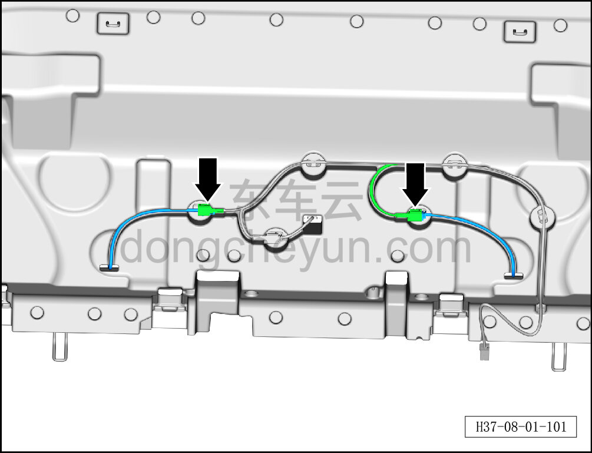
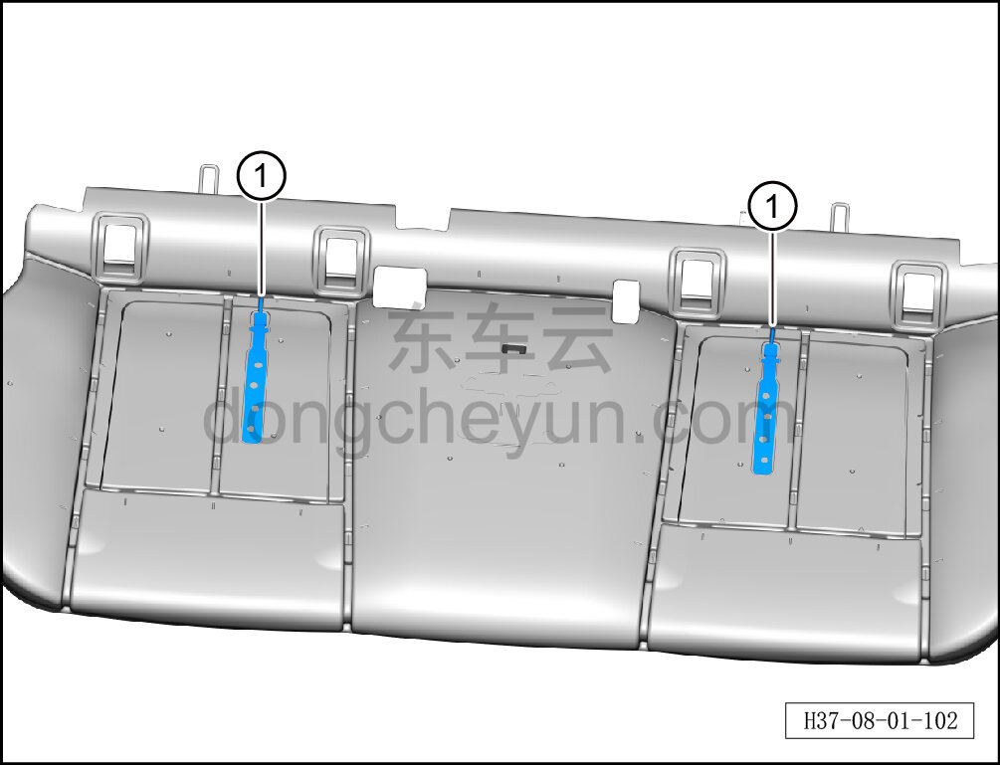

# Снятие и установка датчика SBR заднего сиденья (обе стороны)

> Внутренняя и внешняя отделка › Сиденья › Снятие и установка заднего сиденья  
> Оригинал: `拆卸与安装后排SBR传感器（两侧）` · [dongcheyun 56746](https://dongcheyun.com/p/56746), страница `4f3fae3197094a8cb980995bfb6c1b92` · [оглавление](../README.md)

**Порядок снятия**

1. Выключите все электроприборы, отключите питание.

2. Выполните обесточивание автомобиля для ремонта. См. [3.1.4.1 Обесточивание автомобиля](../03-техническое-обслуживание/005-обесточивание-автомобиля.md)

3. Снимите подушку заднего сиденья. См. [8.1.5.1 Снятие и установка подушки заднего сиденья](029-снятие-и-установка-подушки-заднего-сиденья.md)

4. Снимите обивку подушки заднего сиденья. См. [8.1.5.12 Снятие и установка обивки подушки заднего сиденья](040-снятие-и-установка-обивки-подушки-заднего-сиденья.md)

5. Снимите мягкий пенопласт подушки заднего сиденья. См. [8.1.5.13 Снятие и установка мягкого пенопласта подушки заднего сиденья](041-снятие-и-установка-мягкого-пенопласта-подушки-заднего.md)

6. Снимите датчик SBR заднего сиденья (обе стороны).

a. Удерживая фиксатор разъёма, отсоедините 2 разъёма жгута датчика SBR заднего сиденья (обе стороны).

b. Извлеките датчик SBR заднего сиденья (обе стороны) ①.

**Порядок установки**

Установка выполняется в обратном порядке.
