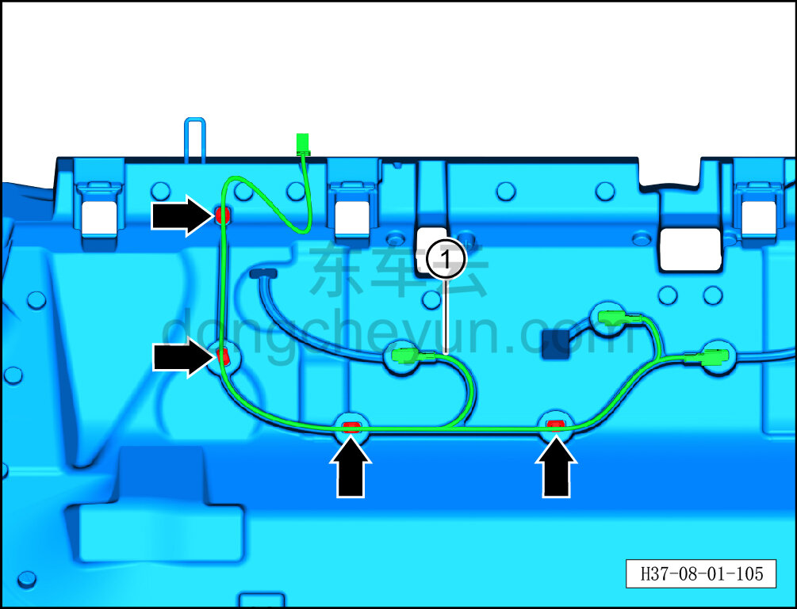
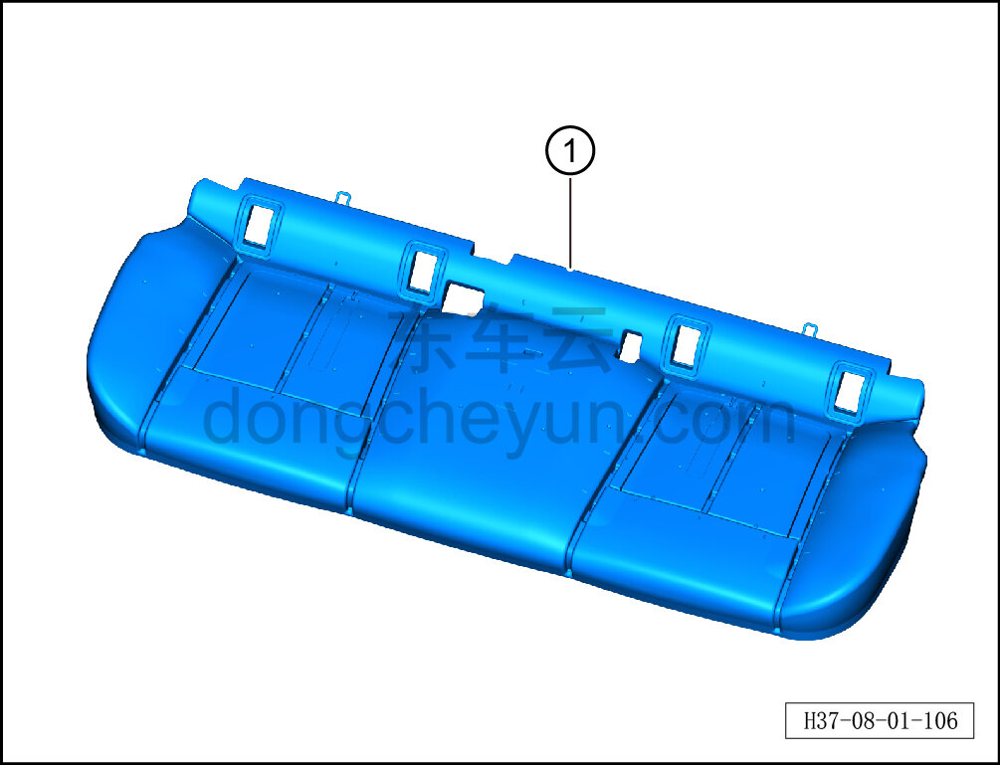

# Снятие и установка пенонаполнителя подушки заднего сиденья в сборе

> Внутренняя и внешняя отделка › Сиденья › Снятие и установка заднего сиденья  
> Оригинал: `拆卸与安装后排座垫发泡总成` · [dongcheyun 56746](https://dongcheyun.com/p/56746), страница `5512dbef2f784180a059a1f4d4200862` · [оглавление](../README.md)

**Порядок снятия**

1. Выключите все электроприборы, отключите питание.

2. Выполните обесточивание автомобиля для ремонта. См. [3.1.4.1 Обесточивание автомобиля](../03-техническое-обслуживание/005-обесточивание-автомобиля.md)

3. Снимите подушку заднего сиденья. См. [8.1.5.1 Снятие и установка подушки заднего сиденья](029-снятие-и-установка-подушки-заднего-сиденья.md)

4. Снимите датчик SBR заднего сиденья (обе стороны). См. [8.1.5.14 Снятие и установка датчика SBR заднего сиденья (обе стороны)](042-снятие-и-установка-датчика-sbr-заднего-сиденья-обе.md)

5. Снимите датчик SBR заднего сиденья (центр). См. [8.1.5.15 Снятие и установка датчика SBR заднего сиденья (центр)](043-снятие-и-установка-датчика-sbr-заднего-сиденья-центр.md)

6. Снимите пенонаполнитель подушки заднего сиденья в сборе.

a. С помощью инструмента для снятия внутренней облицовки отсоедините 4 крепёжные клипсы жгута заднего сиденья в сборе и снимите жгут заднего сиденья в сборе ①.

b. Снимите пенонаполнитель подушки заднего сиденья в сборе ①.

**Порядок установки**

Установка выполняется в обратном порядке.
